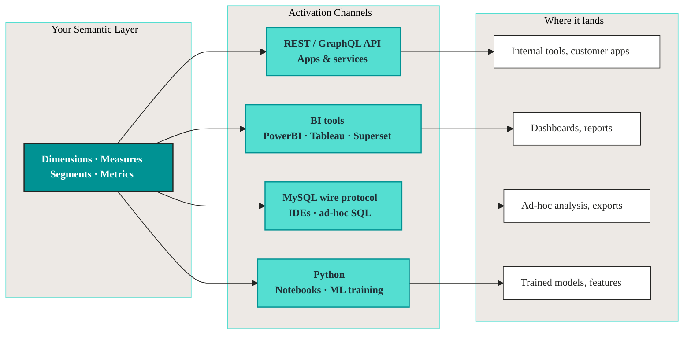

# Activation

You've defined your models, validated them, and shipped a semantic layer. Now downstream tools need to read it: a dashboard in PowerBI, a notebook in Python, a customer-facing app, an analyst running ad-hoc SQL.

Activation is how each of those surfaces connects to the same governed definitions, without re-modeling the data per tool.

## What activation gives you

Your semantics are the contract. Every channel reads from the same definitions, so a metric called `total_revenue` means the same thing in PowerBI, in a Python notebook, and in a customer-facing API. No re-modeling, no drift, no "which dashboard is right?"

## Channels

**1. Build applications (API).** Hit the REST or GraphQL endpoint to pull semantic data into internal tools, customer-facing products, or workflows. The semantics handle the joins and aggregations; your app just asks for measures and dimensions. See the [Vulcan API Guide](../guides/vulcan_api_guide.md).

**2. Visualize (BI tools).** Connect PowerBI, Tableau, or Superset over the MySQL wire protocol. Your dimensions and measures show up as fields, ready for charts and drilldowns. No SQL in the dashboard, no metric definitions duplicated per workbook. See [BI tools](./bi/README.md).

**3. Explore (MySQL).** Point any MySQL-compatible client (CLI, DBeaver, JetBrains, etc.) at the same wire protocol for ad-hoc querying or to power exports and integrations. See [MySQL](./mysql.md).

**4. Train models (Python).** Pull semantic data into a notebook with the standard `mysql-connector-python` library. The features and labels you train on are the same ones your dashboards report against. See [Python](./python.md).

## How it pays off

Define the metric once. Every team, tool, and use case downstream gets the same answer. That's the point of investing in the semantic layer in the first place.
