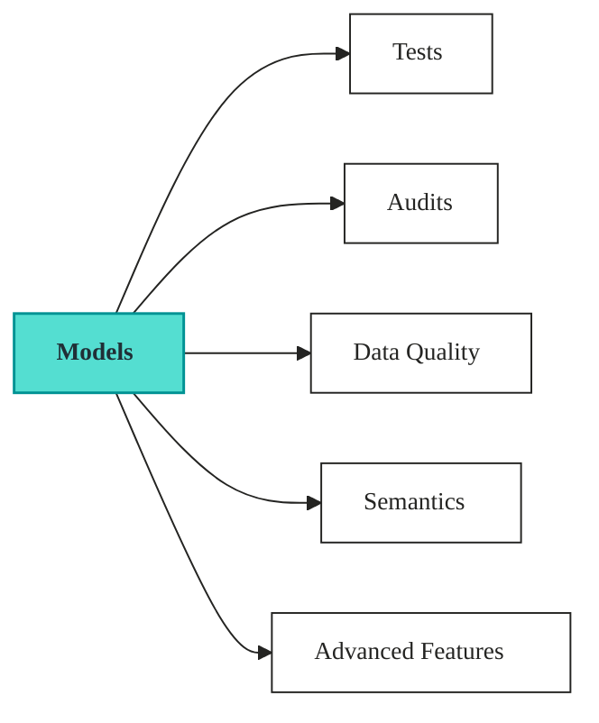

# Components

Components are the building blocks of a Vulcan project.

They define how data is transformed, validated, described, and served.

## What lives here

Use this section when you need to:

* define transformation logic in models
* validate model logic with tests
* block bad data at runtime with audits and assertions
* monitor datasets with DQ checks
* expose business-friendly semantic definitions
* extend projects with advanced features

## How components fit together

In most projects, the flow looks like this:

1. Build tables or views with **models**.
2. Validate logic with **tests** (controlled inputs and expected outputs).
3. Block bad data at runtime with **audits**, attached to models as **assertions**.
4. Monitor data over time with **DQ checks** (`kind: dq`).
5. Expose curated definitions through **semantics**.
6. Extend behavior with **advanced features**.

The model is the center of gravity. Everything else, tests, audits, DQ checks, semantics, and advanced features, attaches to a model. Get the model right first; the rest only has something to validate or expose once it exists.

## Choose a component

<table data-view="cards"><thead><tr><th></th><th data-card-target data-type="content-ref"></th></tr></thead><tbody><tr><td><strong>Model</strong> Define transformations, metadata, scheduling, and materialization behavior.</td><td><a href="model/">model</a></td></tr><tr><td><strong>Tests</strong> Validate model logic with controlled inputs and expected outputs.</td><td><a href="tests.md">tests.md</a></td></tr><tr><td><strong>Assertions</strong> Attach audits to models to block bad data at runtime.</td><td><a href="./assertions.md">assertions.md</a></td></tr><tr><td><strong>Data Quality</strong> Apply reusable DQ checks to monitor datasets over time.</td><td><a href="data-quality.md">data-quality.md</a></td></tr><tr><td><strong>Semantics</strong> Map technical models to business dimensions, measures, and metrics.</td><td><a href="semantics/">semantics</a></td></tr><tr><td><strong>Advanced Features</strong> Use macros, signals, and custom materializations to extend Vulcan.</td><td><a href="advanced-features/">advanced-features</a></td></tr></tbody></table>

## Quick guidance

Start with **Model** if you are building a pipeline.

Add **Tests** when you want confidence in transformation logic before deployment.

Use **Assertions** (and the audits behind them) and **Data Quality** checks when you need runtime validation on produced data.

Use **Semantics** when the project must serve business users, BI tools, or APIs.

## Best practices

Keep models focused and composable.

Use tests for logic correctness, audits and assertions to block bad data at runtime, and DQ checks to monitor it over time.

Add semantics after the underlying models are stable and well named.
