# Configurations

Your Vulcan project needs a configuration file. It tells Vulcan how to connect to your data warehouse, where to store state, and what defaults to use for your models. Without it, Vulcan doesn't know where your data lives or how to run your transformations.

## Configuration File

Create a configuration file in your project root. Choose one:

* `config.yaml`: YAML format. Use this for most projects. Simple and readable.
* `config.py`: Python format. Use this if you need dynamic configuration or want to generate settings programmatically.

Usage guidance lives separately in `usage.yaml`. Keep connection/runtime settings in `config.yaml`, and keep business-facing guidance in `usage.yaml`.

## Example Configuration

Here's what a typical configuration file looks like:


```yaml
# Project identity
name: orders-analytics
display_name: Orders Analytics Platform
description: Orders Analytics is a centralized data product delivering clean, trusted insights across the full order lifecycle.

# Catalog metadata
discoverable: true
version: 0.1.2
alignment: consumer_aligned

# Environment behaviour
vde: false   # set to true to enable Virtual Data Environments; not supported on spark/trino

# Classification
tags:
  - e-commerce
  - retail
  - sales_analytics
  - customer_analytics
  - postgres

terms:
  - glossary.data_product
  - glossary.analytics_platform
  - glossary.sales_operations


# Gateway Connection
gateways:
  default:
    connection:
      type: postgres
      host: warehouse
      port: 5432
      database: warehouse
      user: vulcan
      password: "{{ env_var('DB_PASSWORD') }}"
    state_connection:
      type: postgres
      host: statestore
      port: 5432
      database: statestore
      user: vulcan
      password: "{{ env_var('STATE_DB_PASSWORD') }}"

default_gateway: default

# Model Defaults (required)
model_defaults:
  dialect: postgres
  start: 2024-01-01
  cron: '@daily'

# Linting Rules
linter:
  enabled: true
  rules:
    - ambiguousorinvalidcolumn
    - invalidselectstarexpansion
```


## Example Usage Guidance

Create `usage.yaml` in your project root to describe who the data product is good for, who it is not good for, caveats users should know, and reference links.

```yaml
good_for:
  - Customer analytics and segmentation
  - title: Revenue reporting and forecasting
    details: Planning, board reporting, and trend analysis across segments
  - User acquisition tracking
  - Subscription lifecycle management

not_for:
  - Real-time alerting
  - title: Real-time operational decisions
    details: Data refreshes weekly. Not suitable for alerting or live dashboards

caveats:
  - Historical data available from 2024-01-01
  - title: Weekly refresh cadence
    details: Updates every Monday ~6am UTC; answers can be up to 7 days stale
    severity: medium
  - title: Excludes test and demo accounts
    severity: low

references:
  - title: Vulcan book
    url: https://tmdc-io.github.io/vulcan-book/
    type: doc
```

## Configuration Structure

```mermaid
%%{init: {"theme":"base","themeVariables":{"fontFamily":"PP Neue Montreal, Inter, Helvetica Neue, Arial, sans-serif","fontSize":"14px","primaryColor":"#EDE9E5","primaryTextColor":"#242422","primaryBorderColor":"#242422","lineColor":"#242422","secondaryColor":"#D6CDC6","tertiaryColor":"#FFFFFF","clusterBkg":"#EDE9E5","clusterBorder":"#54DED1","edgeLabelBackground":"#FFFFFF"},"flowchart":{"curve":"basis","padding":12,"nodeSpacing":40,"rankSpacing":50}}}%%
graph TB
    Config[config.yaml]
    Usage[usage.yaml]
    Config --> Project[Project Settings]
    Config --> Gateways[Gateways]
    Config --> ModelDefaults[Model Defaults]
    Config --> Options[Optional Features]
    Usage --> GoodFor[good_for]
    Usage --> NotFor[not_for]
    Usage --> Caveats[caveats]
    Usage --> References[references]
    Project --> Name[name, display_name]
    Project --> Desc[description]
    Project --> Tags[tags, terms]
    Gateways --> Connection[connection]
    Gateways --> StateConn[state_connection]
    Gateways --> TestConn[test_connection]
    Gateways --> Scheduler[scheduler]
    Options --> Linter[linter]
    Options --> Notifications[notifications]
    Options --> Variables[variables]
    Options --> ExecHooks[execution_hooks]

    classDef primary-teal fill:#54DED1,color:#202F36,stroke:#009293,stroke-width:1.5px,font-weight:600;
    classDef surface      fill:#FFFFFF,color:#242422,stroke:#242422,stroke-width:1px;

    class Config,Usage primary-teal;
    class Project,Gateways,ModelDefaults,Options,GoodFor,NotFor,Caveats,References,Name,Desc,Tags,Connection,StateConn,TestConn,Scheduler,Linter,Notifications,Variables,ExecHooks surface;
```



## Configuration Sections

### Project Settings

Project settings identify your project. They do not affect how Vulcan runs, but catalog tools rely on them for organization and discovery. Business-facing usage guidance belongs in `usage.yaml`, not in `config.yaml`.

| Option         | Description                                                                               |       Type      | Required |
| -------------- | ----------------------------------------------------------------------------------------- | :-------------: | :------: |
| `name`         | Project identifier (used internally). Can also be set via `DATAOS_RESOURCE_NAME` env var. |      string     |    Yes   |
| `description`  | Project description. Has a placeholder default but is still validated as non-empty.       |      string     |    Yes   |
| `display_name` | Human-readable project name for UI/docs                                                   |      string     |    No    |
| `discoverable` | Whether this product appears in catalog search                                            |     boolean     |    No    |
| `version`      | Release version (SemVer 2.0, e.g. `0.1.2`)                                                |      string     |    No    |
| `alignment`    | Data Mesh orientation: `source_aligned` or `consumer_aligned`                             |       enum      |    No    |
| `tags`         | Labels for categorization and filtering. Merged with `DATAOS_RESOURCE_TAGS` env var.      | array of string |    No    |
| `terms`        | Business glossary terms using dot notation (e.g., `glossary.data_product`)                | array of string |    No    |

```yaml
# Project identity
name: orders-analytics
display_name: Orders Analytics Platform
description: Orders Analytics delivers insights across the full order lifecycle.

# Catalog metadata
discoverable: true
version: 0.1.2
alignment: consumer_aligned

# Classification
tags:
  - e-commerce
  - retail
  - sales_analytics

terms:
  - glossary.data_product
  - glossary.analytics_platform
  - glossary.sales_operations
```


**Tenant comes from the environment**

`tenant` is required by the platform, but it is not a YAML key in `config.yaml`. In production, the platform injects it through `DATAOS_TENANT_ID`. For local development, export it before running Vulcan:

```bash
export DATAOS_TENANT_ID=marketing
```

Without `DATAOS_TENANT_ID`, Vulcan refuses to load the project.


### Usage Guidance (`usage.yaml`)

Use `usage.yaml` for business-facing guidance. This file helps consumers understand when to use the data product, when not to use it, what caveats apply, and where to find supporting references.

Unlike `config.yaml`, `usage.yaml` does not configure runtime behavior. It is documentation and discovery guidance for humans and catalog/AI experiences.

| Option       | Description                                                           |          Type          | Required |
| ------------ | --------------------------------------------------------------------- | :--------------------: | :------: |
| `good_for`   | Use cases where this data product is a good fit                       | array of string/object |    No    |
| `not_for`    | Use cases where this data product should not be used                  | array of string/object |    No    |
| `caveats`    | Known limits, freshness notes, exclusions, or interpretation warnings | array of string/object |    No    |
| `references` | Supporting links such as docs, dashboards, runbooks, or tickets       |     array of object    |    No    |

List items can be simple strings or structured objects with `title` and optional details.

```yaml
good_for:
  - Customer analytics and segmentation
  - title: Revenue reporting and forecasting
    details: Planning, board reporting, and trend analysis across segments

not_for:
  - Real-time alerting
  - title: Real-time operational decisions
    details: Data refreshes weekly. Not suitable for alerting or live dashboards

caveats:
  - Historical data available from 2024-01-01
  - title: Weekly refresh cadence
    details: Updates every Monday ~6am UTC; answers can be up to 7 days stale
    severity: medium

references:
  - title: Vulcan book
    url: https://tmdc-io.github.io/vulcan-book/
    type: doc
```

### Gateways

Gateways define how Vulcan connects to your data warehouse and state backend. Define multiple gateways for different environments: dev, staging, prod. Each gateway has its own connection settings.

| Component          | Description                                                                                                                                     |  Type  | Required |
| ------------------ | ----------------------------------------------------------------------------------------------------------------------------------------------- | :----: | :------: |
| `connection`       | Primary data warehouse connection                                                                                                               | object |    Yes   |
| `state_connection` | Where Vulcan stores internal state (defaults to `connection` if not set). For local testing, point this at DuckDB; for production, use Postgres | object |    No    |
| `test_connection`  | Connection for running tests (defaults to DuckDB)                                                                                               | object |    No    |
| `scheduler`        | Scheduler configuration                                                                                                                         | object |    No    |
| `state_schema`     | Schema name for state tables                                                                                                                    | string |    No    |
| `default_gateway`  | Which gateway to use when none is specified                                                                                                     | string |    No    |

```yaml
# Gateway Connection
gateways:
  default:
    connection:
      type: postgres
      host: warehouse
      port: 5432
      database: warehouse
      user: vulcan
      password: "{{ env_var('DB_PASSWORD') }}"

default_gateway: default
```

### Model Defaults

The `model_defaults` section is required. At minimum, specify `dialect` to tell Vulcan what SQL dialect your models use. Other defaults are optional but apply to all models automatically, so you don't repeat the same settings in every model file.

```yaml
model_defaults:
  dialect: postgres     # Required
  owner: data-team
  start: 2024-01-01
  cron: '@daily'
```

See [Model Defaults](options/model_defaults.md) for all available options.

### Variables

Store sensitive information like passwords and API keys without hardcoding them. Use environment variables, `.env` files, or configuration overrides. Variables also let you override configuration values dynamically.

```yaml
variables:
  warehouse_schema: analytics
  refresh_window_days: 7

gateways:
  default:
    variables:
      warehouse_schema: analytics_dev  # override per gateway
```

See [Variables](options/variables.md) for details.

### Execution Hooks

Run SQL statements automatically at the start and end of `vulcan plan` and `vulcan run` commands. Use `before_all` for setup tasks like creating temporary tables or granting permissions. Use `after_all` for cleanup or post-processing. Hook entries can be inline SQL, macros, or files that contain SQL statements.

```yaml
before_all:
  - GRANT SELECT ON ALL TABLES IN SCHEMA analytics TO reporting_role
  - file: ./statements/setup.sql

after_all:
  - ANALYZE analytics.daily_sales
  - ./statements/cleanup.sql
```

See [Execution Hooks](options/execution_hooks.md) for detailed examples and use cases.

### Linter

Automatic code quality checks that run when you create a plan or run the lint command. Catches common mistakes and enforces coding standards. Use built-in rules or create custom ones.

See [Linter](options/linter.md) for rules and custom linter configuration.

### Notifications

Set up alerts via Slack, Teams webhook, email, or console targets. Get notified when plans start or finish, when runs complete, or when data quality checks fail. Data quality events use the `dq_*` names.

```yaml
notification_targets:
  - type: teams_webhook
    url: "{{ env_var('TEAMS_WEBHOOK_URL') }}"
    notify_on:
      - apply_failure
      - run_failure
      - dq_failure
  - type: console
    notify_on:
      - plan_change
```

See [Notifications](options/notifications.md) for Teams webhook, Slack, API, and email setup.

### Auth Extension Hook

Use the root-level `after_authorize` field when a data product needs to resolve user groups after Heimdall authorization. The hook points to an async Python function in your project. Put plugin modules in a `plugins/` package at the project root:


**Required for auth-backed policies**

If you are working with Heimdall auth, semantic model policies, or masking, make sure `config.yaml` includes this root-level hook:

```yaml
after_authorize: "plugins.auth_ext:resolve_user_groups"
```


```
plugins/
├── __init__.py
└── auth_ext.py
```

```yaml
after_authorize: "plugins.auth_ext:resolve_user_groups"

heimdall:
  enabled: true
  base_url: "https://your-instance.dataos.cloud/heimdall"
  timeout: 5
```

Previously, this behavior was commonly configured inside the `heimdall` block. For OSI GA projects, keep Heimdall connection settings under `heimdall` and put the extension hook at the root of `config.yaml`.

```python
from __future__ import annotations

from schema.auth import AuthExtensionContext, SecurityContext

ROLE_ID_TAG_PREFIX = "roles:id:"
GROUP_DELIMITER = ","
POLICY_GROUP_PRIORITY = ("operator", "developer")


async def resolve_user_groups(ctx: AuthExtensionContext) -> SecurityContext:
    """Derive policy groups from Heimdall role tags."""

    groups = [
        tag.replace(ROLE_ID_TAG_PREFIX, "", 1)
        for tag in ctx.user_tags
        if tag.startswith(ROLE_ID_TAG_PREFIX)
    ]

    group = next(
        (policy_group for policy_group in POLICY_GROUP_PRIORITY if policy_group in groups),
        groups[0] if groups else "",
    )
    return SecurityContext(group=group, groups=GROUP_DELIMITER.join(groups))
```

## Supported Engines

Vulcan works with these data warehouses and compute engines:

| Engine                                                                             |    Status   |
| ---------------------------------------------------------------------------------- | :---------: |
| [PostgreSQL](engines/postgres.md)                                                  |  Available  |
| [Snowflake](engines/snowflake.md)                                                  |  Available  |
| [BigQuery](engines/bigquery.md)                                                    |  Available  |
| [Databricks](engines/databricks.md)                                                |     WIP     |
| [Redshift](engines/redshift.md)                                                    |     WIP     |
| [Spark](engines/spark.md)                                                          |     WIP     |
| [Trino](engines/trino/README.md)                                                          |     WIP     |
| [Microsoft Fabric](engines/fabric.md)                                              |     WIP     |
| [SQL Server](engines/mssql.md)                                                     |     WIP     |
| [MySQL](engines/mysql.md)                                                          |     WIP     |
| [Lakehouse](../configurations/engines/) | Coming Soon |

## Complete Configuration Reference

This table lists all available configuration keys in `config.yaml`. Click the links for detailed documentation.

### Project Identity

| Configuration Key | Description                                                                            |   Type  | Required | Default            | Documentation |
| ----------------- | -------------------------------------------------------------------------------------- | :-----: | :------: | ------------------ | ------------- |
| `name`            | Project identifier (used for resource naming). Overridable via `DATAOS_RESOURCE_NAME`. |  string |  **Yes** | -                  | -             |
| `description`     | Project description and purpose. Validated as non-empty.                               |  string |  **Yes** | placeholder        | -             |
| `display_name`    | Human-readable name for UI/docs                                                        |  string |    No    | `null`             | -             |
| `discoverable`    | Whether the product is listed in catalog search                                        | boolean |    No    | `true`             | -             |
| `version`         | Release version (SemVer 2.0)                                                           |  string |    No    | `"0.0.0"`          | -             |
| `alignment`       | Data Mesh orientation (`source_aligned` or `consumer_aligned`)                         |   enum  |    No    | `consumer_aligned` | -             |
| `project`         | Legacy alias of `name`. Auto-filled from `name` if omitted.                            |  string |    No    | `""`               | -             |
| `tags`            | Labels for categorization. Merged with `DATAOS_RESOURCE_TAGS`.                         |  array  |    No    | `[]`               | -             |
| `terms`           | Business glossary terms (e.g., `glossary.data_product`)                                |  array  |    No    | `[]`               | -             |

### Usage Guidance (`usage.yaml`)

These keys live in `usage.yaml`, not `config.yaml`.

| Usage Key    | Description                                               |  Type | Required | Default |
| ------------ | --------------------------------------------------------- | :---: | :------: | ------- |
| `good_for`   | Use cases where the data product is a good fit            | array |    No    | `[]`    |
| `not_for`    | Use cases where the data product should not be used       | array |    No    | `[]`    |
| `caveats`    | Known limits, freshness notes, exclusions, or warnings    | array |    No    | `[]`    |
| `references` | Supporting links with `title`, `url`, and optional `type` | array |    No    | `[]`    |

### Gateway & Connection Configuration

| Configuration Key                  | Description                                                                                                                                                      |  Type  |  Required | Default                             | Documentation                     |
| ---------------------------------- | ---------------------------------------------------------------------------------------------------------------------------------------------------------------- | :----: | :-------: | ----------------------------------- | --------------------------------- |
| `gateways`                         | Gateway configurations for different environments                                                                                                                | object | **Yes**\* | `{"": {}}`                          | [See above](./#gateways)          |
| `gateways.<name>.connection`       | Primary data warehouse connection                                                                                                                                | object |  **Yes**  | -                                   | [Engines](engines/postgres.md)    |
| `gateways.<name>.state_connection` | Where Vulcan stores internal state. For local testing, point this at DuckDB; for production, use Postgres                                                        | object |     No    | Uses `connection`                   | -                                 |
| `gateways.<name>.test_connection`  | Connection for running unit tests                                                                                                                                | object |     No    | `null`                              | -                                 |
| `gateways.<name>.scheduler`        | Scheduler configuration                                                                                                                                          | object |     No    | Built-in (`BuiltInSchedulerConfig`) | -                                 |
| `gateways.<name>.state_schema`     | Schema name for state tables                                                                                                                                     | string |     No    | `vulcan`\*\*                        | -                                 |
| `gateways.<name>.variables`        | Gateway-specific variables                                                                                                                                       | object |     No    | `{}`                                | [Variables](options/variables.md) |
| `default_gateway`                  | Name of the default gateway                                                                                                                                      | string |     No    | `""`                                | -                                 |
| `default_connection`               | Root-level default connection                                                                                                                                    | object |     No    | `null`                              | -                                 |
| `default_test_connection`          | Root-level default test connection                                                                                                                               | object |     No    | `null`                              | -                                 |
| `default_scheduler`                | Root-level default scheduler                                                                                                                                     | object |     No    | Built-in (`BuiltInSchedulerConfig`) | -                                 |
| `state`                            | Separate root-level state connection (alternative to per-gateway `state_connection`). Can also be loaded from `/etc/dataos/secret/state_connection_config.yaml`. | object |     No    | `null`                              | -                                 |

\* At least one gateway with a `connection` is required.\
\*\* With root-level `state` connection, defaults to `{name}` (normalized).

### Model Configuration

| Configuration Key                      | Description                                       |      Type     |  Required | Default   | Documentation                               |
| -------------------------------------- | ------------------------------------------------- | :-----------: | :-------: | --------- | ------------------------------------------- |
| `model_defaults`                       | Default values applied to all models              |     object    | **Yes**\* | `{}`      | [Model Defaults](options/model_defaults.md) |
| `model_defaults.dialect`               | SQL dialect (postgres, snowflake, bigquery, etc.) |     string    |  **Yes**  | -         | [Model Defaults](options/model_defaults.md) |
| `model_defaults.owner`                 | Default owner for all models                      |     string    |     No    | `null`    | -                                           |
| `model_defaults.start`                 | Default start date for backfilling                |     string    |     No    | Inferred  | -                                           |
| `model_defaults.cron`                  | Default cron schedule (e.g., `@daily`)            |     string    |     No    | `null`    | -                                           |
| `model_defaults.kind`                  | Default model kind (FULL, INCREMENTAL, etc.)      | string/object |     No    | `VIEW`    | -                                           |
| `model_defaults.interval_unit`         | Temporal granularity of data intervals            |     string    |     No    | From cron | -                                           |
| `model_defaults.batch_concurrency`     | Max concurrent batches for incremental models     |    integer    |     No    | `1`       | -                                           |
| `model_defaults.table_format`          | Table format (iceberg, delta, hudi)               |     string    |     No    | `null`    | -                                           |
| `model_defaults.storage_format`        | Storage format (parquet, orc)                     |     string    |     No    | `null`    | -                                           |
| `model_defaults.on_destructive_change` | Action on destructive schema changes              |     string    |     No    | `error`   | -                                           |
| `model_defaults.on_additive_change`    | Action on additive schema changes                 |     string    |     No    | `apply`   | -                                           |
| `model_defaults.physical_properties`   | Properties for physical tables/views              |     object    |     No    | `{}`      | -                                           |
| `model_defaults.virtual_properties`    | Properties for virtual layer views                |     object    |     No    | `{}`      | -                                           |
| `model_defaults.session_properties`    | Engine-specific session properties                |     object    |     No    | `{}`      | -                                           |
| `model_defaults.audits`                | Assertion/assertion functions for all models      |     array     |     No    | `[]`      | -                                           |
| `model_defaults.optimize_query`        | Whether to optimize SQL queries                   |    boolean    |     No    | `true`    | -                                           |
| `model_defaults.allow_partials`        | Whether models can process incomplete intervals   |    boolean    |     No    | `false`   | -                                           |
| `model_defaults.enabled`               | Whether models are enabled by default             |    boolean    |     No    | `true`    | -                                           |
| `model_defaults.pre_statements`        | SQL statements executed before model runs         |     array     |     No    | `null`    | -                                           |
| `model_defaults.post_statements`       | SQL statements executed after model runs          |     array     |     No    | `null`    | -                                           |

\* The `model_defaults.dialect` field is required.

### Variables & Environment

| Configuration Key | Description                            |  Type  | Required | Default | Documentation                     |
| ----------------- | -------------------------------------- | :----: | :------: | ------- | --------------------------------- |
| `variables`       | Root-level variables for models/macros | object |    No    | `{}`    | [Variables](options/variables.md) |
| `env_vars`        | Environment variable overrides         | object |    No    | `{}`    | [Variables](options/variables.md) |

### Execution Hooks

| Configuration Key | Description                                                              |  Type | Required | Default | Documentation                                 |
| ----------------- | ------------------------------------------------------------------------ | :---: | :------: | ------- | --------------------------------------------- |
| `before_all`      | SQL statements, macros, or statement files executed at start of plan/run | array |    No    | `null`  | [Execution Hooks](options/execution_hooks.md) |
| `after_all`       | SQL statements, macros, or statement files executed at end of plan/run   | array |    No    | `null`  | [Execution Hooks](options/execution_hooks.md) |

### Code Quality & Linting

| Configuration Key   | Description                            |   Type  | Required | Default            | Documentation               |
| ------------------- | -------------------------------------- | :-----: | :------: | ------------------ | --------------------------- |
| `linter`            | Linting configuration                  |  object |    No    | `{enabled: false}` | [Linter](options/linter.md) |
| `linter.enabled`    | Enable or disable linting              | boolean |    No    | `false`            | [Linter](options/linter.md) |
| `linter.rules`      | List of rules to enforce (error level) |  array  |    No    | `[]`               | [Linter](options/linter.md) |
| `linter.warn_rules` | List of rules to warn about            |  array  |    No    | `[]`               | [Linter](options/linter.md) |

### Notifications & Users

| Configuration Key      | Description                                                         |  Type  | Required | Default | Documentation                             |
| ---------------------- | ------------------------------------------------------------------- | :----: | :------: | ------- | ----------------------------------------- |
| `notification_targets` | List of notification targets (Teams webhook, Slack, email, console) |  array |    No    | `[]`    | [Notifications](options/notifications.md) |
| `users`                | List of users for approvals/notifications                           |  array |    No    | `[]`    | -                                         |
| `username`             | Single user to receive notifications                                | string |    No    | `""`    | -                                         |

### Environment & Schema Management

| Configuration Key                  | Description                                                                                                                                                                                                                                                                                                                      |   Type  | Required | Default            | Documentation |
| ---------------------------------- | -------------------------------------------------------------------------------------------------------------------------------------------------------------------------------------------------------------------------------------------------------------------------------------------------------------------------------- | :-----: | :------: | ------------------ | ------------- |
| `vde`                              | Turn full Virtual Data Environments on/off. `true` = versioned physical tables + virtual layer; `false` = simple mode. Defaults to `false`: enable it explicitly when you want VDE. Not supported for `spark` and `trino` gateways: validation rejects `vde: true` on those. Replaces the deprecated `virtual_environment_mode`. | boolean |    No    | `false`            | -             |
| `default_target_environment`       | Default environment for plan/run commands                                                                                                                                                                                                                                                                                        |  string |    No    | `prod`             | -             |
| `snapshot_ttl`                     | Time before unused snapshots are deleted                                                                                                                                                                                                                                                                                         |  string |    No    | `in 1 week`        | -             |
| `environment_ttl`                  | Time before dev environments are deleted                                                                                                                                                                                                                                                                                         |  string |    No    | `in 1 week`        | -             |
| `pinned_environments`              | Environments not deleted by janitor                                                                                                                                                                                                                                                                                              |  array  |    No    | `[]`               | -             |
| `physical_schema_mapping`          | Map model patterns (regex) to physical schema names. Replaces the deprecated `physical_schema_override`, which is auto-converted with a warning.                                                                                                                                                                                 |  object |    No    | `{}`               | -             |
| `environment_suffix_target`        | Where to append environment name (`schema`, `table`, `catalog`)                                                                                                                                                                                                                                                                  |   enum  |    No    | `schema`           | -             |
| `environment_catalog_mapping`      | Route environments to specific catalogs (e.g., dev models go to `dev_catalog`, prod to `prod_catalog`). Useful in multi-catalog setups where each environment writes to a different database.                                                                                                                                    |  object |    No    | `{}`               | -             |
| `physical_table_naming_convention` | How to name tables at the physical layer                                                                                                                                                                                                                                                                                         |   enum  |    No    | `schema_and_table` | -             |
| `gateway_managed_virtual_layer`    | Whether virtual-layer views are created by the model's own gateway                                                                                                                                                                                                                                                               | boolean |    No    | `false`            | -             |


**Catalog in model names vs. environment catalog mapping**

There are two ways to control which catalog your models land in:

* **Model-level:** Use a three-part name (`catalog.schema.model`) in your MODEL definition to target a specific catalog for that model. See [model name property](../components/model/properties.md#name).
* **Environment-level:** Use `environment_catalog_mapping` to route all models in a given environment to a specific catalog, without changing individual model names.

Model-level catalog takes precedence. If you set both, the catalog in the model name wins.

```yaml
environment_catalog_mapping:
  dev: dev_catalog
  staging: staging_catalog
  prod: prod_catalog
```


### Project Management

| Configuration Key           | Description                                   |   Type  | Required | Default        | Documentation |
| --------------------------- | --------------------------------------------- | :-----: | :------: | -------------- | ------------- |
| `ignore_patterns`           | Glob patterns for files to ignore             |  array  |    No    | Standard list  | -             |
| `time_column_format`        | Default format for model time columns         |  string |    No    | `%Y-%m-%d`     | -             |
| `infer_python_dependencies` | Auto-detect Python package requirements       | boolean |    No    | `true`         | -             |
| `log_limit`                 | Default number of logs to keep                | integer |    No    | `20`           | -             |
| `cache_dir`                 | Directory for Vulcan's compiled project cache |  string |    No    | `.cache`       | -             |
| `loader`                    | Loader class for loading project files        |  class  |    No    | Default loader | -             |
| `loader_kwargs`             | Arguments to pass to loader instance          |  object |    No    | `{}`           | -             |

### Command Configuration

| Configuration Key              | Description                                                                                     |   Type  | Required | Default | Documentation |
| ------------------------------ | ----------------------------------------------------------------------------------------------- | :-----: | :------: | ------- | ------------- |
| `format`                       | SQL formatting options                                                                          |  object |    No    | Default | -             |
| `ui`                           | UI server configuration                                                                         |  object |    No    | Default | -             |
| `plan`                         | Plan command configuration                                                                      |  object |    No    | Default | -             |
| `plan.auto_categorize_changes` | Auto-categorize changes as breaking/non-breaking. Replaces top-level `auto_categorize_changes`. |  object |    No    | Default | -             |
| `plan.include_unmodified`      | Include unmodified models in the plan output. Replaces top-level `include_unmodified`.          | boolean |    No    | `false` | -             |
| `plan.use_finalized_state`     | Use finalized state when creating plans. Requires `vde: true`.                                  | boolean |    No    | `false` | -             |
| `migration`                    | Migration configuration                                                                         |  object |    No    | Default | -             |
| `run`                          | Run command configuration                                                                       |  object |    No    | Default | -             |
| `janitor`                      | Cleanup task configuration                                                                      |  object |    No    | Default | -             |
| `model_naming`                 | Name inference rules for models                                                                 |  object |    No    | Default | -             |
| `cicd_bot`                     | CI/CD bot configuration                                                                         |  object |    No    | `null`  | -             |

### Integrations & External Services

| Configuration Key   | Description                                                                                                  |   Type  | Required | Default                                                         | Documentation |
| ------------------- | ------------------------------------------------------------------------------------------------------------ | :-----: | :------: | --------------------------------------------------------------- | ------------- |
| `dbt`               | DBT-specific configuration                                                                                   |  object |    No    | `null`                                                          | -             |
| `object_store`      | Object storage for query results (MinIO/S3/GCS/Azure)                                                        |  object |    No    | `null`                                                          | -             |
| `transpiler`        | External transpiler service                                                                                  |  object |    No    | `{base_url: "http://127.0.0.1:8100", timeout: 30, token: null}` | -             |
| `graphql`           | GraphQL proxy configuration                                                                                  |  object |    No    | `{base_url: "http://127.0.0.1:3000", timeout: 30}`              | -             |
| `pgq`               | PostgreSQL Queue for async jobs                                                                              |  object |    No    | Default                                                         | -             |
| `analytics`         | CloudEvents telemetry configuration. Replaces the deprecated `disable_anonymized_analytics`.                 |  object |    No    | `{enabled: false}`                                              | -             |
| `analytics.enabled` | Enable telemetry publishing                                                                                  | boolean |    No    | `false`                                                         | -             |
| `analytics.api_key` | Telemetry API key. Required when `analytics.enabled: true`.                                                  |  string |    No    | `null`                                                          | -             |
| `openlineage`       | OpenLineage data lineage integration                                                                         |  object |    No    | `null`                                                          | -             |
| `after_authorize`   | Auth extension hook called after Heimdall authorization, for example `plugins.auth_ext:resolve_user_groups`. |  string |    No    | `null`                                                          | -             |
| `heimdall`          | Heimdall authentication (Vulcan API only)                                                                    |  object |    No    | `{enabled: false}`                                              | -             |
| `heimdall.enabled`  | Enable Heimdall auth                                                                                         | boolean |    No    | `false`                                                         | -             |
| `heimdall.base_url` | Heimdall service URL. Required when `heimdall.enabled: true`.                                                |  string |    No    | `null`                                                          | -             |
| `hera`              | Hera/OpenMetadata sync configuration                                                                         |  object |    No    | `{enabled: false}`                                              | -             |
| `hera.enabled`      | Enable Hera/OpenMetadata sync                                                                                | boolean |    No    | `false`                                                         | -             |
| `hera.url`          | Hera service URL. Required when `hera.enabled: true`.                                                        |  string |    No    | `null`                                                          | -             |
| `hera.token`        | Hera auth token. Required when `hera.enabled: true`.                                                         |  string |    No    | `null`                                                          | -             |

### Minimal Valid Configuration

The non-skippable parts of `config.yaml` are: a non-empty `name`, a non-empty `description`, at least one working `gateways.<name>.connection`, and `model_defaults.dialect`. The runtime also needs `DATAOS_TENANT_ID` in the environment.

```yaml
name: my-project
description: My project description

gateways:
  default:
    connection:
      type: postgres
      host: localhost
      port: 5432
      database: mydb
      user: myuser
      password: mypass

model_defaults:
  dialect: postgres
```

```bash
# Required at runtime, not in YAML
export DATAOS_TENANT_ID=my-tenant
```

Everything else has a default and you can omit it.

## Validation Rules

Some fields become required only when another field is enabled:

* `name` must be non-empty (or supplied via `DATAOS_RESOURCE_NAME`).
* `description` must be non-empty.
* `hera.url` and `hera.token` are required when `hera.enabled: true`.
* `heimdall.base_url` is required when `heimdall.enabled: true`.
* `analytics.api_key` is required when `analytics.enabled: true`.
* `vde: true` is rejected for `spark` and `trino` gateway types.
* `version` must be valid SemVer 2.0 (e.g. `0.1.2`, `1.0.0-rc.1`).

## Environment Variables

A few values come from the shell or `.env`, not from YAML:

| Variable               | Effect                                                         |
| ---------------------- | -------------------------------------------------------------- |
| `DATAOS_TENANT_ID`     | Required at runtime. Supplies the `tenant`. Not a YAML key.    |
| `DATAOS_RESOURCE_NAME` | Overrides `name` from `config.yaml`.                           |
| `DATAOS_RESOURCE_TAGS` | Merged into `tags` from `config.yaml`.                         |
| `TEAMS_WEBHOOK_URL`    | Recommended source for Teams webhook notification target URLs. |

## Migration from the Legacy Schema

If you have an older `config.yaml`, these keys have moved or been replaced:

| Old key                                     | Replacement                        | Notes                                                                                                          |
| ------------------------------------------- | ---------------------------------- | -------------------------------------------------------------------------------------------------------------- |
| `virtual_environment_mode: full`            | `vde: true`                        | Old string values fail validation.                                                                             |
| `virtual_environment_mode: dev_only`        | `vde: false` (or omit)             | `vde` defaults to `false`.                                                                                     |
| `auto_categorize_changes` (top-level)       | `plan.auto_categorize_changes`     | Now nested under `plan`.                                                                                       |
| `include_unmodified` (top-level)            | `plan.include_unmodified`          | Now nested under `plan`.                                                                                       |
| `physical_schema_override`                  | `physical_schema_mapping`          | Auto-converted with a warning.                                                                                 |
| `disable_anonymized_analytics`              | `analytics.enabled`                | Move into the `analytics` block.                                                                               |
| `tenant` (in YAML)                          | `DATAOS_TENANT_ID` env var         | No longer a YAML key.                                                                                          |
| `heimdall.after_authorize`                  | `after_authorize` at root          | Auth extension hooks now live at the root of `config.yaml`; keep only Heimdall service settings in `heimdall`. |
| `check_start`, `check_end`, `check_failure` | `dq_start`, `dq_end`, `dq_failure` | Data quality notification events now use `dq_*` names.                                                         |
| `metadata` (in `config.yaml`)               | `usage.yaml`                       | Move business usage guidance out of runtime config.                                                            |

Quick migration checklist:

1. Replace `virtual_environment_mode: full` with `vde: true`.
2. Remove `virtual_environment_mode: dev_only` (or set `vde: false` explicitly).
3. Add `discoverable`, `version`, `alignment` near the top of the file if you want non-default values.
4. Make sure `version` is valid SemVer (`0.1.2`, not `0.1` or `v0.1.2`).
5. Move business usage guidance from `metadata:` into `usage.yaml`.
6. Move any Heimdall auth extension hook to root-level `after_authorize`.
7. Replace `check_*` notification events with `dq_*` event names.
8. Remove any deprecated keys listed above.
9. Set `DATAOS_TENANT_ID` in your shell or `.env`.

## Best Practices

Use environment variables for sensitive data like passwords and API keys. Keeps secrets out of your config files and makes it easier to manage different environments.

Set meaningful defaults in `model_defaults` to reduce boilerplate. If most of your models use the same dialect, start date, or cron schedule, set it once here instead of repeating it everywhere.

Enable linting to catch common errors early in development. Fix issues before they make it to production.

Separate state connection from your data warehouse for better isolation. Prevents state operations from interfering with your data processing.

Use multiple gateways for different environments: dev, staging, prod. Test changes safely before deploying to production. Use different database configurations for each environment.
