# Data product lifecycle

Follow this path from setup to production. Each step builds on the previous one.


**Before you start**

This guide assumes you've completed the [Get Started](get-started.md) guide. You need Docker running, the Vulcan stack up, and the CLI alias configured. If `vulcan --help` doesn't work yet, finish the setup first.


***

## Phase 1: setup and infrastructure

Get your environment ready.

### Start the full stack

```bash
make up
```

This starts the complete Vulcan stack:

* Docker network `vulcan`
* Statestore (PostgreSQL) on port 5431 - stores Vulcan's internal state
* MinIO on ports 9000/9001 - stores query results and artifacts
* Transpiler API on port 8100 - converts semantic queries to SQL
* Vulcan API on port 8000 - REST API for querying
* GraphQL on port 3000 - GraphQL interface
* MySQL proxy on port 3306 - for BI tool connectivity

### Configure CLI access

Create an alias to access the Vulcan command-line interface (CLI). The alias uses an engine-specific Docker image. **Postgres is shown by default** (recommended for most users). For a different engine, select it from the tabs below.


**Automatic updates**

Docker image versions in this section sync with the engine configuration files. When engine image versions update, this section updates too.




```bash
alias vulcan="docker run -it --network=vulcan --rm -v .:/workspace tmdcio/vulcan-postgres:0.228.1.19 vulcan"
```

_Image version from_ [_Postgres engine configuration_](../configurations/engines/postgres.md)



```bash
alias vulcan="docker run -it --network=vulcan --rm -v .:/workspace tmdcio/vulcan-bigquery:0.228.1.10 vulcan"
```

_Image version from_ [_BigQuery engine configuration_](../configurations/engines/bigquery.md)



```bash
alias vulcan="docker run -it --network=vulcan --rm -v .:/workspace tmdcio/vulcan-databricks:0.228.1.19 vulcan"
```

_Image version from_ [_Databricks engine configuration_](../configurations/engines/databricks.md)



```bash
alias vulcan="docker run -it --network=vulcan --rm -v .:/workspace tmdcio/vulcan-fabric:0.228.1.6 vulcan"
```

_Image version from_ [_Fabric engine configuration_](../configurations/engines/fabric.md)



```bash
alias vulcan="docker run -it --network=vulcan --rm -v .:/workspace tmdcio/vulcan-mssql:0.228.1.6 vulcan"
```

_Image version from_ [_MSSQL engine configuration_](../configurations/engines/mssql.md)



```bash
alias vulcan="docker run -it --network=vulcan --rm -v .:/workspace tmdcio/vulcan-mysql:0.228.1.6 vulcan"
```

_Image version from_ [_MySQL engine configuration_](../configurations/engines/mysql.md)



```bash
alias vulcan="docker run -it --network=vulcan --rm -v .:/workspace tmdcio/vulcan-redshift:0.228.1.6 vulcan"
```

_Image version from_ [_Redshift engine configuration_](../configurations/engines/redshift.md)



```bash
alias vulcan="docker run -it --network=vulcan --rm -v .:/workspace tmdcio/vulcan-snowflake:0.228.1.19 vulcan"
```

_Image version from_ [_Snowflake engine configuration_](../configurations/engines/snowflake.md)



```bash
alias vulcan="docker run -it --network=vulcan --rm -v .:/workspace tmdcio/vulcan-spark:0.228.1.19 vulcan"
```

_Image version from_ [_Spark engine configuration_](../configurations/engines/spark.md)



```bash
alias vulcan="docker run -it --network=vulcan --rm -v .:/workspace tmdcio/vulcan-trino:0.228.1.19 vulcan"
```

_Image version from_ [_Trino engine configuration_](../configurations/engines/trino/README.md)



Verify it works:

```bash
vulcan --help
```

***

## Phase 2: project initialization

Create your project structure.

### Initialize project

```bash
vulcan init
```

This creates:

```
your-project/
├── models/              # SQL/Python transformation models
│   ├── dq/              # Data Quality rule packs (kind: dq)
│   ├── semantics/       # Semantic models (kind: semantic)
│   └── metrics/         # Per-metric files
├── seeds/               # CSV files for static data
├── audits/              # Data quality assertions (blocking)
├── tests/               # Unit tests for models
├── macros/              # Reusable SQL patterns
└── config.yaml          # Project configuration
```

### Configure project

Edit `config.yaml`:

* Set database connections
* Define model defaults (dialect, start date, cron schedule)
* Configure linting rules

### Verify setup

```bash
vulcan info
```

Checks connection status, project structure, and configuration.

***

## Phase 3: model development

Write your data transformation logic.

### Write models

**SQL models** (`models/example.sql`):

```sql
MODEL (
  name warehouse.users,
  start '2024-01-01',
  cron '@daily'
);

SELECT 
  user_id,
  email,
  created_at
FROM raw.users
WHERE status = 'active';
```

**Python models** (`models/example.py`):

```python
def execute(context, start, end):
    # Complex logic, API calls, ML models
    return pd.DataFrame(...)
```

Most teams start with SQL for transformations, then add Python when SQL gets painful: calling external APIs, running machine learning models, or handling complex business rules.

### Lint your code

```bash
vulcan info
```

Vulcan checks for syntax errors, ambiguous columns, and invalid SQL patterns. Code is validated before execution.

***

## Phase 4: testing and validation

Make sure your models work correctly.

### Write tests

```bash
vulcan create_test model_name
```

Tests validate model logic locally. They run without touching your warehouse, so you get fast feedback without warehouse costs.

### Run tests

```bash
vulcan test
```

Tests pass when model logic is correct.

***

## Phase 5: semantic layer

Define business metrics and dimensions.

### Define semantic models

Create `models/semantics/users.yml`:

```yaml
kind: semantic
name: users
depends_on: warehouse.users

dimensions:
  - plan_type

measures:
  - name: total_users
    type: count
```

You get:

* Business-friendly query interface
* Automatic API generation
* Single source of truth for metrics

***

## Phase 6: planning

Review and apply changes safely.

### Create a plan

```bash
vulcan plan
```

The plan:

1. Validates models and dependencies
2. Calculates which intervals need backfill
3. Shows full impact of changes
4. Creates isolated environment for testing

Plan output shows:

* Models that will be created/modified
* Data intervals that need processing
* Dependencies and execution order

### Review plan

Check:

* Are the right models affected?
* Is the backfill scope correct?
* Any breaking changes?

### Apply plan

```bash
# When prompted, enter 'y'
```

Applying the plan:

1. Creates model variants (with unique fingerprints)
2. Creates physical tables in warehouse
3. Backfills historical data
4. Creates/updates views (virtual layer)
5. Updates environment references

Changes are deployed to the target environment.

***

## Phase 7: running and scheduling

Process new data on schedule.

### Run scheduled execution

```bash
vulcan run
```

Running checks for missing intervals (compares with state), filters models by cron schedule (only processes due models), executes missing intervals, and updates state database.

**Difference from `plan`:**

* `plan` = Apply code changes
* `run` = Process new data intervals

### Schedule for production

Set up automation:

* **Cron job:** `0 * * * * vulcan run`
* **CI/CD pipeline:** Scheduled workflows
* **Kubernetes CronJob:** Container orchestration

Models run automatically on schedule.

***

## Phase 8: data quality

Validate data quality at every step.

### Write assertions

Create `audits/unique_users.sql`:

```sql
SELECT user_id, COUNT(*) as count
FROM warehouse.users
GROUP BY user_id
HAVING COUNT(*) > 1
```

Assertions block bad data before it reaches production. They stop execution if data quality fails. The query returns rows when it finds bad data.

### Write data quality rules

Create `dq/completeness.yml`:

```yaml
kind: dq
name: users_completeness
depends_on: warehouse.users

rules:
  - missing_count(email) = 0:
      name: user_email_completeness
      dimension: completeness
```

Data Quality rule packs monitor data quality over time. They're non-blocking (warnings, not failures) and track quality metrics.

Bad data is caught and blocked.

***

## Phase 9: API access

Expose your data through APIs.

### Query via REST API

If you ran `make up` in step 1, all API services are already running. Query your data right away.

```bash
curl -X POST http://localhost:8000/api/v1/query \
  -H "Content-Type: application/json" \
  -d '{
    "query": {
      "measures": ["users.total_users"],
      "dimensions": ["users.plan_type"]
    }
  }'
```

### Query via semantic layer

```bash
vulcan transpile --format sql "SELECT MEASURE(total_users) FROM users"
```

Data is accessible via REST, GraphQL, Python APIs, and semantic queries.

***

## Phase 10: monitoring and iteration

Monitor, debug, and improve.

### Monitor execution

```bash
# Check project status
vulcan info

# View logs
cat .logs/vulcan_*.log

# Render SQL to debug
vulcan render model_name

# Test queries
vulcan fetchdf "SELECT * FROM schema.model_name LIMIT 10"
```

### Iterate

**When you need to change models:**

1. Edit model files
2. Run `vulcan plan` (applies changes)
3. Run `vulcan run` (processes new data)

**When you need to add features:**

1. Add new models → `vulcan plan`
2. Add semantic definitions → `vulcan plan`
3. Add assertions/checks → `vulcan plan`
4. Test → `vulcan test`

***

## Complete lifecycle flow

```mermaid
%%{init: {"theme":"base","themeVariables":{"fontFamily":"PP Neue Montreal, Inter, Helvetica Neue, Arial, sans-serif","fontSize":"14px","primaryColor":"#EDE9E5","primaryTextColor":"#242422","primaryBorderColor":"#242422","lineColor":"#242422","secondaryColor":"#D6CDC6","tertiaryColor":"#FFFFFF","clusterBkg":"#EDE9E5","clusterBorder":"#54DED1","edgeLabelBackground":"#FFFFFF"},"flowchart":{"curve":"basis","padding":12,"nodeSpacing":40,"rankSpacing":50}}}%%
graph LR
    A[Setup Infrastructure] --> B[Initialize Project]
    B --> C[Write Models]
    C --> D[Lint Code]
    D --> E[Write Tests]
    E --> F[Run Tests]
    F --> G[Define Semantic Layer]
    G --> H[Create Plan]
    H --> I[Review Plan]
    I --> J[Apply Plan]
    J --> K[Schedule Runs]
    K --> L[Add Audits & Checks]
    L --> M[Start APIs]
    M --> N[Monitor & Iterate]

    classDef primary-teal fill:#54DED1,color:#202F36,stroke:#009293,stroke-width:1.5px,font-weight:600;
    classDef dark-teal    fill:#009293,color:#FFFFFF,stroke:#242422,stroke-width:1.5px,font-weight:600;
    classDef surface      fill:#FFFFFF,color:#242422,stroke:#242422,stroke-width:1px;

    class A primary-teal;
    class G primary-teal;
    class J dark-teal;
    class N primary-teal;
    class B,C,D,E,F,H,I,K,L,M surface;
```



***

## Key commands reference

| Phase        | Command            | Purpose                         |
| ------------ | ------------------ | ------------------------------- |
| **Setup**    | `make up`          | Start full stack (infra + APIs) |
| **Setup**    | `alias vulcan=...` | Configure CLI                   |
| **Shutdown** | `make down`        | Stop all services               |
| **Init**     | `vulcan init`      | Create project                  |
| **Init**     | `vulcan info`      | Verify setup                    |
| **Develop**  | `vulcan lint`      | Check code quality              |
| **Test**     | `vulcan test`      | Run unit tests                  |
| **Plan**     | `vulcan plan`      | Create & apply changes          |
| **Run**      | `vulcan run`       | Process new data                |
| **Query**    | `vulcan fetchdf`   | Execute SQL queries             |
| **Semantic** | `vulcan transpile` | Convert semantic to SQL         |
| **Debug**    | `vulcan render`    | See generated SQL               |

***

## Key concepts

**Plans vs runs:**

* `vulcan plan` = Apply code/model changes (use when you modify code)
* `vulcan run` = Process new data intervals (use for scheduled execution)

**Environments:**

* Dev/Staging: Test changes safely
* Production: Deploy validated changes
* Plans create isolated environments for testing

**Data quality:**

* Assertions: block bad data (stops execution)
* Checks: monitor quality (warnings only)
* Tests: validate logic (before execution)

**Semantic layer:**

* Define metrics once, use everywhere
* Automatic API generation
* Business-friendly query interface

***

## Summary

Vulcan's lifecycle:

1. **Setup** → Infrastructure and project initialization
2. **Develop** → Write models, tests, semantics
3. **Validate** → Lint, test, assertion, check
4. **Plan** → Review and apply changes safely
5. **Run** → Process data on schedule
6. **Expose** → APIs and semantic queries
7. **Monitor** → Logs, status, debugging
8. **Iterate** → Continuous improvement

The flow is linear and predictable. Each phase builds on the previous one, and you can trace back to see what happened at each step.

This lifecycle gives you code quality, data quality, safe deployments, and continuous operation of your data pipeline.
