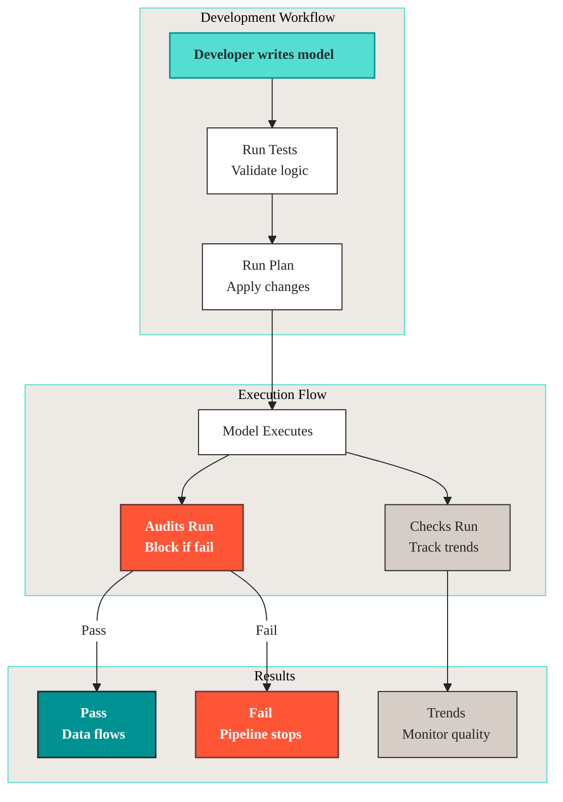

# Data quality

Use **Assertions**, **Checks**, and **Tests** together to keep data quality in your Orders360 project.

Three tools, three jobs. Tests catch logic bugs in your transformations before they run anywhere. Assertions block bad rows at write time. Checks watch for trends and anomalies without blocking the pipeline.

***

## The three-layer quality strategy

```mermaid
%%{init: {"theme":"base","themeVariables":{"fontFamily":"PP Neue Montreal, Inter, Helvetica Neue, Arial, sans-serif","fontSize":"14px","primaryColor":"#EDE9E5","primaryTextColor":"#242422","primaryBorderColor":"#242422","lineColor":"#242422","secondaryColor":"#D6CDC6","tertiaryColor":"#FFFFFF","clusterBkg":"#EDE9E5","clusterBorder":"#54DED1","edgeLabelBackground":"#FFFFFF"},"flowchart":{"curve":"basis","padding":12,"nodeSpacing":40,"rankSpacing":50}}}%%
flowchart TB
    subgraph "Layer 1: Audits - Critical Blocking"
        AUDIT[Audits<br/>Block invalid data<br/>Run with model]
        EXAMPLES1["• Primary keys unique<br/>• Revenue non-negative<br/>• Foreign keys valid"]
    end

    subgraph "Layer 2: Checks - Monitoring"
        CHECK[Checks<br/>Track quality trends<br/>Non-blocking]
        EXAMPLES2["• Row count anomalies<br/>• Completeness trends<br/>• Cross-model validation"]
    end

    subgraph "Layer 3: Tests - Logic Validation"
        TEST[Tests<br/>Validate transformations<br/>Unit testing]
        EXAMPLES3["• SQL logic correct<br/>• Expected outputs<br/>• Edge cases"]
    end

    AUDIT --> EXAMPLES1
    CHECK --> EXAMPLES2
    TEST --> EXAMPLES3

    classDef ember        fill:#FF5537,color:#FFFFFF,stroke:#733635,stroke-width:1.5px,font-weight:600;
    classDef primary-teal fill:#54DED1,color:#202F36,stroke:#009293,stroke-width:1.5px,font-weight:600;
    classDef sandpaper    fill:#D6CDC6,color:#242422,stroke:#242422,stroke-width:1px;
    classDef surface      fill:#FFFFFF,color:#242422,stroke:#242422,stroke-width:1px;

    class AUDIT ember;
    class CHECK sandpaper;
    class TEST primary-teal;
    class EXAMPLES1,EXAMPLES2,EXAMPLES3 surface;
```



**When to use each:**

| Tool           | Purpose             | Blocks pipeline? | Best for                       |
| -------------- | ------------------- | ---------------- | ------------------------------ |
| **Assertions** | Critical validation | Yes (always)     | Business rules, data integrity |
| **Checks**     | Quality monitoring  | No               | Trends, anomalies, monitoring  |
| **Tests**      | Logic validation    | No               | SQL correctness, edge cases    |

The key difference: Assertions stop everything if they fail. Checks and tests warn you, so you can investigate without blocking production.

***

## Quick reference

### Assertions: critical blocking validation

**Use assertions when:** Data must be correct or the pipeline should stop. These are your "must never fail" rules. If an assertion fails, something is wrong and you don't want that bad data flowing downstream.

```sql
MODEL (
  name sales.daily_sales,
  assertions (
    -- Primary key validation
    not_null(columns := (order_date)),
    unique_values(columns := (order_date)),
    
    -- Business rules
    positive_values(column := total_revenue),
    accepted_range(column := total_orders, min_v := 0, max_v := 10000)
  )
);
```

**Why assertions are useful:**

* Always blocking. If they fail, execution stops immediately. No bad data gets through.
* Run automatically with model execution. You don't have to remember to run them.
* Fast feedback during development. Catch issues before they hit production.
* Use for critical business rules like "revenue must be positive" or "primary keys must be unique".

Assertions block at write time: if the audit finds bad rows, execution stops before they reach production.

### Data quality: quality monitoring

**Use Data Quality rule packs when:** You want to monitor trends and detect anomalies over time. Unlike assertions, Data Quality rules don't block your pipeline. They watch and warn you when something looks off.

```yaml
# dq/daily_sales.yml
kind: dq
name: daily_sales_dq
depends_on: sales.daily_sales

rules:
  - row_count > 0:
      name: daily_records_exist
      dimension: completeness
      description: "At least one record per day"

  - anomaly detection for total_revenue:
      name: revenue_anomaly
      dimension: accuracy
      description: "Detect unusual revenue patterns"
```

**Why checks are useful:**

* Non-blocking. Warnings, not failures. Your pipeline keeps running even when a check flags something.
* Historical tracking. See trends over time. Spot patterns like "revenue always drops on weekends" or "row counts are trending down".
* Anomaly detection. Statistical analysis. Checks detect when something is statistically unusual, even when it's not technically wrong.
* Use for monitoring and alerting. Set up alerts for when checks fail, so you know to investigate.

Checks monitor everything and alert you when something suspicious happens, but they don't stop execution.

### Tests: logic validation

**Use tests when:** You need to validate SQL transformations and edge cases. These are your unit tests for SQL. They make sure your logic is correct before you deploy.

```yaml
# tests/test_daily_sales.yaml
tests:
  - name: test_daily_sales_aggregation
    model: sales.daily_sales
    inputs:
      raw.raw_orders:
        - order_id: ORD-001
          order_date: 2025-01-15
          total_amount: 100.50
    outputs:
      - order_date: 2025-01-15
        total_orders: 1
        total_revenue: 100.50
```

**Why tests are useful:**

* Unit testing for SQL logic. Test your transformations in isolation.
* Validate expected outputs. Confirm you're getting the results you expect.
* Test edge cases. What happens with empty data? Null values? Boundary conditions?
* Use during development. Catch bugs before they reach production.

Tests run in a controlled environment before production.

***

## Complex example: Orders360 daily sales

See how all three tools work together for the `sales.daily_sales` model. This example shows how to layer these tools.

### The model

```sql
MODEL (
  name sales.daily_sales,
  kind FULL,
  cron '@daily',
  grains (order_date),
  tags ('silver', 'sales', 'aggregation'),
  terms ('sales.daily_metrics'),
  description 'Daily sales summary with order counts and revenue',
  assertions (
    -- Audit: Critical validations
    not_null(columns := (order_date, total_orders, total_revenue)),
    unique_values(columns := (order_date)),
    positive_values(column := total_orders),
    positive_values(column := total_revenue),
    accepted_range(column := total_revenue, min_v := 0, max_v := 1000000)
  )
);

SELECT
  CAST(order_date AS TIMESTAMP)::TIMESTAMP AS order_date,
  COUNT(order_id)::INTEGER AS total_orders,
  SUM(total_amount)::FLOAT AS total_revenue,
  MAX(order_id)::VARCHAR AS last_order_id
FROM raw.raw_orders
GROUP BY order_date
ORDER BY order_date
```

### Layer 1: assertions (critical blocking)

**Why:** These rules must never fail. Invalid data should not flow downstream. If revenue is negative or primary keys aren't unique, that's a critical problem that needs to stop everything immediately.

```sql
-- audits/revenue_consistency.sql
AUDIT (name assert_revenue_consistency);
-- Ensure revenue matches sum of individual orders
SELECT 
  ds.order_date,
  ds.total_revenue,
  SUM(o.total_amount) as calculated_revenue
FROM @this_model ds
JOIN raw.raw_orders o ON DATE(o.order_date) = ds.order_date
GROUP BY ds.order_date, ds.total_revenue
HAVING ABS(ds.total_revenue - SUM(o.total_amount)) > 0.01;
```

**Attach to model:**

```sql
MODEL (
  name sales.daily_sales,
  assertions (
    -- ... other audits ...
    assert_revenue_consistency  -- Custom audit
  )
);
```

### Layer 2: data quality (monitoring)

**Why:** Monitor trends and detect anomalies without blocking the pipeline. You want to know when revenue spikes unexpectedly or row counts drop, but these might be legitimate business events. Investigate rather than block.

```yaml
# dq/daily_sales.yml
kind: dq
name: daily_sales_dq
depends_on: sales.daily_sales

rules:
  # Completeness: ensure data exists
  - row_count > 0:
      name: daily_records_exist
      dimension: completeness
      description: "At least one record per day"

  - missing_count(order_date) = 0:
      name: no_missing_dates
      dimension: completeness
      description: "All dates must be present"

  # Validity: check data ranges
  - failed rows:
      name: revenue_outliers
      dimension: validity
      fail query: |
        SELECT order_date, total_revenue
        FROM sales.daily_sales
        WHERE total_revenue > 500000 OR total_revenue < 0
      samples limit: 10
      description: "Revenue outside expected range"

  # Accuracy: anomaly detection
  - anomaly detection for total_revenue:
      name: revenue_anomaly
      dimension: accuracy
      description: "Detect unusual revenue patterns"

  - anomaly detection for total_orders:
      name: order_count_anomaly
      dimension: accuracy
      description: "Detect unusual order volume"

  # Consistency: cross-model validation
  - failed rows:
      name: revenue_mismatch_with_raw
      dimension: consistency
      fail query: |
        SELECT
          ds.order_date,
          ds.total_revenue AS daily_revenue,
          SUM(o.total_amount) AS raw_revenue
        FROM sales.daily_sales ds
        LEFT JOIN raw.raw_orders o
          ON DATE(o.order_date) = ds.order_date
        GROUP BY ds.order_date, ds.total_revenue
        HAVING ABS(ds.total_revenue - SUM(o.total_amount)) > 1.0
      samples limit: 5
      description: "Daily revenue should match sum of raw orders"

  # Timeliness: check data freshness
  - change for row_count >= -20%:
      name: row_count_drop_alert
      dimension: timeliness
      description: "Alert if daily records drop more than 20%"
```

### Layer 3: tests (logic validation)

**Why:** Validate SQL logic and edge cases during development. Before you deploy, confirm your SQL does what you think it does. Tests catch logic errors early.

```yaml
# tests/test_daily_sales.yaml
tests:
  - name: test_daily_sales_single_order
    model: sales.daily_sales
    inputs:
      raw.raw_orders:
        - order_id: ORD-001
          order_date: 2025-01-15
          customer_id: CUST-001
          product_id: PROD-001
          total_amount: 100.50
    outputs:
      - order_date: 2025-01-15
        total_orders: 1
        total_revenue: 100.50
        last_order_id: ORD-001
  
  - name: test_daily_sales_multiple_orders
    model: sales.daily_sales
    inputs:
      raw.raw_orders:
        - order_id: ORD-001
          order_date: 2025-01-15
          total_amount: 100.00
        - order_id: ORD-002
          order_date: 2025-01-15
          total_amount: 200.00
        - order_id: ORD-003
          order_date: 2025-01-15
          total_amount: 50.00
    outputs:
      - order_date: 2025-01-15
        total_orders: 3
        total_revenue: 350.00
        last_order_id: ORD-003
  
  - name: test_daily_sales_empty_day
    model: sales.daily_sales
    inputs:
      raw.raw_orders: []
    outputs: []
  
  - name: test_daily_sales_date_grouping
    model: sales.daily_sales
    inputs:
      raw.raw_orders:
        - order_id: ORD-001
          order_date: 2025-01-15 10:00:00
          total_amount: 100.00
        - order_id: ORD-002
          order_date: 2025-01-15 15:30:00
          total_amount: 200.00
        - order_id: ORD-003
          order_date: 2025-01-16 09:00:00
          total_amount: 150.00
    outputs:
      - order_date: 2025-01-15
        total_orders: 2
        total_revenue: 300.00
      - order_date: 2025-01-16
        total_orders: 1
        total_revenue: 150.00
```

***

## How they work together



**Execution order:**

1. **Tests** run during development (validate logic). Catch bugs before deployment.
2. **Plan** applies changes to environment. Your changes go live.
3. **Model** executes transformation. Data gets processed.
4. **Assertions** run immediately (block if fail). Critical validation happens right away.
5. **Checks** run (track trends, don't block). Monitoring happens in the background.

Tests run first against fixtures. Assertions run with the model and stop the run on failure. Checks run alongside to track quality over time. Each layer catches what the previous one isn't designed to.

***

## Complex scenario: revenue validation

This example shows how assertions and checks work together to validate revenue data: critical blocking vs. monitoring.

### The problem

We need to ensure:

1. **Critical:** Revenue is always positive (assertion: blocks)
2. **Critical:** Daily totals match raw order sums (assertion: blocks)
3. **Monitoring:** Revenue trends are normal (check: warns)
4. **Monitoring:** Detect unusual spikes/drops (check: warns)

### Solution: combined approach

**Assertions (critical, blocking):**

```sql
MODEL (
  name sales.daily_sales,
  assertions (
    -- Basic validation
    positive_values(column := total_revenue),
    not_null(columns := (order_date, total_revenue)),
    
    -- Complex validation: Revenue consistency
    assert_revenue_matches_raw_orders
  )
);

-- audits/revenue_matches_raw.sql
AUDIT (name assert_revenue_matches_raw_orders);
SELECT 
  ds.order_date,
  ds.total_revenue as daily_total,
  COALESCE(SUM(o.total_amount), 0) as raw_total,
  ABS(ds.total_revenue - COALESCE(SUM(o.total_amount), 0)) as difference
FROM @this_model ds
LEFT JOIN raw.raw_orders o 
  ON DATE(o.order_date) = ds.order_date
GROUP BY ds.order_date, ds.total_revenue
HAVING ABS(ds.total_revenue - COALESCE(SUM(o.total_amount), 0)) > 0.01;
```

**Data Quality rule pack (monitoring, non-blocking):**

```yaml
# dq/revenue_monitoring.yml
kind: dq
name: revenue_monitoring_dq
depends_on: sales.daily_sales

rules:
  # Anomaly detection for revenue
  - anomaly detection for total_revenue:
      name: revenue_anomaly_detection
      dimension: accuracy
      description: "Detect statistically unusual revenue"

  # Trend monitoring
  - change for total_revenue >= 50%:
      name: revenue_spike_alert
      dimension: accuracy
      description: "Alert if revenue increases >50% day-over-day"

  - change for total_revenue <= -30%:
      name: revenue_drop_alert
      dimension: accuracy
      description: "Alert if revenue drops >30% day-over-day"

  # Cross-model validation (non-blocking)
  - failed rows:
      name: revenue_vs_raw_check
      dimension: consistency
      fail query: |
        SELECT
          ds.order_date,
          ds.total_revenue,
          SUM(o.total_amount) AS raw_sum,
          ABS(ds.total_revenue - SUM(o.total_amount)) AS diff
        FROM sales.daily_sales ds
        LEFT JOIN raw.raw_orders o
          ON DATE(o.order_date) = ds.order_date
        GROUP BY ds.order_date, ds.total_revenue
        HAVING ABS(ds.total_revenue - SUM(o.total_amount)) > 10.0
      samples limit: 5
      description: "Monitor revenue consistency (wider tolerance than audit)"
```

**Why both?**

You need both an assertion and a check for revenue:

* **Assertion:** Stops the pipeline when revenue is wrong (critical). If daily totals don't match raw orders, that's a data integrity issue and everything stops.
* **Check:** Warns about trends and anomalies (monitoring). If revenue spikes 50% day-over-day, that might be legitimate (big sale) or a problem. Investigate, don't block.
* **Together:** Critical issues blocked, trends monitored. You get both immediate protection and ongoing visibility.

The assertion has a tight tolerance (0.01) because it checks correctness. The check has a wider tolerance (10.0) because it looks for trends, not exact matches.

***

## Running quality tools

### Run tests

```bash
# Run all tests
vulcan test

# Run specific test
vulcan test tests/test_daily_sales.yaml::test_daily_sales_single_order

# Run tests matching pattern
vulcan test tests/test_daily*
```

### Run assertions

```bash
# Run all audits
vulcan audit

# Audits also run automatically with plan
vulcan plan dev
```

### Run checks

```bash
# Run all checks
vulcan check

# Run checks for specific model
vulcan check --select sales.daily_sales

# Checks also run automatically with plan/run
vulcan plan dev
```

***

## Best practices

### Do

1. **Start with assertions.** Add critical blocking validations first. Get your safety net in place before worrying about trends.
2. **Add checks gradually.** Monitor trends, then add anomaly detection. Build monitoring over time.
3. **Test during development.** Write tests before deploying. Catch logic errors before they hit production.
4. **Use descriptive names.** Names like `revenue_mismatch_with_raw` beat `check_1`.
5. **Order assertions efficiently.** Fast checks first, slow checks last. Fail fast.

### Don't

1. **Don't use checks for critical rules.** Use assertions instead. If it's critical, it should block. Checks are for monitoring, not blocking.
2. **Don't skip assertion failures.** Fix the root cause. If an assertion fails, something is wrong.
3. **Don't over-audit.** Focus on critical business rules. Too many audits slow things down. Only audit what matters.
4. **Don't ignore check trends.** They signal data quality issues. If checks are consistently failing, there's a real problem.

***

## Summary

**Three-layer strategy:**

* **Assertions:** critical blocking validation (must pass)
* **Checks:** quality monitoring (trends, anomalies)
* **Tests:** logic validation (development)

**Use together:**

* Assertions block invalid data
* Checks monitor quality trends
* Tests validate SQL logic

**Orders360 example:**

* Assertions confirm revenue is positive and matches raw data
* Checks detect anomalies and trends
* Tests validate aggregation logic

***

## Next steps

* Learn about [Built-in Assertions](../components/assertions.md#built-in-assertions)
* Explore [Data Quality Dimensions](../components/data-quality.md#data-quality-dimensions)
* Read about [Testing](../components/tests.md)
