# Incremental by time

This guide explains how incremental by time models work in Vulcan using the Orders360 example project. You'll see why they're efficient, how they process data, and how to create them.

See the [models guide](./models.md) for general model information or the [model kinds page](../components/model/model_kinds.md) for all model types.

---

## Why use incremental models?

### The problem: full refreshes are expensive

If you have a table with sales data from the last year (365 days), every `FULL` model run processes all 365 days. This is inefficient when you only need to process today's data.

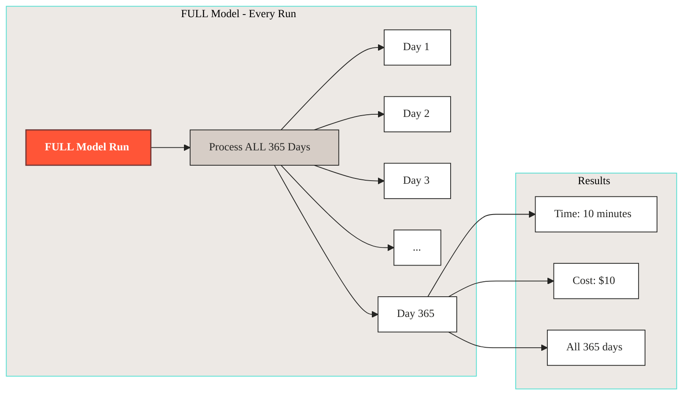

<!-- *[Screenshot: Visual showing FULL model processing all 365 days]* -->

### The solution: only process what's new

With incremental models, Vulcan only processes **new or missing** days:

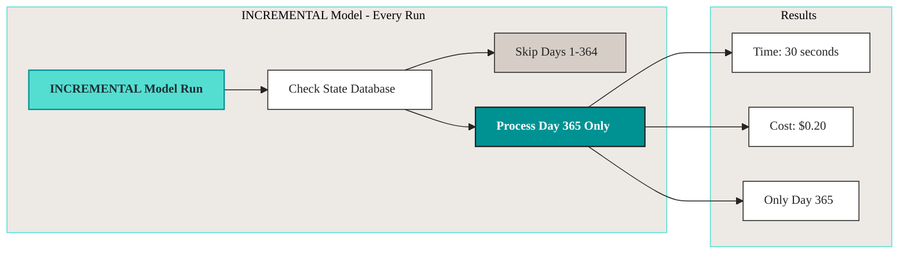

<!-- *[Screenshot: Visual showing incremental model processing only Day 365]* -->

**Result:** 50x faster and 50x cheaper.

Incremental models process only what you need, when you need it.

---

## How incremental models work

Incremental models use **time intervals** to track what's been processed. Think of it like a calendar where Vulcan checks off each day: it knows what's done and what still needs work.

```mermaid
%%{init: {"theme":"base","themeVariables":{"fontFamily":"PP Neue Montreal, Inter, Helvetica Neue, Arial, sans-serif","fontSize":"14px","primaryColor":"#EDE9E5","primaryTextColor":"#242422","primaryBorderColor":"#242422","lineColor":"#242422","secondaryColor":"#D6CDC6","tertiaryColor":"#FFFFFF","clusterBkg":"#EDE9E5","clusterBorder":"#54DED1","edgeLabelBackground":"#FFFFFF"},"flowchart":{"curve":"basis","padding":12,"nodeSpacing":40,"rankSpacing":50}}}%%
flowchart TB
    subgraph "Incremental Processing Flow"
        START[vulcan run]
        CHECK[Check State Database<br/>What's already processed?]

        subgraph "State Database"
            PROCESSED1[Jan 1-7: Processed]
            PROCESSED2[Jan 8-14: Processed]
            MISSING[Jan 15-21: Missing]
        end

        CALC[Calculate Missing Intervals<br/>Jan 15-21 needs processing]
        SET_MACROS[Set Macros<br/>@start_ds = '2025-01-15'<br/>@end_ds = '2025-01-21']
        QUERY[Run Query<br/>WHERE order_date BETWEEN @start_ds AND @end_ds]
        INSERT[Insert Results<br/>Into weekly_sales table]
        UPDATE[Update State<br/>Mark Jan 15-21 as processed]
    end

    START --> CHECK
    CHECK --> PROCESSED1
    CHECK --> PROCESSED2
    CHECK --> MISSING

    MISSING --> CALC
    CALC --> SET_MACROS
    SET_MACROS --> QUERY
    QUERY --> INSERT
    INSERT --> UPDATE

    UPDATE --> PROCESSED1
    UPDATE --> PROCESSED2

    classDef primary-teal fill:#54DED1,color:#202F36,stroke:#009293,stroke-width:1.5px,font-weight:600;
    classDef dark-teal    fill:#009293,color:#FFFFFF,stroke:#242422,stroke-width:1.5px,font-weight:600;
    classDef iron         fill:#35505B,color:#FFFFFF,stroke:#54DED1,stroke-width:1.5px,font-weight:600;
    classDef ember        fill:#FF5537,color:#FFFFFF,stroke:#733635,stroke-width:1.5px,font-weight:600;
    classDef sandpaper    fill:#D6CDC6,color:#242422,stroke:#242422,stroke-width:1px;
    classDef surface      fill:#FFFFFF,color:#242422,stroke:#242422,stroke-width:1px;

    class START primary-teal;
    class CHECK surface;
    class PROCESSED1,PROCESSED2 dark-teal;
    class MISSING ember;
    class CALC sandpaper;
    class SET_MACROS iron;
    class QUERY surface;
    class INSERT,UPDATE dark-teal;
```

### Vulcan checks what's already done

When you run `vulcan run`, Vulcan looks at your state database and asks:

- "What dates have I already processed?" These are done, skip them.

- "What dates are missing?" These need work, process them.

It's like checking your to-do list: you only work on what's not done yet.

```
State Database Check:
Jan 1-7:   Already processed
Jan 8-14:  Already processed  
Jan 15-21: Missing - needs processing
```

<!-- *[Screenshot: Visual diagram showing state database check with processed vs missing intervals]* -->

### Vulcan processes only missing intervals

Vulcan processes only the missing dates. It sets the macros (`@start_ds` and `@end_ds`) and runs your query for just that time range:

```
Processing Jan 15-21:
@start_ds = '2025-01-15'
@end_ds   = '2025-01-21'

Query runs:
SELECT ... FROM daily_sales
WHERE order_date BETWEEN '2025-01-15' AND '2025-01-21'
```

<!-- *[Screenshot: Visual showing how @start_ds and @end_ds are used in the query]* -->

### Results are inserted

The processed data is inserted into your table, and Vulcan records that these dates are now complete. Next time you run, it knows these dates are done and skips them.

```
Jan 15-21: Now processed and recorded
```

<!-- *[Screenshot: Visual showing data insertion and state update]* -->

---

## Understanding time intervals

Vulcan divides time into **intervals** based on your model's schedule. Each interval is a chunk of time that gets processed together: a day, a week, or an hour, depending on your model's `cron` schedule.

### Daily intervals example

For a daily model (`cron '@daily'`), each day is one interval:

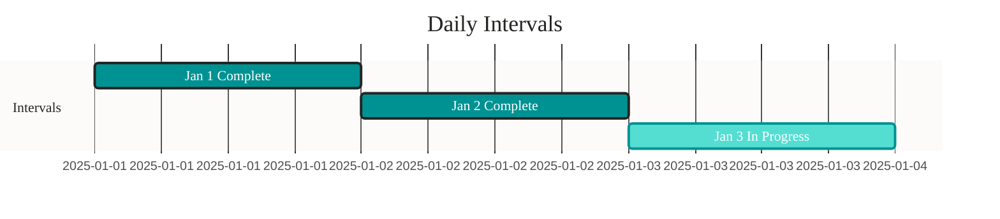

```
Model Start: Jan 1, 2025
Today: Jan 3, 2025 at 2pm

Intervals:
- Jan 1: Complete (full day passed)

- Jan 2: Complete (full day passed)

- Jan 3: In progress (day not finished yet)
```

<!-- *[Screenshot: Calendar view showing daily intervals with Jan 1-2 complete, Jan 3 in progress]* -->

### Weekly intervals example

For a weekly model (`cron '@weekly'`), each week is one interval:

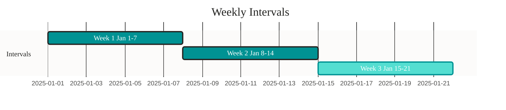

```
Model Start: Jan 1, 2025
Today: Jan 15, 2025

Intervals:
- Week 1 (Jan 1-7):   Complete

- Week 2 (Jan 8-14):  Complete

- Week 3 (Jan 15-21): In progress
```

<!-- *[Screenshot: Calendar view showing weekly intervals]* -->

### How Vulcan tracks intervals

When you first run `vulcan plan` on an incremental model, Vulcan:

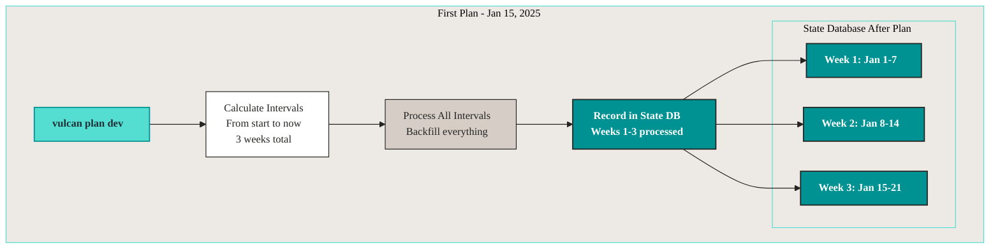

1. **Calculates all intervals** from the start date to now
2. **Processes all missing intervals** (backfill)
3. **Records what was processed** in the state database

```
First Plan (Jan 15, 2025):
- Calculates: 3 weeks of intervals

- Processes: All 3 weeks

- Records: "Weeks 1-3 processed"

State Database:
Week 1 (Jan 1-7)
Week 2 (Jan 8-14)
Week 3 (Jan 15-21)
```

<!-- *[Screenshot: Visual showing first plan calculating and processing all intervals]* -->

When you run `vulcan run` later, Vulcan:

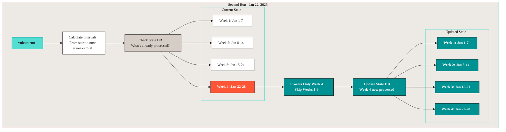

1. **Calculates intervals** from start to now
2. **Compares** with what's already processed
3. **Processes only new intervals**

```
Second Run (Jan 22, 2025):
- Calculates: 4 weeks total

- Already processed: Weeks 1-3

- Missing: Week 4 (Jan 22-28)

- Processes: Only Week 4

State Database:
Week 1 (Jan 1-7)
Week 2 (Jan 8-14)
Week 3 (Jan 15-21)
Week 4 (Jan 22-28) ← NEW
```

<!-- *[Screenshot: Visual showing second run processing only new Week 4]* -->

---

## Creating an incremental model

Create a weekly sales aggregation model for Orders360.

### Create the model file

```bash
touch models/sales/weekly_sales.sql
```

<!-- *[Screenshot: File explorer showing new weekly_sales.sql file]* -->

### Define the model

Edit `models/sales/weekly_sales.sql`:

```sql
MODEL (
  name sales.weekly_sales,
  kind INCREMENTAL_BY_TIME_RANGE (
    time_column order_date,  -- ⏰ This column contains the date
    batch_size 1             -- Process 1 week at a time
  ),
  start '2025-01-01',       -- Start processing from this date
  cron '@weekly',            -- Run weekly
  grain [order_date],        -- One row per week
  description 'Weekly aggregated sales metrics'
);

SELECT
  DATE_TRUNC('week', order_date) AS order_date,
  COUNT(DISTINCT order_id)::INTEGER AS total_orders,
  SUM(total_amount)::FLOAT AS total_revenue,
  AVG(total_amount)::FLOAT AS avg_order_value
FROM sales.daily_sales
WHERE order_date BETWEEN @start_ds AND @end_ds  -- Filter by time range
GROUP BY DATE_TRUNC('week', order_date)
ORDER BY order_date
```

<!-- *[Screenshot: Code editor showing complete weekly_sales.sql model]* -->

### Key components explained

#### 1. Time column declaration

```sql
kind INCREMENTAL_BY_TIME_RANGE (
  time_column order_date  -- Tell Vulcan which column has dates
)
```

**What it does:** Tells Vulcan which column contains the timestamp/date for each row. Vulcan uses this to filter and group your data by time.

<!-- *[Screenshot: Code highlighting time_column declaration]* -->

#### 2. WHERE clause with macros

```sql
WHERE order_date BETWEEN @start_ds AND @end_ds
```

**What it does:** Filters data to only the time range being processed. Without it, you'd process all your data every time.

- `@start_ds`: start date of the interval (e.g., '2025-01-15')

- `@end_ds`: end date of the interval (e.g., '2025-01-21')

Vulcan replaces these with the correct dates. You don't figure out what dates to process: Vulcan does that for you.

<!-- *[Screenshot: Code highlighting WHERE clause with macros, showing how they're replaced]* -->

#### 3. Start date

```sql
start '2025-01-01'
```

**What it does:** Tells Vulcan when your data begins. Vulcan backfills from this date when you first create the model, processing all historical data up to today.

<!-- *[Screenshot: Code highlighting start date]* -->

### Apply the model

Run `vulcan plan` to apply your new model:

```bash
vulcan plan dev
```

**Expected output:**
```
======================================================================
Successfully Ran 2 tests against postgres
----------------------------------------------------------------------

Differences from the `prod` environment:

Models:
└── Added:
    └── sales.weekly_sales

Models needing backfill (missing dates):
└── sales.weekly_sales: 2025-01-01 - 2025-01-15

Apply - Backfill Tables [y/n]: y
```

<!-- *[Screenshot: Plan output showing weekly_sales model to be added]* -->

Vulcan processes each week incrementally:

```
[1/3] sales.weekly_sales  [insert 2025-01-01 - 2025-01-07]  1.2s
[2/3] sales.weekly_sales  [insert 2025-01-08 - 2025-01-14]  1.1s
[3/3] sales.weekly_sales  [insert 2025-01-15 - 2025-01-21]  1.3s

Executing model batches ━━━━━━━━━━━━━━━━━━━━━━━━━━━━━━━━━━━━━━━━ 100.0% • 3/3 • 0:00:03

✔ Model batches executed
✔ Plan applied successfully
```

<!-- *[Screenshot: Backfill progress showing each week being processed]* -->

---

## Real example: daily sales from Orders360

Here's the actual `daily_sales` model from Orders360 (currently FULL, but could be incremental):

```sql
MODEL (
  name sales.daily_sales,
  kind FULL,  -- Could be INCREMENTAL_BY_TIME_RANGE
  cron '@daily',
  grains (order_date),
  tags ('silver', 'sales', 'aggregation'),
  terms ('sales.daily_metrics', 'analytics.sales_summary'),
  description 'Daily sales summary with order counts and revenue',
  column_descriptions (
    order_date = 'Date of the sales',
    total_orders = 'Total number of orders for the day',
    total_revenue = 'Total revenue for the day',
    last_order_id = 'Last order ID processed for the day'
  ),
  column_tags (
    order_date = ('dimension', 'grain', 'date'),
    total_orders = ('measure', 'count'),
    total_revenue = ('measure', 'financial'),
    last_order_id = ('dimension', 'identifier')
  ),
  assertions (
    unique_values(columns := (order_date)),
    not_null(columns := (order_date, total_orders, total_revenue)),
    positive_values(column := total_orders),
    positive_values(column := total_revenue)
  )
);

SELECT
  CAST(order_date AS TIMESTAMP)::TIMESTAMP AS order_date,
  COUNT(order_id)::INTEGER AS total_orders,
  SUM(total_amount)::FLOAT AS total_revenue,
  MAX(order_id)::VARCHAR AS last_order_id
FROM raw.raw_orders
GROUP BY order_date
ORDER BY order_date
```

<!-- *[Screenshot: daily_sales.sql file showing complete model]* -->

**To make this incremental:**

1. Change `kind FULL` to `kind INCREMENTAL_BY_TIME_RANGE`
2. Add `time_column order_date`
3. Add `WHERE order_date BETWEEN @start_ds AND @end_ds`

```sql
MODEL (
  name sales.daily_sales,
    kind INCREMENTAL_BY_TIME_RANGE (
    time_column order_date
  ),
  start '2025-01-01',
  cron '@daily',
  -- ... rest stays the same
);

SELECT
  CAST(order_date AS TIMESTAMP)::TIMESTAMP AS order_date,
  COUNT(order_id)::INTEGER AS total_orders,
  SUM(total_amount)::FLOAT AS total_revenue,
  MAX(order_id)::VARCHAR AS last_order_id
FROM raw.raw_orders
WHERE order_date BETWEEN @start_ds AND @end_ds  -- ADD THIS
GROUP BY order_date
ORDER BY order_date
```

<!-- *[Screenshot: Comparison showing FULL vs INCREMENTAL changes]* -->

---

## Understanding the WHERE clause

You might ask: "Why do I need a WHERE clause if Vulcan adds one automatically?" They serve different purposes.

### Two WHERE clauses, two purposes

Vulcan uses **two** WHERE clauses.

#### 1. Your model's WHERE clause

```sql
WHERE order_date BETWEEN @start_ds AND @end_ds
```

**Purpose:** filters data **read into** the model.

- Only reads necessary data from upstream tables. Performance optimization.

- Saves processing time and resources.

- You control this in your SQL.

This is your optimization. Without it, you'd read all the data from upstream tables, even though you only need a small date range.

<!-- *[Screenshot: Visual showing model WHERE clause filtering input data]* -->

#### 2. Vulcan's automatic WHERE clause

Vulcan automatically adds another filter on the output:

```sql
-- Vulcan adds this automatically:
WHERE order_date BETWEEN @start_ds AND @end_ds
```

**Purpose:** filters data **output by** the model.

- Prevents data leakage (no rows outside the time range). Safety check.

- Safety mechanism: even if your SQL has a bug, Vulcan makes sure you don't output wrong dates.

- Vulcan controls this automatically.

This is Vulcan's safety net. Even if your WHERE clause has a bug, you can't accidentally output data for the wrong time period.

<!-- *[Screenshot: Visual showing Vulcan's automatic WHERE clause filtering output]* -->

### Why both are needed

You need both:

- **Your WHERE clause:** optimizes performance by reading less data. Makes your queries faster.

- **Vulcan's WHERE clause:** keeps correctness by preventing data leakage.

**Always include the WHERE clause in your model SQL.** It's not optional. Vulcan needs it to know what time range to process, and it makes your queries far more efficient.

<!-- *[Screenshot: Side-by-side comparison showing both WHERE clauses and their purposes]* -->

---

## Running incremental models

Vulcan has two commands for processing models.

### `vulcan plan`: for model changes

Use when you've **changed a model**:

```bash
vulcan plan dev
```

**What it does:**

- Detects model changes

- Shows what will be affected

- Backfills missing intervals

- Applies changes to the environment

<!-- *[Screenshot: Plan command output showing model changes]* -->

### `vulcan run`: for scheduled execution

Use when **no models have changed**:

```bash
vulcan run
```

**What it does:**

- Checks each model's `cron` schedule

- Processes only models that are due

- Processes only missing intervals

- Fast and efficient

<!-- *[Screenshot: Run command output showing scheduled execution]* -->

### How cron schedules work

Each model has a `cron` parameter that sets how often it runs:

```mermaid
%%{init: {"theme":"base","themeVariables":{"fontFamily":"PP Neue Montreal, Inter, Helvetica Neue, Arial, sans-serif","fontSize":"14px","primaryColor":"#EDE9E5","primaryTextColor":"#242422","primaryBorderColor":"#242422","lineColor":"#242422","secondaryColor":"#D6CDC6","tertiaryColor":"#FFFFFF","clusterBkg":"#EDE9E5","clusterBorder":"#54DED1","edgeLabelBackground":"#FFFFFF"},"flowchart":{"curve":"basis","padding":12,"nodeSpacing":40,"rankSpacing":50}}}%%
flowchart LR
    subgraph "Cron Schedules"
        DAILY[@daily<br/>Every 24 hours]
        WEEKLY[@weekly<br/>Every 7 days]
        HOURLY[@hourly<br/>Every 1 hour]
    end

    subgraph "Example Models"
        M1[sales.daily_sales<br/>cron: @daily]
        M2[sales.weekly_sales<br/>cron: @weekly]
    end

    DAILY --> M1
    WEEKLY --> M2

    classDef primary-teal fill:#54DED1,color:#202F36,stroke:#009293,stroke-width:1.5px,font-weight:600;
    classDef dark-teal    fill:#009293,color:#FFFFFF,stroke:#242422,stroke-width:1.5px,font-weight:600;

    class DAILY,WEEKLY,HOURLY primary-teal;
    class M1,M2 dark-teal;
```

```sql
cron '@daily'   -- Run once per day
cron '@weekly'  -- Run once per week
cron '@hourly'  -- Run once per hour
```

**Example from Orders360:**

```sql
-- Daily model
MODEL (
  name sales.daily_sales,
  cron '@daily'  -- Runs every day
);

-- Weekly model
MODEL (
  name sales.weekly_sales,
  cron '@weekly'  -- Runs once per week
);
```

<!-- *[Screenshot: Visual showing cron schedules for daily vs weekly models]* -->

When you run `vulcan run`:

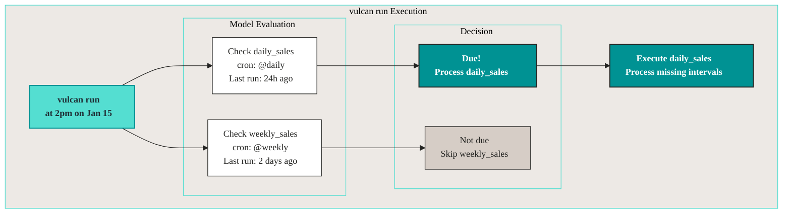

1. Vulcan checks each model's `cron`.
2. Determines if enough time has passed since the last run.
3. Processes only models that are due.

```
vulcan run at 2pm on Jan 15:

daily_sales (@daily):   Last run 24h ago → Due, process!
weekly_sales (@weekly): Last run 2 days ago → Not due, skip
```

<!-- *[Screenshot: Visual showing cron evaluation logic]* -->

---

## Batch processing

For large datasets, process intervals in batches using `batch_size`:

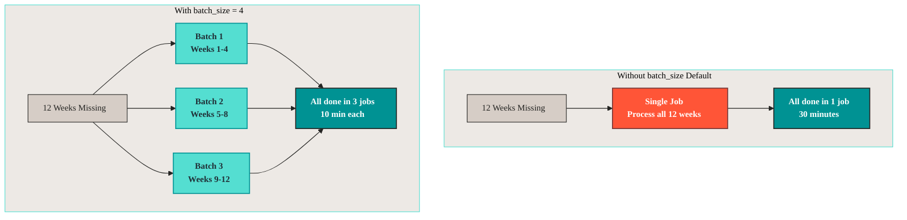

```sql
MODEL (
  name sales.weekly_sales,
    kind INCREMENTAL_BY_TIME_RANGE (
    time_column order_date,
    batch_size 4  -- Process 4 weeks at a time
  )
);
```

**Without batch_size (default):**

- Processes all missing intervals in one job

- Example: 12 weeks = 1 job

**With batch_size:**

- Divides intervals into batches

- Example: 12 weeks ÷ 4 = 3 jobs

<!-- *[Screenshot: Visual comparison showing batch processing vs single job]* -->

**When to use batches:**

- Large datasets that might timeout

- Need better progress tracking

- Want to parallelize processing

**When not to use batches:**

- Small datasets (< 1GB)

- Fast queries (< 1 minute)

- Simple transformations

---

## Forward-only models

Sometimes models are so large that rebuilding them is impossible. Forward-only models solve this. Use them for massive tables where a full backfill would take days or cost too much.

### What are forward-only models?

Forward-only models never rebuild historical data. Changes apply only going forward in time. Once historical data is processed, you can't go back and change it. You can only change what happens going forward.

```mermaid
%%{init: {"theme":"base","themeVariables":{"fontFamily":"PP Neue Montreal, Inter, Helvetica Neue, Arial, sans-serif","fontSize":"14px","primaryColor":"#EDE9E5","primaryTextColor":"#242422","primaryBorderColor":"#242422","lineColor":"#242422","secondaryColor":"#D6CDC6","tertiaryColor":"#FFFFFF","clusterBkg":"#EDE9E5","clusterBorder":"#54DED1","edgeLabelBackground":"#FFFFFF"},"flowchart":{"curve":"basis","padding":12,"nodeSpacing":40,"rankSpacing":50}}}%%
flowchart TB
    subgraph "Regular Model Change"
        REG_CHANGE["Breaking Change Detected"]
        REG_REBUILD["Rebuild Entire Table<br/>All dates: Jan 1 - Dec 31"]
        REG_RESULT["All data updated"]
    end

    subgraph "Forward-Only Model Change"
        FWD_CHANGE["Breaking Change Detected<br/>forward_only: true"]
        FWD_CHECK["Check Existing Data<br/>Jan 1 - Dec 15: Keep as-is"]
        FWD_APPLY["Apply Change Forward<br/>Dec 16 - Dec 31: New data"]
        FWD_RESULT["Historical preserved<br/>Future updated"]
    end

    REG_CHANGE --> REG_REBUILD
    REG_REBUILD --> REG_RESULT

    FWD_CHANGE --> FWD_CHECK
    FWD_CHECK --> FWD_APPLY
    FWD_APPLY --> FWD_RESULT

    classDef primary-teal fill:#54DED1,color:#202F36,stroke:#009293,stroke-width:1.5px,font-weight:600;
    classDef dark-teal    fill:#009293,color:#FFFFFF,stroke:#242422,stroke-width:1.5px,font-weight:600;
    classDef ember        fill:#FF5537,color:#FFFFFF,stroke:#733635,stroke-width:1.5px,font-weight:600;
    classDef sandpaper    fill:#D6CDC6,color:#242422,stroke:#242422,stroke-width:1px;
    classDef surface      fill:#FFFFFF,color:#242422,stroke:#242422,stroke-width:1px;

    class REG_CHANGE ember;
    class REG_REBUILD sandpaper;
    class REG_RESULT dark-teal;
    class FWD_CHANGE primary-teal;
    class FWD_CHECK surface;
    class FWD_APPLY,FWD_RESULT dark-teal;
```

**Regular model change:**
```
Breaking change → Rebuild entire table (all dates)
```

**Forward-only model change:**
```
Breaking change → Only apply to new dates going forward
```

<!-- *[Screenshot: Visual comparison showing regular rebuild vs forward-only]* -->

### When to use forward-only

**Use forward-only when:**

- Tables are too large to rebuild. A full backfill would take too long or cost too much.

- Historical data can't be reprocessed. The source data is gone or too expensive to reprocess.

- You only care about future data. Historical data is "good enough" and you just need new data to be correct.

**Don't use forward-only when:**

- You need to fix historical data. Forward-only won't help you fix the past.

- Schema changes affect past data. If your change affects how historical data should look, you need a full rebuild.

- You want full data consistency. Forward-only means historical and new data might have different schemas.

It's a trade-off: you get speed and cost savings, but you lose the ability to fix historical data.

### Making a model forward-only

Add `forward_only true` to your model:

```sql
MODEL (
  name sales.weekly_sales,
    kind INCREMENTAL_BY_TIME_RANGE (
    time_column order_date,
    forward_only true  -- All changes are forward-only
  )
);
```

<!-- *[Screenshot: Code showing forward_only configuration]* -->

### Forward-only plans

You can also make a specific plan forward-only:

```bash
vulcan plan dev --forward-only
```

This treats **all changes in the plan** as forward-only, even if models aren't configured that way.

<!-- *[Screenshot: Plan command with --forward-only flag]* -->

---

## Schema changes in forward-only models

When you change a forward-only model, Vulcan checks for schema changes that could cause problems.

### Types of schema changes

#### Destructive changes

Changes that **remove or modify** existing data:

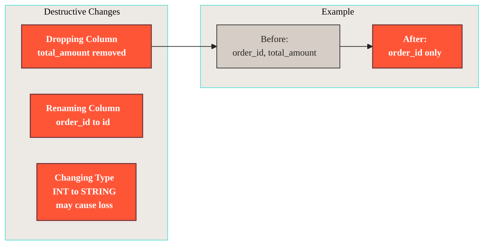

- Dropping a column

- Renaming a column

- Changing data type (could cause data loss)

**Example:**
```sql
-- Before
SELECT order_id, total_amount FROM orders

-- After (destructive - drops total_amount)
SELECT order_id FROM orders
```

<!-- *[Screenshot: Visual showing destructive change example]* -->

#### Additive changes

Changes that **add** new data without removing existing:

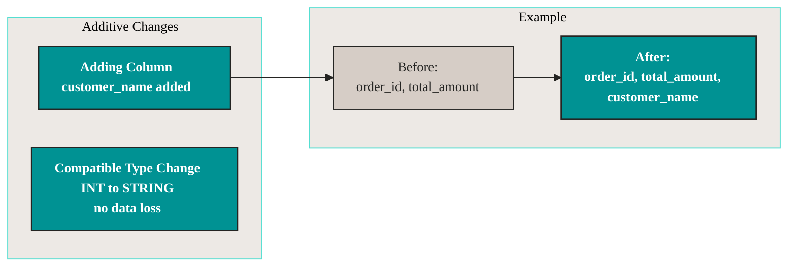

- Adding a new column

- Changing data type (compatible, e.g., INT → STRING)

**Example:**
```sql
-- Before
SELECT order_id, total_amount FROM orders

-- After (additive - adds customer_name)
SELECT order_id, total_amount, customer_name FROM orders
```

<!-- *[Screenshot: Visual showing additive change example]* -->

### Controlling schema change behavior

You can control how Vulcan handles schema changes:

```sql
MODEL (
  name sales.weekly_sales,
    kind INCREMENTAL_BY_TIME_RANGE (
    time_column order_date,
        forward_only true,
        on_destructive_change error,  -- Block destructive changes
    on_additive_change allow      -- Allow new columns
  )
);
```

**Options:**

- `error`: stop and raise an error (default for destructive)

- `warn`: log a warning but continue

- `allow`: silently proceed (default for additive)

- `ignore`: skip the check entirely (dangerous)

<!-- *[Screenshot: Code showing schema change configuration options]* -->

### Common patterns

#### Strict schema control

Prevent any schema changes:

```sql
MODEL (
  name sales.production_model,
    kind INCREMENTAL_BY_TIME_RANGE (
    time_column order_date,
        forward_only true,
    on_destructive_change error,  -- Block destructive
    on_additive_change error       -- Block even new columns
  )
);
```

<!-- *[Screenshot: Strict schema control example]* -->

#### Development model

Allow all changes for rapid iteration:

```sql
MODEL (
  name sales.dev_model,
    kind INCREMENTAL_BY_TIME_RANGE (
    time_column order_date,
        forward_only true,
        on_destructive_change allow,  -- Allow dropping columns
    on_additive_change allow      -- Allow new columns
  )
);
```

<!-- *[Screenshot: Development model example]* -->

#### Production safety

Allow safe changes, warn about risky ones:

```sql
MODEL (
  name sales.production_model,
    kind INCREMENTAL_BY_TIME_RANGE (
    time_column order_date,
        forward_only true,
    on_destructive_change warn,   -- Warn but allow
    on_additive_change allow      -- Allow new columns
  )
);
```

<!-- *[Screenshot: Production safety example]* -->

---

## Important notes

### Time column must be UTC

Always use UTC timezone for your `time_column`:

```sql
-- Good: UTC timezone
time_column order_date_utc

-- Bad: Local timezone
time_column order_date_local
```

**Why?** Keeps interval calculations correct and works with Vulcan's scheduler. Local timezones cause issues with daylight saving time changes, timezone differences, and interval calculations. UTC is consistent everywhere.

<!-- *[Screenshot: Visual warning about UTC requirement]* -->

### Always include WHERE clause

Your model SQL **must** include a WHERE clause with `@start_ds` and `@end_ds`:

```sql
-- Required - This tells Vulcan what time range to process
WHERE order_date BETWEEN @start_ds AND @end_ds

-- Missing WHERE clause - Don't do this

-- WHERE clause is required
```

Without this WHERE clause, Vulcan won't know what time range to process, and your queries will be inefficient (or fail entirely). Always include it.

<!-- *[Screenshot: Code showing required WHERE clause]* -->

### Set a start date

Always specify when your data begins:

```sql
start '2025-01-01'  -- Start processing from this date
```

This tells Vulcan where to start backfilling. If your data goes back to 2020 but you only want to process from 2025, set the start date to 2025-01-01. Vulcan backfills from this date when you first create the model.

<!-- *[Screenshot: Code showing start date configuration]* -->

### Choose appropriate batch_size

- Start with `batch_size 1` for small datasets. Process one interval at a time.

- Increase for larger datasets that might timeout.

- Monitor performance to find the right balance. Too small and you have too many jobs. Too large and jobs timeout.

The default is to process all missing intervals in one job. If that doesn't work, use `batch_size` to break it up.

<!-- *[Screenshot: Visual guide for choosing batch_size]* -->

---

## Summary

**Incremental by time models:**

- Only process new or missing time intervals

- Faster and cheaper than full refreshes

- Use for time-based data (orders, events, transactions)

- Require a time column and WHERE clause

- Use cron schedules to control execution frequency

**Key concepts:**

- **Intervals:** Time periods (days, weeks, hours) that Vulcan tracks

- **Backfill:** Processing historical intervals when first creating a model

- **Cron:** Schedule that determines how often a model runs

- **Forward-only:** Models that never rebuild historical data

---

## Next steps

- Learn about [Model Kinds](../components/model/model_kinds.md) for all model types

