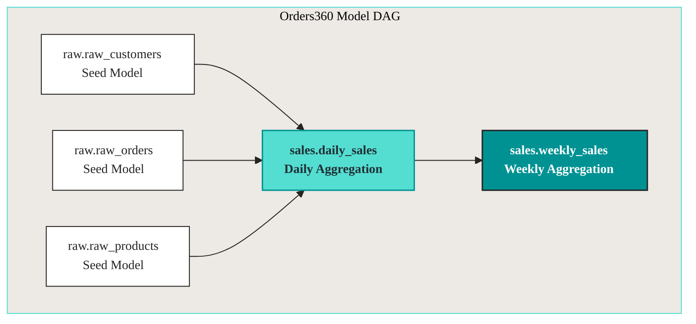
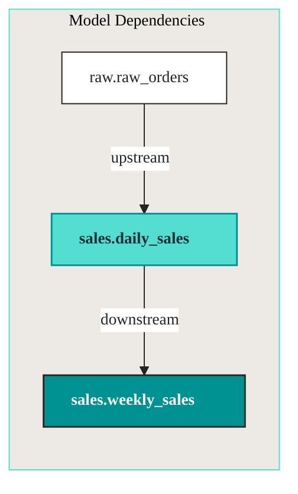
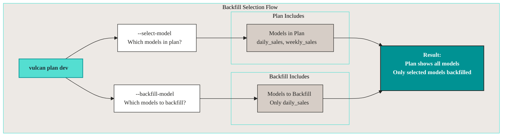
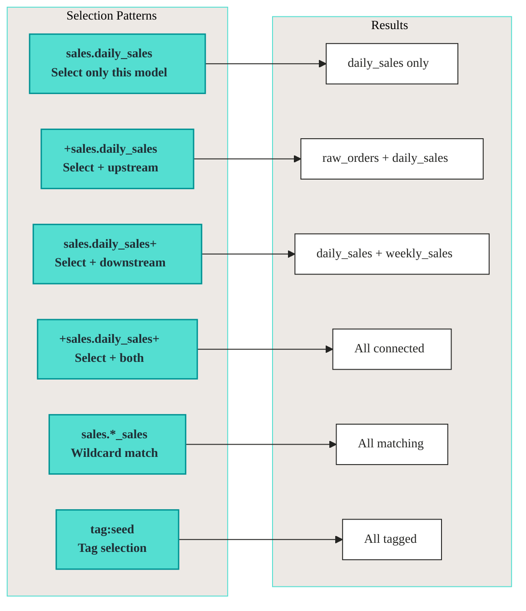

# Model selection

Select specific models to include in a Vulcan plan using the Orders360 example project. Use this when you want to test or apply changes to a subset of your models without processing everything.

In large projects, model selection saves time. Instead of waiting for all models to process, focus on what you're working on.

**Note:** The selector syntax below also works for the Vulcan `plan` [`--allow-destructive-model` and `--allow-additive-model` selectors](plan/plan_guide.md).

***

## Background

A Vulcan [plan](plan/plan_guide.md) detects changes between your local project and the deployed environment. When applied, it backfills directly modified models and their downstream dependencies.

In large projects, a single model change can impact many downstream models, making plans take a long time. Model selection lets you filter which changes to include, so you can test specific models without processing everything.

**Key concept:**

* **Directly modified**: models you changed in your code. These are the ones you actually edited.
* **Indirectly modified**: downstream models affected by your changes. These depend on what you changed, so they need reprocessing.

You're filtering which directly modified models to include, and Vulcan figures out the indirect ones.

***

## Understanding model dependencies

Selection works on top of the model dependency graph: select one model and Vulcan pulls in everything downstream of it. Here's how the models relate in the Orders360 example.



**Dependency flow:**

* `raw.raw_orders` → `sales.daily_sales` → `sales.weekly_sales`
* Changing `raw.raw_orders` affects `daily_sales` (indirectly modified), because daily\_sales reads from raw\_orders.
* Changing `daily_sales` affects `weekly_sales` (indirectly modified), because weekly\_sales reads from daily\_sales.

When you select a model, Vulcan includes its downstream dependencies. You can't process `weekly_sales` without processing `daily_sales` first.

***

## Syntax

Model selections use the `--select-model` argument in `vulcan plan`. The selectors below cover names, patterns, tags, git changes, and combinations.

### Basic selection

Select a single model by name:

```bash
vulcan plan dev --select-model "sales.daily_sales"
```

Select multiple models:

```bash
vulcan plan dev --select-model "sales.daily_sales" --select-model "raw.raw_orders"
```

### Wildcard selection

Use `*` to match multiple models:

```bash
# Select all models starting with "raw."
vulcan plan dev --select-model "raw.*"

# Select all models ending with "_sales"
vulcan plan dev --select-model "sales.*_sales"

# Select all models containing "daily"
vulcan plan dev --select-model "*daily*"
```

**Examples:**

* `"raw.*"` matches `raw.raw_customers`, `raw.raw_orders`, `raw.raw_products`. All models in the raw schema.
* `"sales.*_sales"` matches `sales.daily_sales`, `sales.weekly_sales`. All models ending with \_sales in the sales schema.
* `"*.daily_sales"` matches `sales.daily_sales`. Matches daily\_sales in any schema.

Wildcards let you select a group of related models without listing them all individually.

### Tag selection

Select models by tags using `tag:tag_name`:

```bash
# Select all models with "seed" tag
vulcan plan dev --select-model "tag:seed"

# Select all models with tags starting with "reporting"
vulcan plan dev --select-model "tag:reporting*"
```

**Example:** If `raw.raw_orders` and `raw.raw_customers` have the `seed` tag:

```bash
vulcan plan dev --select-model "tag:seed"
# Selects: raw.raw_orders, raw.raw_customers
```

### Upstream/downstream selection

Use `+` to include upstream or downstream models:

* `+model_name`: include upstream models (dependencies)
* `model_name+`: include downstream models (dependents)



**Examples:**

```bash
# Select daily_sales only
vulcan plan dev --select-model "sales.daily_sales"
# Result: daily_sales (directly modified)

# Select daily_sales + upstream (raw.raw_orders)
vulcan plan dev --select-model "+sales.daily_sales"
# Result: raw.raw_orders, daily_sales

# Select daily_sales + downstream (weekly_sales)
vulcan plan dev --select-model "sales.daily_sales+"
# Result: daily_sales, weekly_sales

# Select daily_sales + both upstream and downstream
vulcan plan dev --select-model "+sales.daily_sales+"
# Result: raw.raw_orders, daily_sales, weekly_sales
```

### Git-based selection

Select models changed in a git branch:

```bash
# Select models changed in feature branch
vulcan plan dev --select-model "git:feature"

# Select changed models + downstream
vulcan plan dev --select-model "git:feature+"

# Select changed models + upstream
vulcan plan dev --select-model "+git:feature"
```

**What it includes:**

* Untracked files (new models): models you've created but haven't committed.
* Uncommitted changes: models you've modified but haven't committed.
* Committed changes different from target branch: models that differ between your branch and the target (like `main`).

Use this for feature branches. Select all models you've changed without listing them manually.

### Complex selections

Combine conditions with logical operators:

* `&` (AND): both conditions must be true
* `|` (OR): either condition must be true
* `^` (NOT): negates a condition

```bash
# Models with finance tag that don't have deprecated tag
vulcan plan dev --select-model "(tag:finance & ^tag:deprecated)"

# daily_sales + upstream OR weekly_sales + downstream
vulcan plan dev --select-model "(+sales.daily_sales | sales.weekly_sales+)"

# Changed models that also have finance tag
vulcan plan dev --select-model "(tag:finance & git:main)"

# Models in sales schema without test tag
vulcan plan dev --select-model "^(tag:test) & sales.*"
```

***

## Examples with Orders360

See how model selection works with the Orders360 project. Modify `raw.raw_orders` and `sales.daily_sales` to walk through different selection scenarios.

### Example setup

Two models are modified:

* `raw.raw_orders` (directly modified)
* `sales.daily_sales` (directly modified)

The dependency chain:

```
raw.raw_orders → sales.daily_sales → sales.weekly_sales
```

### No selection (default)

Without selection, Vulcan includes all directly modified models and their downstream dependencies:

```bash
vulcan plan dev
```

**Expected output:**

```
======================================================================
Successfully Ran 2 tests against postgres
----------------------------------------------------------------------

Differences from the `prod` environment:

Models:
├── Directly Modified:
│   ├── sales.daily_sales
│   └── raw.raw_orders
└── Indirectly Modified:
    └── sales.weekly_sales
```

**What happened:**

* Both directly modified models are included. You changed both, so both are in the plan.
* `weekly_sales` is indirectly modified (depends on `daily_sales`). Even though you didn't change weekly\_sales, it depends on daily\_sales, so it needs reprocessing.

This is the default behavior. Vulcan includes everything that's affected. Model selection lets you narrow this down.

### Select single model

Select only `sales.daily_sales`:

```bash
vulcan plan dev --select-model "sales.daily_sales"
```

**Expected output:**

```
Differences from the `prod` environment:

Models:
├── Directly Modified:
│   └── sales.daily_sales
└── Indirectly Modified:
    └── sales.weekly_sales
```

**What happened:**

* `raw.raw_orders` is excluded (not selected). You changed it, but you didn't select it.
* `daily_sales` is included (directly modified).
* `weekly_sales` is included (indirectly modified, downstream of `daily_sales`).

Vulcan includes downstream models automatically.

### Select with upstream indicator

Select `daily_sales` and include its upstream dependencies:

```bash
vulcan plan dev --select-model "+sales.daily_sales"
```

**Expected output:**

```
Differences from the `prod` environment:

Models:
├── Directly Modified:
│   ├── raw.raw_orders
│   └── sales.daily_sales
└── Indirectly Modified:
    └── sales.weekly_sales
```

**What happened:**

* `raw.raw_orders` is included (upstream of `daily_sales`).
* `daily_sales` is included (selected).
* `weekly_sales` is included (downstream of `daily_sales`).

### Select with downstream indicator

Select `daily_sales` and include its downstream dependencies:

```bash
vulcan plan dev --select-model "sales.daily_sales+"
```

**Expected output:**

```
Differences from the `prod` environment:

Models:
├── Directly Modified:
│   ├── sales.daily_sales
│   └── sales.weekly_sales
└── Indirectly Modified:
    (none)
```

**What happened:**

* `daily_sales` is included (selected).
* `weekly_sales` is included (downstream, now directly modified).
* `raw.raw_orders` is excluded (not selected).

### Select with wildcard

Select all models matching a pattern:

```bash
vulcan plan dev --select-model "sales.*_sales"
```

**Expected output:**

```
Differences from the `prod` environment:

Models:
├── Directly Modified:
│   └── sales.daily_sales
└── Indirectly Modified:
    └── sales.weekly_sales
```

**What happened:**

* `sales.daily_sales` matches the pattern (selected).
* `sales.weekly_sales` matches the pattern but is indirectly modified.
* `raw.raw_orders` doesn't match (excluded).

### Select with tags

If models have tags, select by tag:

```bash
vulcan plan dev --select-model "tag:seed"
```

**Expected output:**

```
Differences from the `prod` environment:

Models:
├── Directly Modified:
│   └── raw.raw_orders
└── Indirectly Modified:
    ├── sales.daily_sales
    └── sales.weekly_sales
```

**What happened:**

* `raw.raw_orders` has the `seed` tag (selected).
* Downstream models are indirectly modified.

### Select with git changes

Select models changed in a git branch:

```bash
vulcan plan dev --select-model "git:feature"
```

**Expected output:**

```
Differences from the `prod` environment:

Models:
├── Directly Modified:
│   └── sales.daily_sales  # Changed in feature branch
└── Indirectly Modified:
    └── sales.weekly_sales
```

**What happened:**

* Only models changed in the `feature` branch are selected.
* Downstream models are included automatically.

***

## Backfill selection

By default, Vulcan backfills all models in a plan. Limit which models are backfilled using `--backfill-model`.

**Important:** `--backfill-model` only works in development environments (not `prod`).

### How backfill selection works



**Key points:**

* `--select-model` sets which models appear in the plan.
* `--backfill-model` sets which models actually get backfilled.
* Upstream models are always backfilled (required for downstream models).

This separation lets you see what would be affected (select-model) but only process what you need (backfill-model). Useful for testing.

### Backfill examples

#### No backfill selection (default)

All models in the plan are backfilled:

```bash
vulcan plan dev
```

**Expected output:**

```
Models needing backfill (missing dates):
├── sales__dev.daily_sales: 2025-01-01 - 2025-01-15
└── sales__dev.weekly_sales: 2025-01-01 - 2025-01-15
```

#### Backfill specific model

Only backfill `daily_sales`:

```bash
vulcan plan dev --backfill-model "sales.daily_sales"
```

**Expected output:**

```
Models needing backfill (missing dates):
└── sales__dev.daily_sales: 2025-01-01 - 2025-01-15
```

**What happened:**

* `weekly_sales` is excluded from backfill. It's in the plan, but it won't be processed.
* Only `daily_sales` will be processed.

Use this in development. See what would be affected, but only process what you're actually testing. Saves time and compute costs.

#### Backfill with upstream

When you backfill a model, its upstream dependencies are automatically included:

```bash
vulcan plan dev --backfill-model "sales.weekly_sales"
```

**Expected output:**

```
Models needing backfill (missing dates):
├── raw__dev.raw_orders: 2025-01-01 - 2025-01-15
└── sales__dev.weekly_sales: 2025-01-01 - 2025-01-15
```

**What happened:**

* `weekly_sales` is selected for backfill.
* `raw.raw_orders` is included (upstream dependency).
* `daily_sales` is excluded (not directly upstream of `weekly_sales`).

The key point: Vulcan includes upstream dependencies when you backfill a model.

***

## Visual selection guide

Quick reference for common selection patterns:



***

## Best practices

1.  **Start small.** Select only the models you're testing.

    ```bash
    vulcan plan dev --select-model "sales.daily_sales"
    ```

    Don't process everything when you're only testing one model. Start small, then expand.
2.  **Use wildcards.** Select multiple related models.

    ```bash
    vulcan plan dev --select-model "sales.*"
    ```

    Wildcards let you select groups of models without listing them all.
3.  **Include dependencies.** Use `+` when you need upstream/downstream models.

    ```bash
    vulcan plan dev --select-model "+sales.daily_sales+"
    ```

    The `+` syntax includes the full dependency chain.
4.  **Limit backfill.** Use `--backfill-model` to save time in development.

    ```bash
    vulcan plan dev --backfill-model "sales.daily_sales"
    ```

    In dev environments, you often don't need to backfill everything.
5.  **Use tags.** Organize models with tags for easier selection.

    ```bash
    vulcan plan dev --select-model "tag:reporting"
    ```

    Tag related models so you can select them all at once.

***

## Summary

**Model selection:**

* Filter which models appear in a plan
* Use wildcards, tags, and git changes
* Include upstream/downstream with `+`
* Combine with logical operators

**Backfill selection:**

* Limit which models actually get backfilled
* Upstream models are always included
* Only works in development environments
* Saves time when testing specific models

***

## Next steps

* Learn about [Plans](plan/plan_guide.md) for understanding plan behavior
