# Plan without virtual layer

What happens when you run `vulcan plan` **without a virtual layer**.


This is the default way to run `vulcan plan`.


In config, this is the direct materialization mode:

```yaml
vde: false
```

In this mode, Vulcan uses direct materialization. Models are materialized using their original unversioned names instead of being promoted through virtual-layer views.

This is useful for engines and deployment patterns where virtual-layer promotion is not supported or not desired.

Companion guide: see [Vulcan Plan Guide With A Virtual Layer](vulcan_plan_vde_true.md) for `vulcan plan` with a virtual layer, versioned physical tables, and virtual-layer promotion.

***

## Short mental model

Without a virtual layer, Vulcan still builds a plan. It still parses the project, fingerprints snapshots, compares with applied state, classifies changes, and computes intervals.

The major difference is what happens at promotion time:

```
with a virtual layer (`vde: true`)
  build versioned physical table
  update virtual-layer view to point at it

without a virtual layer (`vde: false`)
  write the model using its original name
  do not rely on virtual-layer promotion
```



```mermaid
%%{init: {"theme":"base","themeVariables":{"fontFamily":"PP Neue Montreal, Inter, Helvetica Neue, Arial, sans-serif","fontSize":"14px","primaryColor":"#EDE9E5","primaryTextColor":"#242422","primaryBorderColor":"#242422","lineColor":"#242422","secondaryColor":"#D6CDC6","tertiaryColor":"#FFFFFF","clusterBkg":"#EDE9E5","clusterBorder":"#54DED1","edgeLabelBackground":"#FFFFFF"},"flowchart":{"curve":"basis","padding":12,"nodeSpacing":40,"rankSpacing":50}}}%%
flowchart LR
    A[Local project files] --> B[Parse and fingerprint]
    B --> C[Compare with applied state]
    C --> D[Build plan]
    D --> E[Classify changes]
    E --> F[Compute intervals]
    F --> G[Apply direct materialization]
    G --> H[Update original model objects]
    H --> I[Record plan activity]

    classDef primary-teal fill:#54DED1,color:#202F36,stroke:#009293,stroke-width:1.5px,font-weight:600;
    classDef dark-teal    fill:#009293,color:#FFFFFF,stroke:#242422,stroke-width:1.5px,font-weight:600;
    classDef surface      fill:#FFFFFF,color:#242422,stroke:#242422,stroke-width:1px;

    class A primary-teal;
    class G dark-teal;
    class I primary-teal;
    class B,C,D,E,F,H surface;
```

Because there is no virtual-layer safety boundary, Vulcan forces plans into forward-only behavior in this mode. That prevents historical rewrites from being treated like reusable snapshot promotions.

***

## Why this mode exists

The virtual layer is powerful, but not every engine or deployment architecture can use it.

Use `vulcan plan` without a virtual layer when:

1. The engine does not support virtual-layer promotion in this project.
2. The platform expects objects to be written with their original table names.
3. You are running Spark, Trino, or another setup where virtual-layer promotion is forbidden or operationally unsuitable.
4. You want simpler naming.
5. You accept fewer promotion and rollback benefits in exchange for direct materialization.

Running without a virtual layer does not mean there is no planning. It means the plan cannot depend on virtual-layer indirection.

***

## What direct materialization means

Direct materialization keeps the useful planning workflow, but applied state does not get virtual-layer promotion.

For planning:

1. Vulcan still compares local project state to applied state.
2. Plans can focus on changed and added models.
3. You can validate a project shape before applying it.

For materialization:

1. Models are materialized under their original names.
2. There is no full virtual-layer swap from old snapshot table to new snapshot table.
3. Existing objects may be updated in place or replaced according to the model kind and engine behavior.
4. Historical backfill semantics are more constrained.
5. Plans are treated as forward-only.

The practical takeaway: running without a virtual layer is simpler operationally, but it gives up the strongest isolation and promotion properties of the virtual-layer mode.

***

## Full plan lifecycle

Even without a virtual layer, `vulcan plan` follows the same high-level planning stages:

```
1. Load config and project files
2. Parse models, macros, semantics, tests, checks, and hooks
3. Build the DAG
4. Run validation, tests, and linter when enabled
5. Fingerprint models and metadata
6. Read applied state
7. Build a context diff
8. Classify added, removed, direct, indirect, and metadata changes
9. Force forward-only planning because the virtual layer is disabled
10. Compute applicable intervals
11. Show the plan summary
12. Apply when confirmed or when `--auto-apply` is used
13. Execute required model work directly against the materialization pattern
14. Record plan activity, errors, and follow-on run activity
```

The plan remains a safety mechanism. It shows what will change and what is affected before work is applied.

***

## What `vulcan plan` reads

Plan inputs are the same categories as the virtual-layer mode:

1. Project config.
2. Models, macros, tests, assertions, assertions, semantics, metrics, and checks.
3. Project hooks such as `before_all` and `after_all`.
4. Python dependencies when dependency inference or dependency locking is used.
5. Applied state from state sync.
6. CLI flags such as `--start`, `--end`, `--skip-backfill`, `--empty-backfill`, `--restate-model`, `--auto-apply`, and `--explain`.

The difference is that the root config maps:

```
vde: false -> virtual_environment_mode: DEV_ONLY
```

When the config uses this mode, Vulcan does not use virtual-layer promotion.

***

## Snapshot fingerprints still matter

Even without a virtual layer, Vulcan still fingerprints snapshots.

The important fingerprint parts are:

1. **Data hash**: model logic that can affect output data.
2. **Metadata hash**: metadata that can change catalog or governance behavior without changing rows.
3. **Parent data hash**: upstream data-producing versions.

These hashes let Vulcan detect:

1. Direct edits to a model.
2. Indirect impact from upstream changes.
3. Metadata-only updates.
4. Dependency changes.

The plan is still DAG-aware. A direct change upstream can still affect downstream models.

***

## Added models

A model is added when it exists locally but not in applied state.

What happens without a virtual layer:

1. Vulcan records the model as added.
2. The added model is directly affected.
3. During apply, the model is materialized according to its kind and original naming pattern.
4. The object is not promoted by pointing a virtual-layer view to a versioned snapshot table.

Example:

```
local project adds:
  analytics.customer_lifetime_value

direct materialization uses:
  analytics.customer_lifetime_value
```

Adding a new model may be safe for existing consumers, but it can still affect downstream models, semantics, API surfaces, and governance.

***

## Removed models

A model is removed when applied state has it but the local project no longer does.

What happens:

1. Vulcan records the model as removed.
2. The applied state stops tracking it as part of the project.
3. Exposure depends on engine and cleanup behavior.
4. Since there is no full virtual-layer promotion boundary, removal should be treated carefully.

Removal is usually breaking if consumers query the model, if downstream models depend on it, or if semantics expose it.

Before removing a model, check:

1. Downstream dependencies.
2. Semantic models and metrics.
3. Dashboards and REST or GraphQL consumers.
4. Policies, checks, assertions, and ownership expectations.

***

## Directly modified models

A directly modified model changed in its own definition.

Examples:

1. SQL changed.
2. Python model code changed.
3. Model kind changed.
4. Columns changed.
5. Incremental configuration changed.
6. Metadata, checks, assertions, descriptions, tags, or owner changed.

Without a virtual layer, directly modified models are still detected through fingerprint comparison. The difference is that apply does not build a separate versioned physical table and then repoint a view. The model is applied to its normal object name.

Because of that, plans are forward-only in direct materialization mode.

***

## Indirectly modified models

A model is indirectly modified when its upstream dependency changed.

Example:

```
clean.orders changed directly
  -> marts.customer_revenue changed indirectly
  -> semantic.customer_metrics changed indirectly
```

What happens:

1. Vulcan uses the DAG to find downstream impact.
2. Parent fingerprint changes flow into downstream snapshots.
3. The plan separates direct edits from indirect impact.
4. The plan summary shows blast radius.

This matters more without a virtual layer because the apply path has fewer promotion safeguards. You should review indirect impact carefully before applying changes.

***

## Metadata updated

Metadata updated means the model changed in a way that does not require data recomputation by itself.

Examples:

1. Description changed.
2. Tags or terms changed.
3. Owner or governance metadata changed.
4. Some semantic or documentation metadata changed.
5. Data product identity fields changed.

What happens:

1. Vulcan records metadata-only changes.
2. The plan can update state and metadata surfaces.
3. No backfill is required only because metadata changed.
4. Object data does not need to be rewritten for metadata-only changes.

Metadata-only does not mean invisible. These changes can affect catalogs, APIs, lineage, documentation, and consumers who rely on descriptions or tags.

***

## Breaking changes

A breaking change means existing downstream outputs or consumers may no longer be compatible.

Typical breaking changes:

1. Removing or renaming a column.
2. Changing a column type.
3. Changing grain.
4. Changing filters, joins, or aggregations that alter existing values.
5. Changing model kind or incremental strategy in an incompatible way.
6. Changing a source contract used by downstream models.

Without a virtual layer, breaking changes are riskier operationally because there is no virtual-layer swap boundary.

What to expect:

1. The plan identifies the direct breaking change.
2. Downstream models may become indirectly breaking.
3. Historical rebuild behavior is constrained by forward-only mode.
4. Applying the plan may update objects directly under their original names.

Review breaking changes carefully. If you need full old/new isolation during promotion, use `vde: true` on a supported engine.

***

## Non-breaking changes

A non-breaking change affects the directly modified model but does not require rebuilding downstream models.

Examples:

1. Adding a new unused column.
2. Adding compatible metadata or checks.
3. Making a compatible data addition that downstream models do not consume.

What happens:

1. Vulcan marks the direct model as changed.
2. Downstream models may be marked indirect non-breaking or may not require rebuild.
3. Because the virtual layer is disabled, apply still follows forward-only behavior.

Non-breaking is about downstream rebuild requirements. It does not guarantee there is no operational risk.

***

## Indirect breaking and indirect non-breaking

Indirect categories tell you how far the impact travels.

**Indirect breaking** means an upstream change can alter the downstream model's input contract or values enough that the downstream model should be rebuilt or treated as a new affected version.

**Indirect non-breaking** means the upstream change is compatible enough that downstream rebuild is not required.

Without a virtual layer, the important action is review. You do not have virtual-layer promotion, so the plan's indirect-impact section is your best warning before applying a change that can affect consumers.

***

## Forward-only behavior

When the virtual layer is disabled, Vulcan forces plans into forward-only mode internally.

Forward-only means:

1. The change applies going forward.
2. Vulcan avoids treating the plan as a historical rewrite of versioned snapshots.
3. Old processed intervals are not automatically recomputed as part of normal change deployment.
4. Historical correction should be explicit and bounded.

This protects applied data from unexpected full history rebuilds when there is no virtual-layer indirection.

Forward-only is appropriate when:

1. Rebuilding history is too expensive.
2. The change should only affect future intervals.
3. The platform writes directly to object names.
4. You need a conservative plan mode for engines without virtual-layer support.

Forward-only is not appropriate when:

1. Historical values must be corrected.
2. Consumers require old intervals to reflect the new logic.
3. A bug fix must be applied across a past window.

For those cases, use explicit restatement windows and review the operational impact.

***

## Backfill

Backfill means filling missing intervals for model data.

Without a virtual layer, the concept still exists, but it is constrained by direct materialization mode and forward-only behavior.

Backfill can happen when:

1. A new model needs initial data.
2. Applied state needs data for changed models.
3. A selected model has missing intervals.
4. A restatement explicitly asks Vulcan to recompute a bounded range.

Backfill usually does not happen for:

1. Metadata-only changes.
2. Changes intentionally applied forward-only.
3. Plans using `--skip-backfill`.
4. Plans using `--empty-backfill`.

Example interval:

```
analytics.orders_daily:
  [2026-05-01, 2026-05-02)
  [2026-05-02, 2026-05-03)
```

For full models, the execution may be a full refresh instead of interval-by-interval processing.

Because this mode uses original names, treat backfills as live data operations. Review the date window, affected models, and downstream consumers before applying.

***

## Restatement

Restatement asks Vulcan to recompute already processed intervals.

Example:

```bash
vulcan plan --restate-model analytics.orders --start 2026-05-01 --end 2026-05-07
```

Use restatement when:

1. Source data changed historically.
2. A bug affected an old interval.
3. You need a controlled correction window.

Without a virtual layer, restatement does not get the same benefit of building a separate snapshot version and then switching a virtual layer. It should be treated as an intentional data rewrite for the selected model and interval.

Keep restatements bounded and explicit.

***

## With vs without a virtual layer

The biggest difference between the two plan modes is the virtual layer.

With a virtual layer:

```
analytics.orders -> versioned physical snapshot table
```

Without a virtual layer:

```
analytics.orders is the materialized object
```

This changes the risk profile:

1. A virtual layer can build first and expose later.
2. Direct materialization mode writes according to original naming.
3. A virtual layer can reuse already-built snapshot tables for promotion.
4. Direct materialization mode has fewer instant promotion and rollback benefits.
5. A virtual layer better isolates applied states.
6. Direct materialization mode is simpler and fits engines that cannot support virtual-layer promotion.

***

## Plan apply without a virtual layer

When a plan is applied:

1. Vulcan runs `before_all` hooks when configured.
2. It materializes added or changed models according to their model kind.
3. It computes missing or selected intervals when applicable.
4. It applies forward-only behavior.
5. It updates state sync with the current plan and snapshots.
6. It runs assertions/assertions/checks where applicable.
7. It runs `after_all` hooks when configured.
8. It records plan activity, backfill details, errors, and follow-on run activity.

The main operational difference is that the original object name is the object being updated. There is no virtual-layer switch that keeps consumers on the old version while a separate new snapshot is prepared.

***

## Useful commands

Create or update applied state:

```bash
vulcan plan --start 2026-05-01 --end 2026-05-31
```

Plan the default state:

```bash
vulcan plan
```

Apply without prompts:

```bash
vulcan plan --no-prompts --auto-apply
```

Skip backfill:

```bash
vulcan plan --skip-backfill
```

Record intervals without computing data:

```bash
vulcan plan --empty-backfill
```

Restate a bounded historical window:

```bash
vulcan plan --restate-model analytics.orders --start 2026-05-01 --end 2026-05-07
```

Explain the plan:

```bash
vulcan plan --explain
```

***

## When to run without a virtual layer

Run without a virtual layer when engine compatibility or deployment requirements make virtual-layer promotion unsuitable.

It is a good fit for:

1. Spark-style projects where virtual-layer promotion is not supported.
2. Engines explicitly blocked from `vde: true` in project validation.
3. Simple materialization workflows.
4. Cases where direct object names are required by external tooling.
5. Local examples where virtual promotion is not the topic.

Do not run without a virtual layer just to avoid learning virtual environments. If the data product has downstream consumers and the engine supports the virtual-layer mode, `vde: true` gives stronger safety and promotion behavior.

***

## Choosing with or without a virtual layer

Choose the virtual-layer mode when:

1. You need safe promotion.
2. You want applied states to share unchanged physical data safely.
3. You want fast virtual updates.
4. You want to validate before exposing consumers to new data.
5. You need finalized-state workflows.

Choose the no-virtual-layer mode when:

1. The engine does not support virtual-layer promotion.
2. Original table names must be used directly.
3. You accept forward-only behavior.
4. Operational simplicity matters more than virtual promotion.

The two modes exist because Vulcan runs across different engines and deployment patterns. The virtual-layer mode is the safer abstraction. Direct materialization mode is the compatibility path when that abstraction cannot be used.

***

## Common misunderstandings

**"Running without a virtual layer means `vulcan plan` is not useful."**

No. The plan still detects changes, computes impact, shows backfills, and records activity.

**"Running without a virtual layer means no isolation."**

No. It means virtual-layer promotion is disabled. Isolation can still exist depending on the engine and naming strategy.

**"Forward-only means no data ever runs."**

No. It means historical rewrite is avoided by default. New intervals and explicit restatements can still run.

**"Backfill always means rebuild all history."**

No. Backfill is scoped by model, interval, and plan flags.

**"Metadata-only changes are not deployed."**

No. They are deployed to state and metadata surfaces, but they do not require data recomputation by themselves.
