# Vulcan plan guide with a virtual layer

What happens when you run `vulcan plan` **with a virtual layer**.

In config, this is the full virtual-layer mode:

```yaml
vde: true
```

In this mode, Vulcan keeps physical data in versioned snapshot tables and exposes stable consumer-facing views through the virtual layer. A plan decides which snapshots are new, which can be reused, which intervals need to run, and when the virtual layer should point applied state at a different snapshot version.

Companion guide: see [Plan](./plan_guide.md) for `vulcan plan` without a virtual layer, where models use their original unversioned names.

---

## Short mental model

`vulcan plan` is the deployment safety step.

It answers five questions before anything is applied:

1. What changed in the local project compared with applied state?
2. Which changes are direct, indirect, metadata-only, added, or removed?
3. Are the changes breaking, non-breaking, indirect breaking, indirect non-breaking, or metadata-only?
4. Which physical snapshot tables need data, and for which time intervals?
5. Can applied state be updated by only changing virtual-layer views, or must Vulcan run compute first?

With a virtual layer, the safest path is:

```text
local project files
  -> parse and fingerprint
  -> compare against state sync
  -> build plan
  -> backfill missing snapshot intervals
  -> update virtual layer views
  -> record plan and run activity
```



```mermaid
%%{init: {"theme":"base","themeVariables":{"fontFamily":"PP Neue Montreal, Inter, Helvetica Neue, Arial, sans-serif","fontSize":"14px","primaryColor":"#EDE9E5","primaryTextColor":"#242422","primaryBorderColor":"#242422","lineColor":"#242422","secondaryColor":"#D6CDC6","tertiaryColor":"#FFFFFF","clusterBkg":"#EDE9E5","clusterBorder":"#54DED1","edgeLabelBackground":"#FFFFFF"},"flowchart":{"curve":"basis","padding":12,"nodeSpacing":40,"rankSpacing":50}}}%%
flowchart LR
    A[Local project files] --> B[Parse and fingerprint]
    B --> C[Compare with applied state]
    C --> D[Build plan]
    D --> E[Classify changes]
    E --> F{Required data exists?}
    F -- No --> G[Backfill versioned snapshot tables]
    F -- Yes --> H[Reuse existing snapshot tables]
    G --> I[Update virtual-layer views]
    H --> I
    I --> J[Expose stable consumer-facing names]
    J --> K[Record plan activity]

    classDef primary-teal fill:#54DED1,color:#202F36,stroke:#009293,stroke-width:1.5px,font-weight:600;
    classDef dark-teal    fill:#009293,color:#FFFFFF,stroke:#242422,stroke-width:1.5px,font-weight:600;
    classDef surface      fill:#FFFFFF,color:#242422,stroke:#242422,stroke-width:1px;
    classDef decision     fill:#FFFFFF,color:#242422,stroke:#54DED1,stroke-width:1.5px,stroke-dasharray:4 2;

    class A primary-teal;
    class F decision;
    class I dark-teal;
    class K primary-teal;
    class B,C,D,E,G,H,J surface;
```

The user-facing table name stays stable, while the underlying physical table version can change.

```text
Consumer-facing name:
  analytics.orders

Physical snapshot tables:
  sqlmesh__analytics.analytics__orders__123abc
  sqlmesh__analytics.analytics__orders__789def

Virtual layer:
  analytics.orders -> sqlmesh__analytics.analytics__orders__789def
```

---

## Why the virtual layer exists

The virtual layer separates three concerns that are usually tangled together in data pipelines:

1. **Code version**: the model SQL, Python, metadata, dependencies, and parent fingerprints.
2. **Physical data**: the warehouse table that stores the result for one snapshot version.
3. **Consumer exposure**: the stable name consumers query, such as `analytics.orders`.

This separation is useful because consumers should not see partially built data. Vulcan can build new physical tables first, validate them, and only then update the virtual layer. If the same snapshot has already been built elsewhere, Vulcan can reuse it instead of recomputing it.

Use `vulcan plan` with a virtual layer when you want:

1. Isolated consumer-facing views.
2. Safe promotion.
3. Fast virtual updates when data already exists.
4. Reuse of snapshot tables across applied states.
5. Lower risk when promoting large DAG changes.
6. Better support for finalized applied state.

---

## What `vulcan plan` reads

At the beginning of a plan, Vulcan loads the project and the applied state.

Project inputs include:

1. `config.yaml` or `config.yml`.
2. SQL models, Python models, seeds, assertions, tests, macros, hooks, semantic models, metrics, and checks.
3. Project-level config such as `before_all`, `after_all`, `domain`, `version`, `discoverable`, `alignment`, dependency information, and virtual-layer settings.
4. CLI flags such as `--start`, `--end`, `--restate-model`, `--skip-backfill`, `--empty-backfill`, `--forward-only`, `--auto-apply`, and `--explain`.

State inputs include:

1. The applied state record.
2. Previously promoted snapshots.
<!-- vale Vulcan.Marketing = NO -->
3. Previous finalized snapshots when finalized-state comparison is enabled.
<!-- vale Vulcan.Marketing = YES -->
4. Stored snapshot fingerprints and intervals.
5. Previous plan id and state-level statements.

The state store is how Vulcan knows what is already applied. The warehouse is how Vulcan materializes data. The virtual layer is how consumers reach the chosen snapshot versions.

---

## Full plan lifecycle

```text
1. Load config and project files
2. Parse models and macros
3. Build the DAG
4. Run validation, tests, and linter when enabled
5. Create fingerprints for every node
6. Read applied state from state sync
7. Build a context diff
8. Classify changes
9. Categorize modified snapshots
10. Compute missing intervals
11. Show the plan summary
12. Apply when confirmed or when `--auto-apply` is used
13. Backfill physical snapshot tables when needed
14. Update virtual-layer views
15. Run hooks and audits/checks where applicable
16. Record plan activity, backfill details, errors, and follow-on run activity
```

The plan can stop before apply. If you run without `--auto-apply`, Vulcan shows the plan and asks for confirmation. If you use `--explain`, the focus is explanation instead of application.

---

## Snapshot fingerprints

Vulcan does not decide that a model changed by looking only at the filename. It fingerprints the loaded node.

A snapshot fingerprint has multiple parts:

1. **Data hash**: changes when the model's data-producing logic changes.
2. **Metadata hash**: changes when metadata changes without changing data logic.
3. **Parent data hash**: changes when an upstream dependency's data-producing version changes.

This is why a downstream model can be "modified" even when its own SQL file was not edited. Its parent fingerprint changed, so the downstream snapshot may be indirectly affected.

---

## Context diff

The context diff compares local snapshots with snapshots in applied state.

It detects:

1. **Added**: local snapshot exists, applied state has no snapshot with that model name.
2. **Removed**: applied state has a snapshot, local project no longer has that model name.
3. **Modified**: local and applied snapshots have the same model name but different fingerprints.
4. **Requirement changes**: Python dependency set changed.
5. **State statement changes**: `before_all`, `after_all`, data product identity fields, or Python payload changed.
6. **Virtual-layer config changes**: for example, gateway-managed virtual layer changed.
7. **New or unfinalized state**: applied state needs creation or finalization.

A plan can have changes even when no model SQL changed. Config, dependency, and state statement changes still matter because they affect how applied state is built or exposed.

---

## Added models

A model is added when it exists locally but not in applied state.

Example:

```text
models/customer_lifetime_value.sql exists locally
applied state does not have customer_lifetime_value
```

What happens:

1. Vulcan creates a new snapshot for the model.
2. The added snapshot is treated as directly affected.
3. For materialized models, Vulcan computes the intervals that need to exist.
4. During apply, Vulcan creates and fills the physical snapshot table when backfill is required.
5. The virtual layer exposes the model after the snapshot is ready.

Added models are categorized as breaking for planning purposes because they introduce a new version that must be built before applied state can point to it. In practice, adding a model usually does not break existing consumers unless existing downstream models or semantic surfaces change.

---

## Removed models

A model is removed when it exists in applied state but no longer exists locally.

What happens:

1. Vulcan records the snapshot as removed in the plan.
2. Applied state stops promoting that snapshot.
3. The virtual-layer object for that model is removed or no longer points to a promoted snapshot.
4. Physical snapshot cleanup is handled later by retention and janitor behavior, not by immediately deleting every historical table during plan.

Removal is usually breaking for consumers if they query that model, use it through semantics, depend on it downstream, or rely on its checks/assertions.

Before removing a model, verify:

1. No downstream model depends on it.
2. No semantic model, metric, dashboard, API, or consumer references it.
3. No access policy or quality workflow expects it.

---

## Directly modified models

A model is directly modified when the model itself changed.

Common direct changes:

1. SQL query changed.
2. Python model code changed.
3. Model kind changed, such as `FULL` to incremental.
4. Time column, partitioning, cron, or owner metadata changed.
5. Columns changed.
6. Assertions, assertions, checks, descriptions, tags, terms, or semantic metadata changed.

Direct modifications are split into data changes and metadata-only changes.

If the data hash changed, Vulcan assumes the model's output may change. The plan must decide whether this is breaking, non-breaking, or forward-only.

If only the metadata hash changed, Vulcan can avoid data rebuilds. Examples include description, owner, tags, and documentation metadata that do not alter rows, columns, or values.

---

## Indirectly modified models

A model is indirectly modified when one of its upstream dependencies changed.

Example DAG:

```text
raw.orders
  -> clean.orders
    -> marts.customer_revenue
      -> semantic.customer_metrics
```

If `clean.orders` changes, then `marts.customer_revenue` and `semantic.customer_metrics` may be indirectly modified. Their own files may be untouched, but the data they receive can change.

What happens:

1. Vulcan walks the DAG from directly modified snapshots.
2. Downstream snapshots whose parent data hash changed are marked indirectly modified.
3. The direct change category determines whether downstream snapshots need rebuild.
4. The plan records indirect impact separately from direct impact so users can see blast radius.

Indirect impact is the main reason `vulcan plan` is safer than manually running changed files. A small upstream edit can affect many downstream models.

---

## Metadata updated

Metadata updated means the snapshot changed in a way that does not change the model's data-producing version.

Typical metadata-only changes:

1. Description changes.
2. Tags, terms, owner, domain, or display metadata changes.
3. Some documentation or semantic metadata changes.
4. State identity fields such as version or discoverability, depending on where the change is applied.

What happens:

1. Vulcan records the metadata change.
2. The plan can update state and metadata surfaces.
3. No historical data backfill is required only because metadata changed.
4. The virtual layer may still be updated if state metadata or promoted snapshot metadata needs to be refreshed.

Metadata-only changes are important because they are visible to users, catalogs, APIs, and governance, even though they do not require compute.

---

## Breaking changes

A breaking change means downstream outputs may no longer be compatible with the previous version.

Typical breaking changes:

1. Removing a column.
2. Renaming a column.
3. Changing a column type.
4. Changing model kind or materialization strategy in an incompatible way.
5. Changing grain, filters, joins, or aggregations in a way that changes existing rows.
6. Changing a primary time column or incremental strategy.
7. Changing a seed in a way that affects downstream models.

What happens with a virtual layer:

1. Vulcan creates a new snapshot version for the directly changed model.
2. Downstream models that depend on changed data may become indirectly breaking.
3. Missing intervals are computed for the new snapshot versions.
4. Backfill runs before applied state points to the new versions.
5. After successful backfill, the virtual layer is updated to point consumers to the new snapshot tables.

The key benefit is that consumers can keep reading the old snapshot while the new one is being built.

---

## Non-breaking changes

A non-breaking change means the directly changed model needs a new version, but downstream models do not need to be rebuilt.

Typical non-breaking changes:

1. Adding a new unused column.
2. Adding data that does not affect existing columns consumed downstream.
3. Some compatible schema additions, depending on model config and categorization.

What happens:

1. The directly changed model gets a new snapshot version.
2. Downstream models can usually keep using their existing versions.
3. Vulcan computes backfill only for the directly changed model when needed.
4. The virtual layer points applied state at the new direct snapshot while preserving safe downstream snapshot reuse.

Non-breaking does not mean "unimportant." It means the change does not require rebuilding downstream models to preserve correctness.

---

## Indirect breaking and indirect non-breaking

Indirect categories describe downstream impact.

**Indirect breaking** means an upstream breaking change affects this downstream model. The downstream model needs a new version or rebuild because its input data contract changed.

**Indirect non-breaking** means an upstream non-breaking change touched the dependency graph, but this downstream model does not need a rebuild. Vulcan can preserve the existing downstream snapshot where safe.

With a virtual layer, this distinction matters because Vulcan can mix reuse and rebuild:

```text
changed upstream snapshot -> rebuilt
unaffected downstream snapshot -> reused
consumer-facing view -> points to correct combination
```

This is how Vulcan avoids rebuilding the whole DAG for every edit.

---

## Forward-only changes

Forward-only means the change is applied from a point in time forward without rewriting historical intervals.

Use forward-only when:

1. Historical recomputation is too expensive.
2. The business accepts that old intervals keep their previous logic.
3. The change is operationally urgent and should affect future runs only.
4. You want a controlled effective date.

Important behavior:

1. `--forward-only` changes versioning behavior.
2. `--effective-from` can define when the new logic starts.
3. Historical intervals are not rebuilt unless restated separately.
4. Destructive and additive schema changes may require explicit allowance depending on model settings.

With a virtual layer, forward-only still benefits from isolated consumer-facing views. You can preview forward-only behavior, and applied state can switch virtual-layer references according to the plan.

---

## Backfill

Backfill means Vulcan runs model logic to populate missing historical intervals for a snapshot.

It is not the same as "run the whole pipeline." A backfill is scoped by:

1. Snapshot version.
2. Model kind.
3. Date interval.
4. DAG dependencies.
5. User-provided `--start`, `--end`, `--restate-model`, or selected backfill models.

For an incremental model, backfill may mean:

```text
orders_daily:
  [2026-05-01, 2026-05-02)
  [2026-05-02, 2026-05-03)
  [2026-05-03, 2026-05-04)
```

For a full model, backfill often means a full refresh because the model is not interval-partitioned in the same way.

Backfill is required when:

1. A new materialized snapshot has no data for required intervals.
2. A breaking change creates new snapshot versions that need historical data.
3. A direct non-breaking change still needs the changed model's own intervals built.
4. A restatement clears existing intervals and asks Vulcan to recompute them.
5. A new state entry is created and needs data for selected models.

Backfill is not required when:

1. Only metadata changed.
2. The required snapshot intervals already exist and can be reused.
3. The plan is explicitly `--skip-backfill`.
4. The plan is `--empty-backfill`, which records intervals without computing data.
5. A forward-only change intentionally avoids historical recomputation.

`--skip-backfill` means do not run the compute step. `--empty-backfill` goes further: it marks intervals as processed without actually materializing them. Use `--empty-backfill` only when you are certain the data already exists or the model does not need physical evaluation for those intervals.

---

## Restatement

Restatement means intentionally recomputing already processed intervals.

Example:

```bash
vulcan plan --restate-model analytics.orders --start 2026-05-01 --end 2026-05-07
```

Use restatement when:

1. Source data was corrected for a historical period.
2. A model had a bug and old intervals must be replaced.
3. An upstream dependency changed outside normal snapshot versioning.
4. You need to regenerate a bounded window.

With a virtual layer, restatements can clear intervals from other versions of the model when appropriate, because state can manage multiple physical versions and promotion semantics. This helps keep interval state consistent across promoted snapshots.

---

## Virtual layer update

The virtual layer is the set of stable views consumers query.

With a virtual layer, plan apply can have two separate phases:

1. **Physical phase**: create or reuse physical snapshot tables and fill missing intervals.
2. **Virtual phase**: point consumer-facing views at the selected snapshot tables.

If all required data already exists, the plan can become mostly a virtual update. That is fast because Vulcan only changes view definitions or state pointers.

Example:

```text
Before:
  analytics.orders -> orders snapshot A

After successful plan:
  analytics.orders -> orders snapshot B
```

This is the core safety mechanism. Consumers keep querying the stable model name, while Vulcan controls which physical version is exposed.

---

## Plan apply with a virtual layer

When a plan is applied:

1. Vulcan runs `before_all` hooks for the plan context when configured.
2. It creates missing schemas and physical tables.
3. It backfills missing intervals for selected snapshots.
4. It runs assertions/assertions for evaluated models where configured.
5. It updates state with promoted snapshots.
6. It updates virtual-layer views.
7. It runs `after_all` hooks when configured.
8. It records plan activity and follow-on run activity.
9. It emits metrics such as affected model counts, virtual updates, and backfill activity when observability is configured.

If apply fails before the virtual layer is updated, consumers continue using the previous promoted snapshot versions.

---

## Useful commands

Create or update applied state:

```bash
vulcan plan --start 2026-05-01 --end 2026-05-31
```

Plan the default state:

```bash
vulcan plan
```

Apply without prompts:

```bash
vulcan plan --no-prompts --auto-apply
```

Skip tests or linter only when you intentionally accept the risk:

```bash
vulcan plan --skip-tests
vulcan plan --skip-linter
```

Plan a forward-only change:

```bash
vulcan plan --forward-only --effective-from 2026-06-01
```

Restate a historical window:

```bash
vulcan plan --restate-model analytics.orders --start 2026-05-01 --end 2026-05-07
```

Explain a plan:

```bash
vulcan plan --explain
```

---

## When to use a virtual layer

Use `vulcan plan` with a virtual layer for data products where the engine supports it and you want strong deployment safety.

It is the best fit for:

1. Data products with downstream consumers.
2. Teams that need isolated applied states.
3. Large DAGs where rebuilding everything would be expensive.
4. Workflows where promotion should be fast after validation.
5. Projects that need stable consumer names with versioned physical data underneath.
6. Deployments that rely on finalized state.

Avoid or reconsider the virtual-layer mode when:

1. The warehouse engine does not support virtual-layer promotion in this project.
2. Your deployment platform requires writing directly to original table names.
3. You are running a lightweight local or Spark-style project where direct materialization is expected.

---

## Common misunderstandings

**"The virtual layer is just schema suffixing."**

No. Schema suffixing changes names. The virtual-layer mode uses snapshot versioning so applied states can point to different physical versions safely.

**"Backfill always rebuilds everything."**

No. Backfill is interval- and snapshot-scoped. Vulcan computes what is missing and only runs what the plan requires.

**"Indirectly modified means the file changed."**

No. It means an upstream fingerprint changed and this node may be affected through the DAG.

**"Metadata-only changes do not matter."**

They do matter for catalog, governance, API, and documentation surfaces. They usually do not require data compute.

**"`vulcan run` deploys code."**

No. `vulcan plan` deploys project changes. `vulcan run` processes missing intervals for snapshots already promoted into state.
