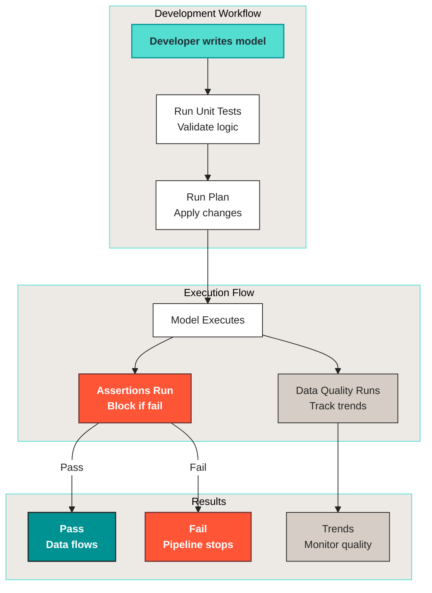

# Quality

Use **Assertions**, **Data Quality** checks, and **Unit Tests** together to keep a model trustworthy.

Three tools, three jobs. Unit tests catch logic bugs in your transformations before they run anywhere. Assertions block bad rows at write time. Data Quality checks watch for trends and anomalies without blocking the pipeline.

***

## The three-layer quality strategy

```mermaid
%%{init: {"theme":"base","themeVariables":{"fontFamily":"PP Neue Montreal, Inter, Helvetica Neue, Arial, sans-serif","fontSize":"14px","primaryColor":"#EDE9E5","primaryTextColor":"#242422","primaryBorderColor":"#242422","lineColor":"#242422","secondaryColor":"#D6CDC6","tertiaryColor":"#FFFFFF","clusterBkg":"#EDE9E5","clusterBorder":"#54DED1","edgeLabelBackground":"#FFFFFF"},"flowchart":{"curve":"basis","padding":12,"nodeSpacing":40,"rankSpacing":50}}}%%
flowchart TB
    subgraph "Layer 1: Assertions - Critical Blocking"
        AUDIT[Assertions<br/>Block invalid data<br/>Run with model]
        EXAMPLES1["• Primary keys unique<br/>• Revenue non-negative<br/>• Foreign keys valid"]
    end

    subgraph "Layer 2: Data Quality - Monitoring"
        CHECK[Data Quality<br/>Track quality trends<br/>Non-blocking]
        EXAMPLES2["• Row count anomalies<br/>• Completeness trends<br/>• Cross-model validation"]
    end

    subgraph "Layer 3: Unit Tests - Logic Validation"
        TEST[Unit Tests<br/>Validate transformations]
        EXAMPLES3["• SQL logic correct<br/>• Expected outputs<br/>• Edge cases"]
    end

    AUDIT --> EXAMPLES1
    CHECK --> EXAMPLES2
    TEST --> EXAMPLES3

    classDef ember        fill:#FF5537,color:#FFFFFF,stroke:#733635,stroke-width:1.5px,font-weight:600;
    classDef primary-teal fill:#54DED1,color:#202F36,stroke:#009293,stroke-width:1.5px,font-weight:600;
    classDef sandpaper    fill:#D6CDC6,color:#242422,stroke:#242422,stroke-width:1px;
    classDef surface      fill:#FFFFFF,color:#242422,stroke:#242422,stroke-width:1px;

    class AUDIT ember;
    class CHECK sandpaper;
    class TEST primary-teal;
    class EXAMPLES1,EXAMPLES2,EXAMPLES3 surface;
```



**When to use each:**

| Tool | Purpose | Blocks pipeline? | Best for |
|---|---|---|---|
| **[Assertions](assertions.md)** | Critical validation | Yes (always) | Business rules, data integrity |
| **[Data Quality](data-quality.md)** | Quality monitoring | No | Trends, anomalies, monitoring |
| **[Unit Tests](tests.md)** | Logic validation | No | SQL correctness, edge cases |

The key difference: assertions stop everything if they fail. Data quality checks and tests warn you, so you can investigate without blocking production.

***

## How they work together



**Execution order:**

1. **Unit Tests** run during development to validate logic, catching bugs before deployment.
2. **Plan** applies changes to the environment.
3. **Model** executes the transformation.
4. **Assertions** run immediately and block the run on failure.
5. **Data Quality checks** run alongside to track quality over time, without blocking.

Unit tests run first against fixtures. Assertions run with the model and stop the run on failure. Data Quality checks run alongside to track quality over time. Each layer catches what the previous one isn't designed to.

***

## Running quality tools

```bash
# Run all tests
vulcan test

# Run all assertions (also run automatically with plan)
vulcan audit

# Run all data quality checks (also run automatically with plan/run)
vulcan check
```

***

## Best practices

**Do**

1. Start with assertions. Add critical blocking validations first, before worrying about trends.
2. Add data quality checks gradually: monitor trends, then add anomaly detection.
3. Test during development, before deploying.
4. Use descriptive names, like `revenue_mismatch_with_raw` instead of `check_1`.
5. Order assertions efficiently: fast checks first, slow checks last.

**Don't**

1. Don't use data quality checks for critical rules. If it's critical, it should block, use an assertion.
2. Don't skip assertion failures. Fix the root cause.
3. Don't over-audit. Focus on critical business rules.
4. Don't ignore data quality trends. Consistently failing checks signal a real problem.

***

## Choose a page

* **[Unit Tests](tests.md)** - validate model logic with controlled inputs and expected outputs.
* **[Assertions](assertions.md)** - attach audits to models to block bad data at runtime.
* **[Data Quality](data-quality.md)** - apply reusable rule packs to monitor datasets over time.
