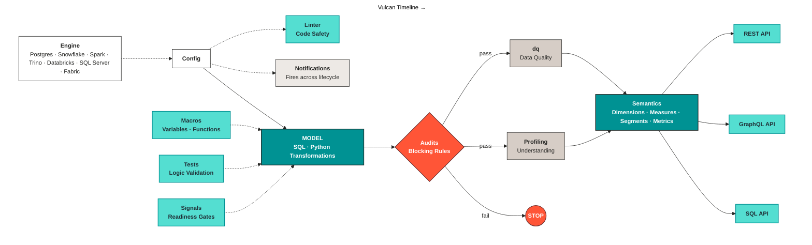

# Vulcan

Vulcan builds governed data products on top of the engine you already use. It keeps transformation, quality, and semantics in one project. You define data once, then expose the same trusted contract to dashboards, applications, and AI agents.

## Why Vulcan exists

Most teams still work with raw tables and tribal knowledge. That works until another team, tool, or AI agent asks the same question. Then the wrong table gets picked, and the answer looks correct but is not.

A data product fixes that. It packages schema, semantics, ownership, lineage, quality, and freshness into one governed asset. Every consumer uses the same definitions and the same trust boundary.

## Why it runs above the engine

If the contract lives inside one warehouse, it stays locked there. Most teams run more than one engine. Analytics lives in Snowflake. Operations lives in Postgres. ML runs on Spark or a lakehouse.

Vulcan sits above those engines. The same data product contract reaches every consumer, regardless of where the data physically lives.

## How Vulcan works

Vulcan covers the full data product lifecycle in one stack:

1. **Input and output**\
   Point a single config at your engine. Vulcan runs directly on Postgres, Snowflake, Spark, Trino, Databricks, SQL Server, and Microsoft Fabric. No data movement happens unless you need it.
2. **Transformation**\
   Build models in SQL, Python, or both in one project. Use `vulcan plan` to preview impact before execution. Use `vulcan run` to apply changes on your schedule.
3. **Quality**\
   Catch issues before they reach consumers. The linter surfaces errors early. Assertions block bad rows at write time. Built-in data quality checks watch for anomalies and drift. Tests validate logic locally without warehouse cost.
4. **Semantics**\
   Define dimensions, measures, segments, and metrics once. Vulcan validates them against your models and generates REST, GraphQL, and SQL APIs automatically.

This flow turns raw data into a governed interface that every consumer can use.

One project carries a data product from source engine to governed API. The audit gate is the control point. Bad rows stop there and never reach semantics or downstream consumers.

## What you get

* One project for transformation, quality, and semantics.
* One governed contract across BI, apps, notebooks, and AI.
* One activation layer through REST, GraphQL, and SQL APIs.

## Where to go next

Start with the [LDK setup](ldk.md). It walks through running the Vulcan CLI, connecting to your engine, and materializing your first models with `vulcan plan`.

| Page | What it covers |
| ---- | -------------- |
| [LDK setup](ldk.md) | Installing the Vulcan CLI, scaffolding a project, and running your first `vulcan plan`. |
| [CLI commands](cli.md) | Every `vulcan` subcommand: what it does and how to call it. |
| [Concepts](concepts/README.md) | Architecture, the data product lifecycle, and how `vulcan plan`/`vulcan run` decide what to execute. |
| [Configurations](configurations/README.md) | `config.yaml`: gateways, model defaults, variables, execution hooks, the linter, and notifications. |
| [Models](models/README.md) | Data models (the `MODEL` block, properties, statements, and model kinds/types), semantic models, and business metrics. |
| [Quality](quality/README.md) | Assertions, data quality checks, and tests, and how they work together. |
| [Policies](policies.md) | Physical-model row filters, column masks, auth context, and semantic/metric inheritance. |
| [Plugins and auth](plugins-and-auth.md) | The `plugins/` auth extension for resolving DataOS role tags into policy groups and claims. |
| [Roles and permissions](roles-and-permissions/README.md) | Minimum engine grants to provision for a Vulcan service account, engine by engine. |
| [Advanced features](advanced-features/README.md) | Macros, signals, custom materializations, and importing Snowflake semantic views. |
| [Deployment steps](deployment.md) | Promoting a Data Product into a DataOS environment. |
| [Troubleshooting](troubleshooting.md) | Every validation and request error Vulcan returns, and how to fix it. |

After setup, the project scaffold gives you ready-to-use folders for `audits/`, `dq/`, `tests/`, `models/semantics/`, and `models/metrics/`.
