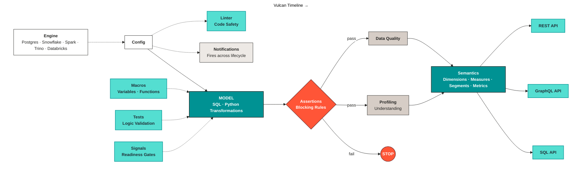
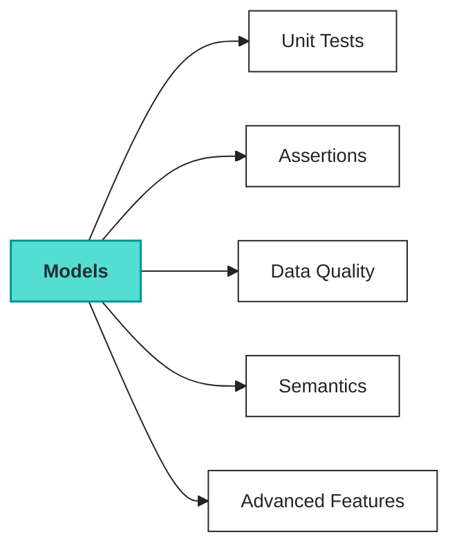

# Architecture

_How Vulcan is structured: the fingerprint-plan-apply flow, the model materialization strategies, and the extensible engine adapter model._

Data productization rarely fits one pattern. Some models need a full rebuild every run. Others need incremental processing over huge, constantly growing tables. Some need full history tracking. Teams also need a consistent way to onboard new warehouses and environments without redesigning the runtime each time. Vulcan gives every model type a common operating model while respecting the different semantics each one needs.

## Why Vulcan exists

Most teams still work with raw tables and tribal knowledge. That works until another team, tool, or AI agent asks the same question. Then the wrong table gets picked, and the answer looks correct but isn't.

A data product fixes that. It packages schema, semantics, ownership, lineage, quality, and freshness into one governed asset. Every consumer uses the same definitions and the same trust boundary.

## Overview

Vulcan is a unified data product framework built around versioned models. It compiles model logic into content-addressed versions, computes exactly what changed, previews the impact before anything runs, and executes across a wide range of warehouse engines. It abstracts change detection, planning, and execution into one consistent pipeline shape.

## ELP and where Vulcan fits

Modern data platforms follow the ELP pattern: Extract, Load, Productize. Raw data gets extracted from source systems, loaded into the warehouse or lakehouse, and then turned into something useful, actionable, or revenue-generating. Vulcan is purpose-built for that last step, the "Productize" stage.

Vulcan doesn't move data between systems. It assumes extraction and loading are already handled upstream, and operates entirely on data that has already landed in the warehouse or lakehouse.

Productizing means taking raw, loaded data and turning it into modeled, versioned, trustworthy tables (through model materialization strategies, fingerprinting, and plan/apply) that are ready to power dashboards, applications, or downstream products.

Because this happens where the data already lives, Vulcan pushes model logic down into the destination engine itself through the engine adapter, rather than pulling data out to productize it elsewhere.

Fingerprinting and planning keep that productization step incremental and safe: Vulcan reprocesses only new or changed data, and classifies and reviews every change before applying it to warehouse tables.

This is what makes Vulcan a natural downstream layer for any ELP pipeline: it picks up right after raw data is loaded and turns it into a modeled, versioned, production-ready data product.

## How Vulcan works

Vulcan covers the full data product lifecycle in one stack:

1. **Input and output** - point a single config at your engine. Vulcan runs directly on Postgres, Snowflake, Spark, Trino, and Databricks. No data movement happens unless you need it.
2. **Transformation** - build [models](../models/data-models/) in SQL, Python, or both in one project. Use `vulcan plan` to preview impact before execution, and `vulcan run` to apply changes on your schedule.
3. **Quality** - catch issues before they reach consumers. The [linter](../configurations/linter.md) surfaces errors early, [assertions](../quality/assertions.md) block bad rows at write time, [data quality checks](../quality/data-quality.md) watch for anomalies and drift, and [unit tests](../quality/tests.md) validate logic locally without warehouse cost.
4. **Semantics** - define dimensions, measures, segments, and metrics once in the [semantic layer](../models/semantic-models/). Vulcan validates them against your models and generates REST, GraphQL, and SQL APIs automatically.

This flow turns raw data into a governed interface that every consumer can use.

One project carries a data product from source engine to governed API. The assertion gate is the control point. Bad rows stop there and never reach semantics or downstream consumers.

## Core capabilities

Vulcan separates data productization into 4 consistent building blocks.

### Model materialization strategies

Every model declares a materialization strategy: [full rebuild](../models/data-models/model-kinds.md#full), [incremental by time range](../models/data-models/model-kinds.md#incremental_by_time_range), [incremental upsert by key](../models/data-models/model-kinds.md#incremental_by_unique_key), [partition-based rebuild](../models/data-models/model-kinds.md#incremental_by_partition), or [history-tracking for slowly changing dimensions](../models/data-models/model-kinds.md#scd-type-2).

This covers everything from small reference tables that get recreated every run to large fact tables that only ever get appended to.

Strategy-specific behavior still matters, but the execution model (fingerprint, plan, apply) stays consistent at the Vulcan layer regardless of which strategy a model uses.

### Versioned change management

Vulcan fingerprints every model from its own logic and everything upstream of it, so it always knows exactly what changed and what didn't.

Vulcan classifies each change (breaking, non-breaking, forward-only, or metadata-only) and plans only the necessary work: a full rebuild, an incremental backfill, or nothing at all.

### Virtual Data Environments (VDE)

VDE is the mechanism that lets environments exist as lightweight views layered on top of versioned physical tables, rather than as separate copies of the warehouse.

VDE runs in 2 modes:

* **`vde: true`**: VDE is fully enabled. Every model gets versioned physical tables, and the user-facing tables are lightweight views that point to the right version. See [Plan with a virtual layer](run-and-plan/plan-with-vde.md).
* **`vde: false`**: VDE isn't fully used. Vulcan still processes models, but they behave more like regular tables instead of being fully managed through the versioned view layer. See [Plan without a virtual layer](run-and-plan/plan-guide.md).

VDE uses the same model definitions, state store, and engine adapters as any other run: there's no separate code path per environment type.

### Flow

1. **Fingerprint**: Vulcan parses each model and computes a content-based identity from its logic and its dependencies. This is how it detects real changes without comparing the entire project every time.
2. **Plan**: Vulcan diffs new fingerprints against what's already recorded, classifies each change, and computes exactly which data is missing. The result is a plan you can review before anything executes.
3. **Run**: Vulcan evaluates the selected models against the current project state, identifies the work that hasn't been materialized yet, and executes it through the configured engine adapter. This produces or refreshes the required physical tables while preserving already-computed versions wherever possible.

## How the pieces fit together

The [model](../models/data-models/) is the center of gravity. Everything else, unit tests, assertions, data quality checks, semantics, and advanced features, attaches to a model. Get the model right first; the rest only has something to validate or expose once it exists.

In most projects, the flow looks like this:

1. Build tables or views with [**models**](../models/data-models/).
2. Validate logic with [**unit tests**](../quality/tests.md): controlled inputs and expected outputs.
3. Block bad data at runtime with [**assertions**](../quality/assertions.md).
4. Monitor data over time with [**data quality**](../quality/data-quality.md) checks (`kind: dq`).
5. Expose curated definitions through [**semantics**](../models/semantic-models/).
6. Extend behavior with [**advanced features**](../advanced-features/): macros, signals, and custom materializations.

## Constraints

* Vulcan exposes engine-specific capabilities through one consistent model-authoring shape. Start with a standard model definition, then tune the materialization details that matter for each source and destination.
* Engine adapter coverage varies: some warehouse integrations are mature, others are earlier in their lifecycle.
* Change classification depends on the model and its dependencies being fully understood; ambiguous changes may require manual review before you can apply a plan.
* Throughput, batch sizing, and backfill scope depend on workload shape and engine-specific options (partitioning, clustering, and similar).

## Why this matters

* One operating model covers full rebuilds, incremental processing, and history tracking instead of separate pipelines per pattern.
* The fingerprint-plan-apply separation keeps changes safe, reviewable, and reproducible across environments.
* The engine adapter model lets Vulcan support a growing set of warehouses without changing the core runtime contract.
* Virtual environments make isolated environments cheap by sharing unchanged data instead of duplicating it.
* One governed contract reaches every consumer, whether that's a BI tool, an application, a notebook, or an AI agent.
* One activation layer exposes REST, GraphQL, and SQL APIs automatically from your semantic definitions.

## Where to go next

See [model kinds](../models/data-models/model-kinds.md) for the full list of materialization strategies, [run and plan](run-and-plan/) to understand how Vulcan decides what to execute, or the [data product lifecycle](data-product-lifecycle.md) for the step-by-step path from setup to production.
