# Configurations

Your Vulcan project needs a configuration file. It tells Vulcan how to connect to your data warehouse, where to store state, and what defaults to use for your models. Without it, Vulcan doesn't know where your data lives or how to run your transformations.

## Configuration file

`vulcan init` creates the base configuration file in your project root. Update it for your project:

* `config.yaml`: Configure connections, runtime behavior, and model defaults.
* `usage.yaml`: Add business-facing guidance for using your models.


**Key casing differs by file type**

`config.yaml` is snake\_cased on load, so camelCase keys are still honored (e.g. `dataHolder` → `data_holder`, `issueTracker` → `issue_tracker`). The `gateways/**` subtree is preserved exactly as written, since gateway names are user identifiers, not schema keys.

Asset YAML files (semantic, metric, dq, and policy models) are loaded **without** key conversion. Keys must already be `snake_case` — camelCase keys such as `dependsOn` or `timeDimension` are silently not recognized, not auto-converted. Rename them: `dependsOn` → `depends_on`, `timeDimension` → `time_dimension`.

The document root of an asset file accepts either `kind:` or `type:` (case-insensitive) — both `kind: dq` and `type: dq` load the same way.


## Example configuration

Here's what a typical configuration file looks like:


```yaml
# Project identity
name: orders-analytics
displayName: Orders Analytics Platform
description: Orders Analytics is a centralized data product delivering clean, trusted insights across the full order lifecycle.

# Catalog metadata
discoverable: true
version: 0.1.2
alignment: consumerAligned

# Environment behavior
vde: false   # set to true to enable Virtual Data Environments; not supported on spark/trino

# Classification
tags:
  - e-commerce
  - retail
  - sales_analytics
  - customer_analytics
  - postgres

terms:
  - glossary.data_product
  - glossary.analytics_platform
  - glossary.sales_operations


# Gateway Connection
gateways:
  default:
    connection:
      type: postgres
      host: warehouse
      port: 5432
      database: warehouse
      user: vulcan
      password: "{{ env_var('DB_PASSWORD') }}"

defaultGateway: default

# Model Defaults (required)
modelDefaults:
  dialect: postgres
  start: 2024-01-01
  cron: '@daily'

# Linting Rules
linter:
  enabled: true
  rules:
    - ambiguousorinvalidcolumn
    - invalidselectstarexpansion
```


## Example usage guidance

Create `usage.yaml` in your project root to describe who the data product is good for, who it is not good for, caveats users should know, and reference links.

```yaml
good_for:
  - Customer analytics and segmentation
  - title: Revenue reporting and forecasting
    details: Planning, board reporting, and trend analysis across segments
  - User acquisition tracking
  - Subscription lifecycle management

not_for:
  - Real-time alerting
  - title: Real-time operational decisions
    details: Data refreshes weekly. Not suitable for alerting or live dashboards

caveats:
  - Historical data available from 2024-01-01
  - title: Weekly refresh cadence
    details: Updates every Monday ~6am UTC; answers can be up to 7 days stale
    severity: medium
  - title: Excludes test and demo accounts
    severity: low

references:
  - title: Vulcan book
    url: https://tmdc-io.github.io/vulcan-book/
    type: doc
```

## Configuration structure

```mermaid
%%{init: {"theme":"base","themeVariables":{"fontFamily":"PP Neue Montreal, Inter, Helvetica Neue, Arial, sans-serif","fontSize":"14px","primaryColor":"#EDE9E5","primaryTextColor":"#242422","primaryBorderColor":"#242422","lineColor":"#242422","secondaryColor":"#D6CDC6","tertiaryColor":"#FFFFFF","clusterBkg":"#EDE9E5","clusterBorder":"#54DED1","edgeLabelBackground":"#FFFFFF"},"flowchart":{"curve":"basis","padding":12,"nodeSpacing":40,"rankSpacing":50}}}%%
graph TB
    Config[config.yaml]
    Usage[usage.yaml]
    Config --> Project[Project Settings]
    Config --> Gateways[Gateways]
    Config --> StateConn[State Connection]
    Config --> ModelDefaults[Model Defaults]
    Config --> Semantic[Semantic Layer]
    Config --> Options[Optional Features]
    Usage --> GoodFor[good_for]
    Usage --> NotFor[not_for]
    Usage --> Caveats[caveats]
    Usage --> References[references]
    Project --> Name[name, displayName]
    Project --> Desc[description]
    Project --> Tags[tags, terms]
    Gateways --> Connection[connection]
    Gateways --> Scheduler[scheduler]
    Semantic --> StrictValidation[strict_semantic_validation]
    Semantic --> Rollups[enable_rollup, rollup_schema]
    Options --> Linter[linter]
    Options --> Notifications[notifications]
    Options --> Variables[variables]
    Options --> ExecHooks[executionHooks]

    classDef primary-teal fill:#54DED1,color:#202F36,stroke:#009293,stroke-width:1.5px,font-weight:600;
    classDef surface      fill:#FFFFFF,color:#242422,stroke:#242422,stroke-width:1px;

    class Config,Usage primary-teal;
    class Project,Gateways,StateConn,ModelDefaults,Semantic,Options,GoodFor,NotFor,Caveats,References,Name,Desc,Tags,Connection,TestConn,Scheduler,StrictValidation,Rollups,Linter,Notifications,Variables,ExecHooks surface;
```



## Configuration sections

### Project settings

Project settings identify your project. They don't affect how Vulcan runs, but catalog tools rely on them for organization and discovery. Business-facing usage guidance belongs in `usage.yaml`, not in `config.yaml`.

<table data-search="false"><thead><tr><th>Option</th><th>Description</th><th align="center">Type</th><th align="center">Required</th></tr></thead><tbody><tr><td><code>name</code></td><td>Project identifier (used internally). Can also be set via <code>DATAOS_RESOURCE_NAME</code> env var.</td><td align="center">string</td><td align="center">Yes</td></tr><tr><td><code>description</code></td><td>Project description. Has a placeholder default but is still validated as non-empty.</td><td align="center">string</td><td align="center">Yes</td></tr><tr><td><code>displayName</code></td><td>Human-readable project name for UI/docs</td><td align="center">string</td><td align="center">No</td></tr><tr><td><code>discoverable</code></td><td>Whether this product appears in catalog search</td><td align="center">boolean</td><td align="center">No</td></tr><tr><td><code>version</code></td><td>Release version (SemVer 2.0, e.g. <code>0.1.2</code>)</td><td align="center">string</td><td align="center">No</td></tr><tr><td><code>alignment</code></td><td>Data Mesh orientation: <code>sourceAligned</code> or <code>consumerAligned</code></td><td align="center">enum</td><td align="center">No</td></tr><tr><td><code>tags</code></td><td>Labels for categorization and filtering. Merged with <code>DATAOS_RESOURCE_TAGS</code> env var.</td><td align="center">array of string</td><td align="center">No</td></tr><tr><td><code>terms</code></td><td>Business glossary terms using dot notation (e.g., <code>glossary.data_product</code>)</td><td align="center">array of string</td><td align="center">No</td></tr></tbody></table>

```yaml
# Project identity
name: orders-analytics
displayName: Orders Analytics Platform
description: Orders Analytics delivers insights across the full order lifecycle.

# Catalog metadata
discoverable: true
version: 0.1.2
alignment: consumerAligned

# Classification
tags:
  - e-commerce
  - retail
  - sales_analytics

terms:
  - glossary.data_product
  - glossary.analytics_platform
  - glossary.sales_operations
```


**Tenant comes from the environment**

`tenant` is required by the platform, but it is not a YAML key in `config.yaml`. In production, the platform injects it through `DATAOS_TENANT_ID`. For local development, export it before running Vulcan:

```bash
export DATAOS_TENANT_ID=marketing
```

Without `DATAOS_TENANT_ID`, Vulcan refuses to load the project.


### Usage guidance (`usage.yaml`)

Use `usage.yaml` for business-facing guidance. This file helps consumers understand when to use the data product, when not to use it, what caveats apply, and where to find supporting references.

Unlike `config.yaml`, `usage.yaml` doesn't configure runtime behavior. It's documentation and discovery guidance for humans and catalog/AI experiences.

| Option       | Description                                                           |          Type          | Required |
| ------------ | --------------------------------------------------------------------- | :--------------------: | :------: |
| `good_for`   | Use cases where this data product is a good fit                       | array of string/object |    No    |
| `not_for`    | Use cases where this data product should not be used                  | array of string/object |    No    |
| `caveats`    | Known limits, freshness notes, exclusions, or interpretation warnings | array of string/object |    No    |
| `references` | Supporting links such as docs, dashboards, runbooks, or tickets       |     array of object    |    No    |

A list item is either a simple string or a structured object with `title` and optional details.

```yaml
good_for:
  - Customer analytics and segmentation
  - title: Revenue reporting and forecasting
    details: Planning, board reporting, and trend analysis across segments

not_for:
  - Real-time alerting
  - title: Real-time operational decisions
    details: Data refreshes weekly. Not suitable for alerting or live dashboards

caveats:
  - Historical data available from 2024-01-01
  - title: Weekly refresh cadence
    details: Updates every Monday ~6am UTC; answers can be up to 7 days stale
    severity: medium

references:
  - title: Vulcan book
    url: https://tmdc-io.github.io/vulcan-book/
    type: doc
```

By default, Vulcan looks for `usage.yml` first, falling back to `usage.yaml` if that doesn't exist. Point it at a different file with `usagePath` in `config.yaml`; use `agreementPath` the same way to load an optional data-sharing agreement sidecar file.

```yaml
usagePath: usage.yaml
agreementPath: agreement.yaml
```


`discoverable`, `version`, and `alignment` are modeled internally under `ProductInfo`, but this is an implementation detail — they're still plain top-level keys in `config.yaml`, same as shown above. No project changes are needed.


### Gateways

Gateways define how Vulcan connects to your data warehouse and state backend. Define multiple gateways for different environments: dev, staging, prod. Each gateway has its own connection settings. `connection.type` accepts `postgres`, `snowflake`, `databricks`, `spark`, `trino`, `mssql` (SQL Server), or `fabric` (Microsoft Fabric, built on the `mssql` adapter). See [Engine Guides](https://app.gitbook.com/s/TVR3yNyAr5eErLRWsr2P/engine-guide) for complete technical reference.&#x20;

| Component        | Description                                 |  Type  | Required |
| ---------------- | ------------------------------------------- | :----: | :------: |
| `connection`     | Primary data warehouse connection           | object |    Yes   |
| `scheduler`      | Scheduler configuration                     | object |    No    |
| `defaultGateway` | Which gateway to use when none is specified | string |    No    |

```yaml
# Gateway Connection
gateways:
  default:
    connection:
      type: postgres
      host: warehouse
      port: 5432
      database: warehouse
      user: vulcan
      password: "{{ env_var('DB_PASSWORD') }}"

defaultGateway: default
```

### State connection

Vulcan needs somewhere to persist plan/run state (applied model versions, environments, snapshots). Configure it with `stateConnection`, using the same connection shape as a gateway `connection`:

```yaml
stateConnection:
  type: duckdb
  database: ./.state/vulcan.db
```

If `stateConnection` is omitted, local runs default to DuckDB at `.vulcan/state.db`, resolved against the project root. `vulcan init` adds `.vulcan/` to `.gitignore`, since the default state database is local, disposable state rather than something to commit.

### Model defaults

The `modelDefaults` section is required. At minimum, specify `dialect` to tell Vulcan what SQL dialect your models use. Other defaults are optional but apply to all models automatically, so you don't repeat the same settings in every model file.

```yaml
modelDefaults:
  dialect: postgres     # Required
  owner: data-team
  start: 2024-01-01
  cron: '@daily'
```

See [Model Defaults](model-defaults.md) for all available options.

### Semantic layer

Two project-level flags control how strictly the semantic layer validates itself and whether it materializes rollups:

```yaml
strict_semantic_validation: false  # default
enable_rollup: false                # default
rollup_schema: rollup               # schema rollups are materialized into
allow_reciprocal_joins: true         # default
metric_join_path: directed           # default
```

* `strict_semantic_validation` defaults to `false`: shape violations in filter, segment, and calculated-measure expressions are logged, not blocked, so a project can load with warnings instead of failing. Set it to `true` to hard-fail on those violations instead.
* `enable_rollup` defaults to `false`. Semantic-model `rollups:` blocks always validate, but only materialize a physical pre-aggregation table when this flag is `true`.
* `rollup_schema` sets the physical schema rollups are materialized into; it factors into the physical-table naming budget (see [Rollups](../models/semantic-models/rollups.md)).
* `allow_reciprocal_joins` defaults to `true`: two semantic models may declare inverse joins to each other, as long as each reciprocal pair has inverse join types and exactly one side sets `skip_for_bi`. Set it to `false` to reject reciprocal pairs as cycles instead (see [Joins](../models/semantic-models/joins.md#reciprocal-joins)).
* `metric_join_path` sets the default join-path mode for metrics that reference multiple semantic models: `directed` (default) or `connected`. Override it per metric with `join_path:` (see [Join path mode](../models/business-metrics.md#join-path-mode-connected-vs-directed)).

### Variables

Store sensitive information like passwords and API keys without hardcoding them. Use environment variables, `.env` files, or configuration overrides. Variables also let you override configuration values dynamically.

```yaml
variables:
  warehouse_schema: analytics
  refresh_window_days: 7

gateways:
  default:
    variables:
      warehouse_schema: analytics_dev  # override per gateway
```

See [Variables](variables.md) for details.

### Execution hooks

Run SQL statements automatically at the start and end of `vulcan plan` and `vulcan run` commands. Use `beforeAll` for setup tasks like creating temporary tables or granting permissions. Use `afterAll` for cleanup or post-processing. A hook entry is inline SQL, a macro, or a file containing SQL statements.

```yaml
beforeAll:
  - GRANT SELECT ON ALL TABLES IN SCHEMA analytics TO reporting_role
  - file: ./statements/setup.sql

afterAll:
  - ANALYZE analytics.daily_sales
  - ./statements/cleanup.sql
```

See [Execution Hooks](execution-hooks.md) for detailed examples and use cases.

### Linter

Automatic code quality checks that run when you create a plan or run the lint command. Catches common mistakes and enforces coding standards. Use built-in rules or create custom ones.

See [Linter](linter.md) for rules and custom linter configuration.

### Notifications

Set up alerts via Slack, Teams webhook, email, or console targets. Get notified when plans start or finish, when runs complete, or when data quality checks fail. Data quality events use the `dq_*` names.

```yaml
notificationTargets:
  - type: teams_webhook
    url: "{{ env_var('TEAMS_WEBHOOK_URL') }}"
    notifyOn:
      - apply_failure
      - run_failure
      - dq_failure
  - type: console
    notifyOn:
      - plan_change
```

See [Notifications](notifications.md) for Teams webhook, Slack, API, and email setup.

### Auth extension hook

Use the root-level `after_authorize` field when a data product needs to resolve user groups and claims after DataOS authorization. The hook points to a Python function in your project. Put plugin modules in a `plugins/` package at the project root:


**Required for auth-backed policies**

If you are working with auth-backed policies or masking, make sure `config.yaml` includes this root-level hook:

```yaml
after_authorize: "plugins.auth_ext:resolve_user_groups"
```


```
plugins/
├── __init__.py
└── auth_ext.py
```

```yaml
after_authorize: "plugins.auth_ext:resolve_user_groups"
```

```python
from __future__ import annotations

from schema.auth import AuthExtensionContext, SecurityContext

ROLE_ID_TAG_PREFIX = "roles:id:"
GROUP_DELIMITER = ","
POLICY_GROUP_PRIORITY = ("operator", "developer")


async def resolve_user_groups(ctx: AuthExtensionContext) -> SecurityContext:
    """Derive policy groups from DataOS role tags."""

    groups = [
        tag.replace(ROLE_ID_TAG_PREFIX, "", 1)
        for tag in ctx.user_tags
        if tag.startswith(ROLE_ID_TAG_PREFIX)
    ]

    group = next(
        (policy_group for policy_group in POLICY_GROUP_PRIORITY if policy_group in groups),
        groups[0] if groups else "",
    )
    return SecurityContext(group=group, groups=GROUP_DELIMITER.join(groups))
```

### Deployment

The `deployment:` block drives `vulcan create_deploy_yaml`, which renders the DataOS `domain-resource.yaml` deterministically: every value in the output is either derived from your project, defaulted, or set explicitly here — there are no placeholders left to fill in by hand.

```yaml
deployment:
  repo:
    url: git@bitbucket.org:org/repo.git
    baseDir: repo/vulcan-project
  compute: general-purpose-shared
  runAsUser: svc-user
  engine: mssql   # required when the gateway connection type is `depot`
```

`repo.url`, `repo.baseDir`, `compute`, and `runAsUser` are required; everything else has a default or is derived (`engine` from the gateway connection type, crons from your models).


**`engine` is required for `depot` connections**

When `gateways.<name>.connection.type` is `depot`, the engine can't be inferred from the depot address, so `deployment.engine` must be set explicitly. For direct connections (`mssql`, `postgres`, `fabric`, and so on), `engine` is derived automatically and should be omitted. Allowed values: `bigquery`, `databricks`, `fabric`, `mssql`, `mysql`, `postgres`, `snowflake`, `spark`, `trino`.


## Complete configuration reference

This table lists all available configuration keys in `config.yaml`. Click the links for detailed documentation.

### Project identity

| Configuration Key | Description                                                                            |   Type  | Required | Default           | Documentation |
| ----------------- | -------------------------------------------------------------------------------------- | :-----: | :------: | ----------------- | ------------- |
| `name`            | Project identifier (used for resource naming). Overridable via `DATAOS_RESOURCE_NAME`. |  string |  **Yes** | -                 | -             |
| `description`     | Project description and purpose. Validated as non-empty.                               |  string |  **Yes** | placeholder       | -             |
| `displayName`     | Human-readable name for UI/docs                                                        |  string |    No    | `null`            | -             |
| `discoverable`    | Whether the product is listed in catalog search                                        | boolean |    No    | `true`            | -             |
| `version`         | Release version (SemVer 2.0)                                                           |  string |    No    | `"0.0.0"`         | -             |
| `alignment`       | Data Mesh orientation (`sourceAligned` or `consumerAligned`)                           |   enum  |    No    | `consumerAligned` | -             |
| `project`         | Legacy alias of `name`. Auto-filled from `name` if omitted.                            |  string |    No    | `""`              | -             |
| `tags`            | Labels for categorization. Merged with `DATAOS_RESOURCE_TAGS`.                         |  array  |    No    | `[]`              | -             |
| `terms`           | Business glossary terms (e.g., `glossary.data_product`)                                |  array  |    No    | `[]`              | -             |
| `usagePath`       | Path to the usage sidecar file                                                          |  string |    No    | `usage.yml`, falling back to `usage.yaml` | - |
| `agreementPath`   | Path to the optional data-sharing agreement sidecar file                               |  string |    No    | `null`            | -             |

### Usage guidance (`usage.yaml`)

These keys live in `usage.yaml`, not `config.yaml`.

| Usage Key    | Description                                               |  Type | Required | Default |
| ------------ | --------------------------------------------------------- | :---: | :------: | ------- |
| `good_for`   | Use cases where the data product is a good fit            | array |    No    | `[]`    |
| `not_for`    | Use cases where the data product should not be used       | array |    No    | `[]`    |
| `caveats`    | Known limits, freshness notes, exclusions, or warnings    | array |    No    | `[]`    |
| `references` | Supporting links with `title`, `url`, and optional `type` | array |    No    | `[]`    |

### Gateway and connection configuration

| Configuration Key            | Description                                       |  Type  |  Required | Default                             | Documentation                                                          |
| ---------------------------- | ------------------------------------------------- | :----: | :-------: | ----------------------------------- | ---------------------------------------------------------------------- |
| `gateways`                   | Gateway configurations for different environments | object | **Yes**\* | `{"": {}}`                          | [See above](./#gateways)                                               |
| `gateways.<name>.connection` | Primary data warehouse connection                 | object |  **Yes**  | -                                   | [Engines](https://app.gitbook.com/s/TVR3yNyAr5eErLRWsr2P/engine-guide) |
| `gateways.<name>.scheduler`  | Scheduler configuration                           | object |     No    | Built-in (`BuiltInSchedulerConfig`) | -                                                                      |
| `gateways.<name>.variables`  | Gateway-specific variables                        | object |     No    | `{}`                                | [Variables](variables.md)                                              |
| `defaultGateway`             | Name of the default gateway                       | string |     No    | `""`                                | -                                                                      |
| `defaultConnection`          | Root-level default connection                     | object |     No    | `null`                              | -                                                                      |
| `defaultScheduler`           | Root-level default scheduler                      | object |     No    | Built-in (`BuiltInSchedulerConfig`) | -                                                                      |
| `stateConnection`            | Where plan/run state is persisted                 | object |     No    | DuckDB at `.vulcan/state.db`        | [See above](./#state-connection)                                       |

\* At least one gateway with a `connection` is required.

### Model configuration

| Configuration Key                   | Description                                                                                                                                                                       |      Type     |  Required | Default                    | Documentation                       |
| ----------------------------------- | --------------------------------------------------------------------------------------------------------------------------------------------------------------------------------- | :-----------: | :-------: | -------------------------- | ----------------------------------- |
| `modelDefaults`                     | Default values applied to all models                                                                                                                                              |     object    | **Yes**\* | `{}`                       | [Model Defaults](model-defaults.md) |
| `modelDefaults.dialect`             | SQL dialect (postgres, snowflake etc.)                                                                                                                                 |     string    |  **Yes**  | -                          | [Model Defaults](model-defaults.md) |
| `modelDefaults.owner`               | Default owner for all models. If not set, defaults to the first `config.users` entry. Must be a username listed in `config.users`; config load fails if the value does not match. |     string    |     No    | First `config.users` entry | -                                   |
| `modelDefaults.start`               | Default start date for backfilling                                                                                                                                                |     string    |     No    | Inferred                   | -                                   |
| `modelDefaults.cron`                | Default cron schedule (e.g., `@daily`)                                                                                                                                            |     string    |     No    | `null`                     | -                                   |
| `modelDefaults.kind`                | Default model kind (FULL, INCREMENTAL, etc.)                                                                                                                                      | string/object |     No    | `VIEW`                     | -                                   |
| `modelDefaults.intervalUnit`        | Temporal granularity of data intervals                                                                                                                                            |     string    |     No    | From cron                  | -                                   |
| `modelDefaults.batchConcurrency`    | Max concurrent batches for incremental models                                                                                                                                     |    integer    |     No    | `1`                        | -                                   |
| `modelDefaults.tableFormat`         | Table format (iceberg, delta, hudi)                                                                                                                                               |     string    |     No    | `null`                     | -                                   |
| `modelDefaults.storageFormat`       | Storage format (parquet, orc)                                                                                                                                                     |     string    |     No    | `null`                     | -                                   |
| `modelDefaults.onDestructiveChange` | Action on destructive schema changes                                                                                                                                              |     string    |     No    | `error`                    | -                                   |
| `modelDefaults.onAdditiveChange`    | Action on additive schema changes                                                                                                                                                 |     string    |     No    | `apply`                    | -                                   |
| `modelDefaults.physicalProperties`  | Properties for physical tables/views                                                                                                                                              |     object    |     No    | `{}`                       | -                                   |
| `modelDefaults.virtualProperties`   | Properties for virtual layer views                                                                                                                                                |     object    |     No    | `{}`                       | -                                   |
| `modelDefaults.sessionProperties`   | Engine-specific session properties                                                                                                                                                |     object    |     No    | `{}`                       | -                                   |
| `modelDefaults.audits`              | Assertion/assertion functions for all models                                                                                                                                      |     array     |     No    | `[]`                       | -                                   |
| `modelDefaults.optimizeQuery`       | Whether to optimize SQL queries                                                                                                                                                   |    boolean    |     No    | `true`                     | -                                   |
| `modelDefaults.allowPartials`       | Whether models can process incomplete intervals                                                                                                                                   |    boolean    |     No    | `false`                    | -                                   |
| `modelDefaults.enabled`             | Whether models are enabled by default                                                                                                                                             |    boolean    |     No    | `true`                     | -                                   |
| `modelDefaults.preStatements`       | SQL statements executed before model runs                                                                                                                                         |     array     |     No    | `null`                     | -                                   |
| `modelDefaults.postStatements`      | SQL statements executed after model runs                                                                                                                                          |     array     |     No    | `null`                     | -                                   |

\* The `modelDefaults.dialect` field is required.

### Semantic layer

| Configuration Key            | Description                                                                    |   Type  | Required | Default   | Documentation                                                |
| ----------------------------- | ------------------------------------------------------------------------------- | :-----: | :------: | --------- | ------------------------------------------------------------- |
| `strict_semantic_validation` | Hard-fail on semantic expression shape violations instead of only logging them | boolean |    No    | `false`   | [Measures](../models/semantic-models/measures.md)              |
| `enable_rollup`               | Materialize semantic-model `rollups:` blocks as physical pre-aggregation tables | boolean |    No    | `false`   | [Rollups](../models/semantic-models/rollups.md)                 |
| `rollup_schema`               | Physical schema rollups are materialized into                                  |  string |    No    | `rollup`  | [Rollups](../models/semantic-models/rollups.md)                 |
| `allow_reciprocal_joins`      | Whether two semantic models may declare inverse joins to each other. When enabled, each reciprocal pair must have inverse join types and exactly one `skip_for_bi`. | boolean | No | `true` | [Joins](../models/semantic-models/joins.md#reciprocal-joins) |
| `metric_join_path`            | Default join-path mode for metrics that reference multiple semantic models: `directed` or `connected`. | string | No | `directed` | [Business metrics](../models/business-metrics.md#join-path-mode-connected-vs-directed) |

### Variables and environment

| Configuration Key | Description                            |  Type  | Required | Default | Documentation             |
| ----------------- | -------------------------------------- | :----: | :------: | ------- | ------------------------- |
| `variables`       | Root-level variables for models/macros | object |    No    | `{}`    | [Variables](variables.md) |
| `envVars`         | Environment variable overrides         | object |    No    | `{}`    | [Variables](variables.md) |

### Execution hooks

| Configuration Key | Description                                                              |  Type | Required | Default | Documentation                         |
| ----------------- | ------------------------------------------------------------------------ | :---: | :------: | ------- | ------------------------------------- |
| `beforeAll`       | SQL statements, macros, or statement files executed at start of plan/run | array |    No    | `null`  | [Execution Hooks](execution-hooks.md) |
| `afterAll`        | SQL statements, macros, or statement files executed at end of plan/run   | array |    No    | `null`  | [Execution Hooks](execution-hooks.md) |

### Code quality and linting

| Configuration Key  | Description                            |   Type  | Required | Default            | Documentation       |
| ------------------ | -------------------------------------- | :-----: | :------: | ------------------ | ------------------- |
| `linter`           | Linting configuration                  |  object |    No    | `{enabled: false}` | [Linter](linter.md) |
| `linter.enabled`   | Enable or disable linting              | boolean |    No    | `false`            | [Linter](linter.md) |
| `linter.rules`     | List of rules to enforce (error level) |  array  |    No    | `[]`               | [Linter](linter.md) |
| `linter.warnRules` | List of rules to warn about            |  array  |    No    | `[]`               | [Linter](linter.md) |

### Notifications and users

| Configuration Key     | Description                                                                                                                   |  Type  | Required | Default | Documentation                     |
| --------------------- | ----------------------------------------------------------------------------------------------------------------------------- | :----: | :------: | ------- | --------------------------------- |
| `notificationTargets` | List of notification targets (Teams webhook, Slack, email, console)                                                           |  array |    No    | `[]`    | [Notifications](notifications.md) |
| `users`               | List of DataOS users for the project. **At least one entry is required.** Config load fails if this list is empty or omitted. |  array |  **Yes** | -       | -                                 |
| `users[].username`    | DataOS username. Must be a valid user in the current tenant. Validated at load time.                                          | string |  **Yes** | -       | -                                 |
| `users[].email`       | Email address for notifications                                                                                               | string |    No    | -       | -                                 |
| `users[].type`        | Role of the user in this project: `OWNER` or `CONTRIBUTOR`                                                                    | string |    No    | -       | -                                 |
| `username`            | Single user to receive notifications                                                                                          | string |    No    | `""`    | -                                 |

### Environment and schema management

| Configuration Key               | Description                                                                                                                                                                                                                                                                                                                      |   Type  | Required | Default          | Documentation |
| ------------------------------- | -------------------------------------------------------------------------------------------------------------------------------------------------------------------------------------------------------------------------------------------------------------------------------------------------------------------------------- | :-----: | :------: | ---------------- | ------------- |
| `vde`                           | Turn full Virtual Data Environments on/off. `true` = versioned physical tables + virtual layer; `false` = simple mode. Defaults to `false`: enable it explicitly when you want VDE. Not supported for `spark` and `trino` gateways: validation rejects `vde: true` on those. Replaces the deprecated `virtual_environment_mode`. | boolean |    No    | `false`          | -             |
| `defaultTargetEnvironment`      | Default environment for plan/run commands                                                                                                                                                                                                                                                                                        |  string |    No    | `prod`           | -             |
| `snapshotTtl`                   | Time before unused snapshots are deleted                                                                                                                                                                                                                                                                                         |  string |    No    | `in 1 week`      | -             |
| `environmentTtl`                | Time before dev environments are deleted                                                                                                                                                                                                                                                                                         |  string |    No    | `in 1 week`      | -             |
| `pinnedEnvironments`            | Environments not deleted by janitor                                                                                                                                                                                                                                                                                              |  array  |    No    | `[]`             | -             |
| `physicalSchemaMapping`         | Map model patterns (regex) to physical schema names. Replaces the deprecated `physical_schema_override`, which is auto-converted with a warning.                                                                                                                                                                                 |  object |    No    | `{}`             | -             |
| `environmentSuffixTarget`       | Where to append environment name (`schema`, `table`, `catalog`)                                                                                                                                                                                                                                                                  |   enum  |    No    | `schema`         | -             |
| `environmentCatalogMapping`     | Route environments to specific catalogs (e.g., dev models go to `dev_catalog`, prod to `prod_catalog`). Useful in multi-catalog setups where each environment writes to a different database.                                                                                                                                    |  object |    No    | `{}`             | -             |
| `physicalTableNamingConvention` | How to name tables at the physical layer                                                                                                                                                                                                                                                                                         |   enum  |    No    | `schemaAndTable` | -             |
| `gatewayManagedVirtualLayer`    | Whether virtual-layer views are created by the model's own gateway                                                                                                                                                                                                                                                               | boolean |    No    | `false`          | -             |


**Catalog in model names vs. environment catalog mapping**

There are two ways to control which catalog your models land in:

* **Model-level:** Use a three-part name (`catalog.schema.model`) in your MODEL definition to target a specific catalog for that model. See [model name property](../models/data-models/properties.md#name).
* **Environment-level:** Use `environmentCatalogMapping` to route all models in a given environment to a specific catalog, without changing individual model names.

Model-level catalog takes precedence. If you set both, the catalog in the model name wins.

```yaml
environmentCatalogMapping:
  dev: dev_catalog
  staging: staging_catalog
  prod: prod_catalog
```


### Project management

| Configuration Key         | Description                                   |   Type  | Required | Default        | Documentation |
| ------------------------- | --------------------------------------------- | :-----: | :------: | -------------- | ------------- |
| `ignorePatterns`          | Glob patterns for files to ignore             |  array  |    No    | Standard list  | -             |
| `timeColumnFormat`        | Default format for model time columns         |  string |    No    | `%Y-%m-%d`     | -             |
| `inferPythonDependencies` | Auto-detect Python package requirements       | boolean |    No    | `true`         | -             |
| `logLimit`                | Default number of logs to keep                | integer |    No    | `20`           | -             |
| `cacheDir`                | Directory for Vulcan's compiled project cache |  string |    No    | `.cache`       | -             |
| `loader`                  | Loader class for loading project files        |  class  |    No    | Default loader | -             |
| `loaderKwargs`            | Arguments to pass to loader instance          |  object |    No    | `{}`           | -             |

### Command configuration

| Configuration Key            | Description                                                                                     |   Type  | Required | Default | Documentation |
| ---------------------------- | ----------------------------------------------------------------------------------------------- | :-----: | :------: | ------- | ------------- |
| `format`                     | SQL formatting options                                                                          |  object |    No    | Default | -             |
| `ui`                         | UI server configuration                                                                         |  object |    No    | Default | -             |
| `plan`                       | Plan command configuration                                                                      |  object |    No    | Default | -             |
| `plan.autoCategorizeChanges` | Auto-categorize changes as breaking/non-breaking. Replaces top-level `auto_categorize_changes`. |  object |    No    | Default | -             |
| `plan.includeUnmodified`     | Include unmodified models in the plan output. Replaces top-level `include_unmodified`.          | boolean |    No    | `false` | -             |
| `plan.useFinalizedState`     | Use finalized state when creating plans. Requires `vde: true`.                                  | boolean |    No    | `false` | -             |
| `migration`                  | Migration configuration                                                                         |  object |    No    | Default | -             |
| `run`                        | Run command configuration                                                                       |  object |    No    | Default | -             |
| `janitor`                    | Cleanup task configuration                                                                      |  object |    No    | Default | -             |
| `modelNaming`                | Name inference rules for models                                                                 |  object |    No    | Default | -             |
| `cicdBot`                    | CI/CD bot configuration                                                                         |  object |    No    | `null`  | -             |

### Deployment

| Configuration Key    | Description                                                                    |   Type  | Required | Default                    | Documentation                  |
| --------------------- | -------------------------------------------------------------------------------- | :-----: | :------: | --------------------------- | ------------------------------- |
| `deployment`          | Drives `vulcan create_deploy_yaml`'s deterministic rendering of `domain-resource.yaml` | object |    No    | `{}`                        | [See above](./#deployment)      |
| `deployment.repo.url` | Git repository URL for the deploy manifest                                       |  string | **Yes**\* | -                           | [See above](./#deployment)      |
| `deployment.repo.baseDir` | Path to the project within the repository                                    |  string | **Yes**\* | -                           | [See above](./#deployment)      |
| `deployment.compute`  | Compute cluster name                                                             |  string | **Yes**\* | -                           | [See above](./#deployment)      |
| `deployment.runAsUser`| DataOS user identity the deployment runs as                                      |  string | **Yes**\* | -                           | [See above](./#deployment)      |
| `deployment.engine`   | Execution engine. Required when the gateway connection is `type: depot`; derived automatically (and should be omitted) for direct connections | string | No | Derived from connection type | [See above](./#deployment) |

\* Required only when you run `vulcan create_deploy_yaml`.

### Integrations and external services

| Configuration Key   | Description                                                                                                |   Type  | Required | Default                                                        | Documentation |
| ------------------- | ---------------------------------------------------------------------------------------------------------- | :-----: | :------: | -------------------------------------------------------------- | ------------- |
| `dbt`               | DBT-specific configuration                                                                                 |  object |    No    | `null`                                                         | -             |
| `objectStore`       | Object storage for query results (MinIO/S3/GCS/Azure)                                                      |  object |    No    | `null`                                                         | -             |
| `transpiler`        | External transpiler service                                                                                |  object |    No    | `{baseUrl: "http://127.0.0.1:8100", timeout: 30, token: null}` | -             |
| `pgq`               | PostgreSQL Queue for async jobs                                                                            |  object |    No    | Default                                                        | -             |
| `analytics`         | CloudEvents telemetry configuration. Replaces the deprecated `disable_anonymized_analytics`.               |  object |    No    | `{enabled: false}`                                             | -             |
| `analytics.enabled` | Enable telemetry publishing                                                                                | boolean |    No    | `false`                                                        | -             |
| `analytics.apiKey`  | Telemetry API key. Required when `analytics.enabled: true`.                                                |  string |    No    | `null`                                                         | -             |
| `openlineage`       | OpenLineage data lineage integration                                                                       |  object |    No    | `null`                                                         | -             |
| `after_authorize`   | Auth extension hook called after DataOS authorization, for example `plugins.auth_ext:resolve_user_groups`. |  string |    No    | `null`                                                         | -             |
| `hera`              | Hera/OpenMetadata sync configuration                                                                       |  object |    No    | `{enabled: false}`                                             | -             |
| `hera.enabled`      | Enable Hera/OpenMetadata sync                                                                              | boolean |    No    | `false`                                                        | -             |
| `hera.url`          | Hera service URL. Required when `hera.enabled: true`.                                                      |  string |    No    | `null`                                                         | -             |
| `hera.token`        | Hera auth token. Required when `hera.enabled: true`.                                                       |  string |    No    | `null`                                                         | -             |


**Object store: GCS and Azure supported alongside S3**

`objectStore`'s secret projection accepts `STORAGE_FORMAT: gcs` and `STORAGE_FORMAT: azure` in addition to `s3` (matching is case-insensitive), each with a `RELATIVE_PATH` key. No project change is needed if you're already on S3.



**Fabric and Azure SQL now labeled correctly in the Datasets page**

`hera`'s service-type mapping now identifies `fabric` and `azuresql` connection types, so datasets backed by those gateways show up as "Microsoft Fabric" in the Datasets catalogue view instead of a generic label.



**GraphQL is served in-process**

GraphQL is served in-process at `/semantic/graphql` — there's no separate `graphql` config block, sidecar, or process to run. Execution tunables are set via environment variables instead: `GRAPHQL_POLL_*`, `RETRY_AFTER`, and `DEFAULT_TIMEZONE`. If your `config.yaml` still has a `graphql` (or `GraphQLConfig`) block, remove it and set the equivalent env vars.


### Minimal valid configuration

The non-skippable parts of `config.yaml` are: a non-empty `name`, a non-empty `description`, at least one working `gateways.<name>.connection`, `modelDefaults.dialect`, and at least one entry in `users`. The runtime also needs `DATAOS_TENANT_ID` in the environment.

```yaml
name: my-project
description: My project description

users:
  - username: jane
    email: jane@example.com
    type: OWNER

gateways:
  default:
    connection:
      type: postgres
      host: localhost
      port: 5432
      database: mydb
      user: myuser
      password: mypass

modelDefaults:
  dialect: postgres
```

```bash
# Required at runtime, not in YAML
export DATAOS_TENANT_ID=my-tenant
```

Everything else has a default, so you can omit it.

## Validation rules

Some fields become required only when another field is enabled:

* `name` must be non-empty (or supplied via `DATAOS_RESOURCE_NAME`).
* `description` must be non-empty.
* `users` must contain at least one entry. Config load fails if the list is empty or the key is omitted entirely.
* `users[].username` values must be valid DataOS usernames in the current tenant. Models referencing an unknown username are rejected at load time.
* `modelDefaults.owner`, when set explicitly, must be a username present in `config.users`. Config load fails if it references an unknown username.
* Each model's `owner` field is validated against `config.users` at load time. Models referencing a username not listed in `config.users` are rejected.
* `hera.url` and `hera.token` are required when `hera.enabled: true`.
* `analytics.apiKey` is required when `analytics.enabled: true`.
* `vde: true` is rejected for `spark` and `trino` gateway types.
* `version` must be valid SemVer 2.0 (e.g. `0.1.2`, `1.0.0-rc.1`).

## Environment variables

A few values come from the shell or `.env`, not from YAML:

| Variable               | Effect                                                         |
| ---------------------- | -------------------------------------------------------------- |
| `DATAOS_TENANT_ID`     | Required at runtime. Supplies the `tenant`. Not a YAML key.    |
| `DATAOS_RESOURCE_NAME` | Overrides `name` from `config.yaml`.                           |
| `DATAOS_RESOURCE_TAGS` | Merged into `tags` from `config.yaml`.                         |
| `TEAMS_WEBHOOK_URL`    | Recommended source for Teams webhook notification target URLs. |
| `GRAPHQL_POLL_*`       | GraphQL execution polling tunables (replaces the old `graphql`/`GraphQLConfig` block). |
| `RETRY_AFTER`          | GraphQL retry-after interval.                                   |
| `DEFAULT_TIMEZONE`     | Default timezone for GraphQL execution.                         |

## Migration from the legacy schema

If you have an older `config.yaml`, these keys moved or changed:

| Old key                                     | Replacement                        | Notes                                                  |
| ------------------------------------------- | ---------------------------------- | ------------------------------------------------------ |
| `virtual_environment_mode: full`            | `vde: true`                        | Old string values fail validation.                     |
| `virtual_environment_mode: dev_only`        | `vde: false` (or omit)             | `vde` defaults to `false`.                             |
| `auto_categorize_changes` (top-level)       | `plan.autoCategorizeChanges`       | Now nested under `plan`.                               |
| `include_unmodified` (top-level)            | `plan.includeUnmodified`           | Now nested under `plan`.                               |
| `physical_schema_override`                  | `physicalSchemaMapping`            | Auto-converted with a warning.                         |
| `disable_anonymized_analytics`              | `analytics.enabled`                | Move into the `analytics` block.                       |
| `tenant` (in YAML)                          | `DATAOS_TENANT_ID` env var         | No longer a YAML key.                                  |
| `check_start`, `check_end`, `check_failure` | `dq_start`, `dq_end`, `dq_failure` | Data quality notification events now use `dq_*` names. |
| `metadata` (in `config.yaml`)               | `usage.yaml`                       | Move business usage guidance out of runtime config.    |
| `graphql` / `GraphQLConfig` (in `config.yaml`) | `GRAPHQL_POLL_*`, `RETRY_AFTER`, `DEFAULT_TIMEZONE` env vars | GraphQL sidecar removed; served in-process at `/semantic/graphql`. |

Quick migration checklist:

1. Replace `virtual_environment_mode: full` with `vde: true`.
2. Remove `virtual_environment_mode: dev_only` (or set `vde: false` explicitly).
3. Add `discoverable`, `version`, `alignment` near the top of the file if you want non-default values.
4. Make sure `version` is valid SemVer (`0.1.2`, not `0.1` or `v0.1.2`).
5. Move business usage guidance from `metadata:` into `usage.yaml`.
6. Move any DataOS auth extension hook to root-level `after_authorize`.
7. Replace `check_*` notification events with `dq_*` event names.
8. Remove any deprecated keys listed above.
9. Set `DATAOS_TENANT_ID` in your shell or `.env`.
10. Remove any `graphql`/`GraphQLConfig` block and set `GRAPHQL_POLL_*`, `RETRY_AFTER`, `DEFAULT_TIMEZONE` env vars if you relied on GraphQL execution tunables.

## Best practices

Use environment variables for sensitive data like passwords and API keys. This keeps secrets out of your config files and makes it easier to manage different environments.

Set meaningful defaults in `modelDefaults` to reduce boilerplate. If most of your models use the same dialect, start date, or cron schedule, set it once here instead of repeating it everywhere.

Enable linting to catch common errors early in development. Fix issues before they make it to production.

Use multiple gateways for different environments: dev, staging, prod. Test changes safely before deploying to production, with a different database configuration for each environment.
